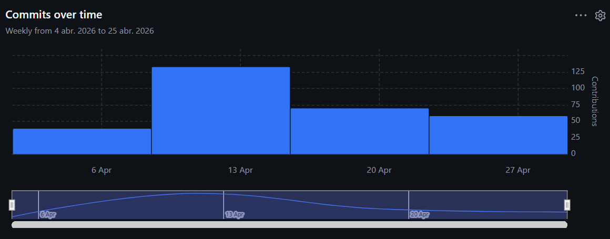
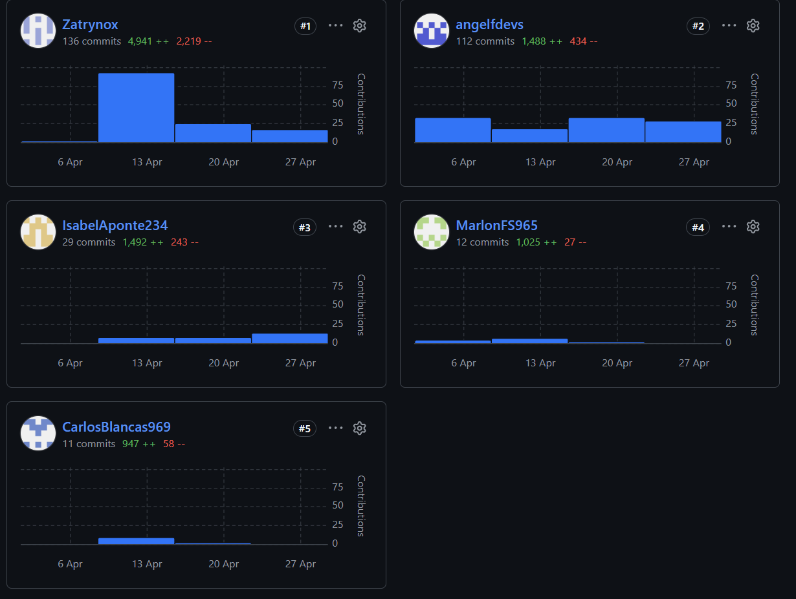

<link rel="stylesheet" href="pdf-style.css" type="text/css">

# RiskGuard by GuardSecurity

  
   

### Universidad Peruana de Ciencias Aplicadas

<small>Facultad de Ingeniería &nbsp;·&nbsp; Ingeniería de Software &nbsp;·&nbsp; 5to Ciclo</small>

Aplicaciones Web

<small>NRC: 12190 &nbsp;·&nbsp; Profesor: Hugo Allan Mori Paiva</small>

### Informe del Trabajo Final

<small>Startup &nbsp;·&nbsp; GuardSecurity</small>

<small>Producto &nbsp;·&nbsp; RiskGuard</small>

### Integrantes

| Código     | Alumno                             |
| :--------: | :--------------------------------: |
| u20241e158 | Aponte Pablo, Isabel Luisa         |
| u202418655 | Laura Acosta, Victor Jhosef        |
| u20241a322 | Blancas Chávez, Carlos Franco      |
| u20231b781 | Flores Eusebio, Angel Thyago       |

<small>Abril &nbsp;·&nbsp; 2026</small>

---

# Registro de Versiones del Informe

| Version | Fecha | Autor | Descripción de modificación |
|:------:|:------:|:------:|:---------------------------:|
| AV1 | 26/04/2026 | Todos los integrantes | Primera Version |
| TB1 | 16/05/2026 | Todos los integrantes | Primera Version |

# Project Report Collaboration Insights

Project Report URL: https://github.com/upc-web-applications

Durante la elaboración de la AV1, los integrantes del equipo contribuyeron en la redacción, diseño e implementación del informe y del Landing Page, distribuyendo la carga de trabajo por capítulos y secciones. El trabajo se organizó utilizando GitHub como plataforma de control de versiones, realizando commits continuos sobre la rama principal del repositorio.

## Repositorio del Informe

**URL:** https://github.com/upc-web-applications/markdown

### Distribución de contribuciones por integrante

| Integrante | Secciones principales del informe |
|---|---|
| Aponte Pablo, Isabel Luisa | Integración del proyecto · Capítulo V (Sprint 1) · Deployment Evidence · Sprint 2: BC Reports & Compliance· Team Collaboration Insights, Software Deployment Evidence for Sprint Review, Execution Evidence for Sprint Review, Development Evidence for Sprint Review|
| Laura Acosta, Victor Jhosef | Capítulo IV (Style Guidelines, Information Architecture) · Diseño Landing Page · Sprint 2: BC Risk Assessment (IPERC) & BC Mitigation · Sprint Backlog 2 · Student Outcome , Software Deployment Evidence for Sprint Review, Execution Evidence for Sprint Review|
| Blancas Chávez, Carlos Franco | Capítulos I y II · Análisis competitivo · Implementación Landing Page · Sprint 2: BC Site / Area & Industrial Asset · BC Inspection / Unsafe Condition, Software Deployment Evidence for Sprint Review, Execution Evidence for Sprint Review |
| Flores Eusebio, Angel Thyago | Perfiles de integrantes · Secciones de diseño UX · Revisión general del informe · Sprint 2: BC Account Generation & Authentication · BC Monitoring / Dashboard, Software Deployment Evidence for Sprint Review, Execution Evidence for Sprint Review|

AV1

TB1

.jpg "evidencia-2")

## Repositorio del Landing Page

**URL:** https://github.com/upc-web-applications/riskguard-landingpage

Durante el Sprint 1, el equipo realizó commits en el repositorio del Landing Page abarcando desde la estructura inicial hasta el despliegue en producción. A continuación se detalla la participación por integrante:

### Contribuciones por integrante

| Integrante | GitHub Username | Área de contribución |
|---|---|---|
| Aponte Pablo, Isabel Luisa | IsabelAponte234 | Diseño visual de secciones · Ajustes de interfaz |
| Laura Acosta, Victor Jhosef | Zatrynox | Integración y consolidación de secciones · Despliegue |
| Blancas Chávez, Carlos Franco | CarlosBlancas969 | Implementación de secciones principales · Navbar · Hero · Características |
| Flores Eusebio, Angel Thyago | angelfdevs | Diseño de secciones · Cómo funciona · Segmentos |

## Repositorio del Frontend

**URL:** https://github.com/upc-web-applications/Frontend

El repositorio cuenta con 7 ramas activas: `main`, `develop`, `feature/reports_cumplimiento`, `feature/monitoring-dashboard`, `feature/inspection_headquarters`, `feature/assessment_mitigation` y `feature/user-authentication`, reflejando la separación por bounded context adoptada por el equipo.

### Contribuciones por integrante

| Integrante | GitHub Username | Rama | Área de contribución |
|---|---|---|---|
| Aponte Pablo, Isabel Luisa | IsabelAponte234 | feature/reports_cumplimiento | BC Reports & Compliance |
| Laura Acosta, Victor Jhosef | Zatrynox | feature/assessment_mitigation | BC Risk Assessment (IPERC) · BC Mitigation |
| Blancas Chávez, Carlos Franco | CarlosBlancas969 | feature/inspection_headquarters | BC Inspection / Unsafe Condition · BC Site / Area & Industrial Asset |
| Flores Eusebio, Angel Thyago | angelfdevs | feature/monitoring-dashboard · feature/user-authentication | BC Monitoring / Dashboard · BC Account Generation & Authentication |

# Tabla de contenidos

**Capítulo I: Introducción**  
- 1.1. Startup Profile  
  - 1.1.1. Descripción del startup  
  - 1.1.2. Perfiles de integrantes del equipo  

- 1.2. Solution Profile  
  - 1.2.1. Antecedentes y problemática  
  - 1.2.2. Lean UX Process  
    - 1.2.2.1. Lean UX Problem Statements  
    - 1.2.2.2. Lean UX Assumptions  
    - 1.2.2.3. Lean UX Hypothesis Statements  
    - 1.2.2.4. Lean UX Canvas  

- 1.3. Segmentos objetivo  

**Capítulo II: Requirements Elicitation & Analysis**  
- 2.1. Competidores  
  - 2.1.1. Análisis competitivo  
  - 2.1.2. Estrategias y tácticas frente a competidores  

- 2.2. Entrevistas  
  - 2.2.1. Diseño de entrevistas  
  - 2.2.2. Registro de entrevistas  
  - 2.2.3. Análisis de entrevistas  

- 2.3. Needfinding  
  - 2.3.1. User Personas  
  - 2.3.2. User Task Matrix  
  - 2.3.3. User Journey Mapping  
  - 2.3.4. Empathy Mapping  

- 2.4. Big Picture EventStorming  
- 2.5. Ubiquitous Language  

**Capítulo III: Requirements Specification**  
- 3.1. User Stories  
- 3.2. Impact Mapping  
- 3.3. Product Backlog  

**Capítulo IV: Product Design**  
- 4.1. Style Guidelines  
  - 4.1.1. General Style Guidelines  
  - 4.1.2. Web Style Guidelines  

- 4.2. Information Architecture  
  - 4.2.1. Organization Systems  
  - 4.2.2. Labeling Systems  
  - 4.2.3. SEO Tags and Meta Tags  
  - 4.2.4. Searching Systems  
  - 4.2.5. Navigation Systems  

- 4.3. Landing Page UI Design  
  - 4.3.1. Landing Page Wireframe  
  - 4.3.2. Landing Page Mock-up  

- 4.4. Web Applications UX/UI Design  
  - 4.4.1. Web Applications Wireframes  
  - 4.4.2. Web Applications Wireflow Diagrams  
  - 4.4.3. Web Applications Mock-ups  
  - 4.4.4. Web Applications User Flow Diagrams  

- 4.5. Web Applications Prototyping  

- 4.6. Domain-Driven Software Architecture  
  - 4.6.1. Design-Level EventStorming  
  - 4.6.2. Software Architecture Context Diagram  
  - 4.6.3. Software Architecture Container Diagrams  
  - 4.6.4. Software Architecture Components Diagrams  

- 4.7. Software Object-Oriented Design  
  - 4.7.1. Class Diagrams  

- 4.8. Database Design  
  - 4.8.1. Database Diagrams  

**Capítulo V: Product Implementation, Validation & Deployment**  
- 5.1. Software Configuration Management  
  - 5.1.1. Software Development Environment Configuration  
  - 5.1.2. Source Code Management  
  - 5.1.3. Source Code Style Guide & Conventions  
  - 5.1.4. Software Deployment Configuration  

- 5.2. Landing Page, Services & Applications Implementation  
  - 5.2.1. Sprint 1  
    - 5.2.1.1. Sprint Planning 1  
    - 5.2.1.2. Aspect Leaders and Collaborators  
    - 5.2.1.3. Sprint Backlog 1  
    - 5.2.1.4. Development Evidence for Sprint Review  
    - 5.2.1.5. Execution Evidence for Sprint Review  
    - 5.2.1.6. Services Documentation Evidence for Sprint Review  
    - 5.2.1.7. Software Deployment Evidence for Sprint Review  
    - 5.2.1.8. Team Collaboration Insights during Sprint  

- 5.3. Validation Interviews  
  - 5.3.1. Diseño de Entrevistas  
  - 5.3.2. Registro de Entrevistas  
  - 5.3.3. Evaluación según heurísticas  

- 5.4. Video About-the-Product  

---

**Final**  
- Conclusiones  
- Recomendaciones  
- Bibliografía  
- Anexos  

# Student Outcome

**ABET – EAC - Student Outcome 5**

*Criterio completo: "La capacidad de funcionar efectivamente en un equipo cuyos miembros juntos proporcionan liderazgo, crean un entorno de colaboración e inclusivo, establecen objetivos, planifican tareas y cumplen objetivos."*

<table>
  <thead>
    <tr>
      <th>Criterio específico</th>
      <th>Acciones realizadas</th>
      <th>Conclusiones</th>
    </tr>
  </thead>
  <tbody>
    <tr>
      <td>Participa activamente en la planificación y cumplimiento de objetivos del equipo, asumiendo responsabilidades de liderazgo o colaboración según las necesidades del sprint.</td>
      <td>
        <strong>Aponte Pablo, Isabel Luisa</strong> 
        <em>AV1:</em> Participó activamente en la reunión de Sprint Planning 1, contribuyendo a la definición del sprint goal y a la distribución de tareas entre los integrantes. Asumió la responsabilidad del diseño visual de secciones del Landing Page, coordinando con sus compañeros para asegurar la coherencia estética del sitio. Su participación constante en los canales de comunicación del equipo facilitó la resolución de bloqueos durante el desarrollo.  
        <strong>Laura Acosta, Victor Jhosef</strong> 
        <em>AV1:</em> Lideró la integración y consolidación de las secciones desarrolladas por los distintos integrantes del equipo, asegurando que el Landing Page funcionara de manera cohesionada como producto final. Coordinó el proceso de despliegue en GitHub Pages y Vercel, estableciendo los pasos del pipeline de publicación y comunicándolos al equipo para garantizar que todos comprendieran el flujo de entrega. Su rol de liderazgo técnico en la fase de integración fue clave para cumplir el objetivo del Sprint 1.  
        <strong>Blancas Chávez, Carlos Franco</strong> 
        <em>AV1:</em> Asumió un rol de liderazgo en la implementación del Landing Page, tomando la iniciativa en la estructuración del navbar, la sección hero y las características del sistema. Coordinó con el resto del equipo la coherencia entre las secciones desarrolladas en paralelo, revisando y apoyando el trabajo de sus compañeros para mantener la consistencia visual y funcional del sitio. Su capacidad para organizar el trabajo colectivo fue determinante para completar el entregable dentro del plazo del Sprint.  
        <strong>Flores Eusebio, Angel Thyago</strong> 
        <em>AV1:</em> Contribuyó al equipo asumiendo la responsabilidad del diseño e implementación de las secciones "Cómo funciona" y "Segmentos" del Landing Page, trabajando de forma coordinada con los demás integrantes para respetar los lineamientos visuales acordados en las Style Guidelines. Participó en las reuniones de seguimiento del Sprint, reportando su avance y señalando dependencias con otras secciones para facilitar la integración. Su compromiso con los plazos establecidos contribuyó al cumplimiento del objetivo del Sprint 1.
      </td>
      <td>
        Durante la AV1, el equipo de RiskGuard Solutions demostró capacidad para funcionar de manera efectiva como unidad de trabajo colaborativo. La distribución de responsabilidades durante el Sprint Planning, la comunicación continua a través de los canales del equipo y la integración coordinada de las secciones del Landing Page evidencian que los integrantes no solo cumplieron sus tareas individuales, sino que también apoyaron el trabajo colectivo para alcanzar el objetivo común del Sprint. La existencia de roles diferenciados —liderazgo técnico en integración y despliegue, liderazgo en implementación de secciones y colaboración en diseño— refleja un equipo que distribuye el liderazgo de forma situacional, creando un entorno inclusivo donde cada integrante aporta desde sus fortalezas. El cumplimiento del sprint goal dentro del plazo establecido valida que el equipo ha comenzado a desarrollar efectivamente la competencia de trabajo en equipo definida por el Student Outcome 5.
      </td>
    </tr>
    <tr>
      <td>Crea un entorno colaborativo e inclusivo, contribuyendo activamente al logro de los objetivos del equipo mediante la implementación de los bounded contexts asignados durante el Sprint 2.</td>
      <td>
        <strong>Aponte Pablo, Isabel Luisa</strong> 
        <em>TB1:</em> Implementó el frontend del Bounded Context Reports & Compliance, desarrollando las interfaces para la generación y visualización de reportes de cumplimiento normativo. Trabajó en la rama <code>feature/reports_cumplimiento</code>, colaborando con el equipo para integrar su módulo con los demás bounded contexts. Participó en las reuniones de seguimiento del Sprint 2, reportando avances y coordinando la integración de su frontend con el backend correspondiente.  
        <strong>Laura Acosta, Victor Jhosef</strong> 
        <em>TB1:</em> Lideró el desarrollo del frontend de los Bounded Contexts Risk Assessment (IPERC) y Mitigation, implementando las interfaces para la evaluación de riesgos y la gestión de medidas de mitigación y precaución. Trabajó en la rama <code>feature/assessment_mitigation</code>, asegurando la correcta navegación entre los módulos de riesgo. Coordinó con el equipo la integración de su frontend con el backend y participó activamente en las decisiones de arquitectura durante el Sprint 2.  
        <strong>Blancas Chávez, Carlos Franco</strong> 
        <em>TB1:</em> Desarrolló el frontend de los Bounded Contexts Site/Area & Industrial Asset e Inspection/Unsafe Condition, creando las interfaces para la gestión de sedes, áreas, activos industriales y la realización de inspecciones de condiciones inseguras. Trabajó en la rama <code>feature/inspection_headquarters</code>, colaborando estrechamente con el equipo para mantener la consistencia visual entre los distintos bounded contexts. Su contribución fue clave para cumplir con los objetivos del Sprint 2.  
        <strong>Flores Eusebio, Angel Thyago</strong> 
        <em>TB1:</em> Implementó el frontend de los Bounded Contexts Monitoring/Dashboard y Account Generation & Authentication, desarrollando las interfaces del dashboard de monitoreo en tiempo real y el módulo de inicio de sesión y generación de cuentas de usuario. Trabajó en las ramas <code>feature/monitoring-dashboard</code> y <code>feature/user-authentication</code>, garantizando la seguridad y usabilidad del acceso al sistema. Participó activamente en la revisión cruzada de código con sus compañeros para asegurar la calidad del producto final.
      </td>
      <td>
        Durante la TB1 (Sprint 2), el equipo de RiskGuard demostró capacidad para organizarse en torno a la arquitectura de bounded contexts, asignando a cada integrante un frente de trabajo claramente delimitado pero interdependiente. La división del trabajo por bounded contexts —Reports & Compliance, Risk Assessment & Mitigation, Site/Area & Inspection, y Monitoring & Authentication— permitió que cada miembro trabajara de forma autónoma en su rama de Git, mientras que la comunicación constante y las reuniones de sincronización garantizaron la cohesión del producto final. El equipo cumplió con los objetivos del Sprint 2, evidenciando un entorno colaborativo e inclusivo donde cada integrante aportó desde su especialidad, reforzando la competencia de trabajo en equipo definida por el Student Outcome 5.
      </td>
    </tr>
  </tbody>
</table>
