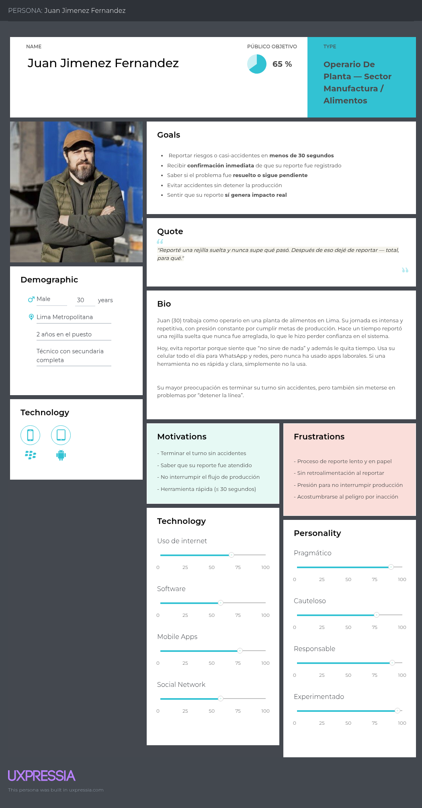
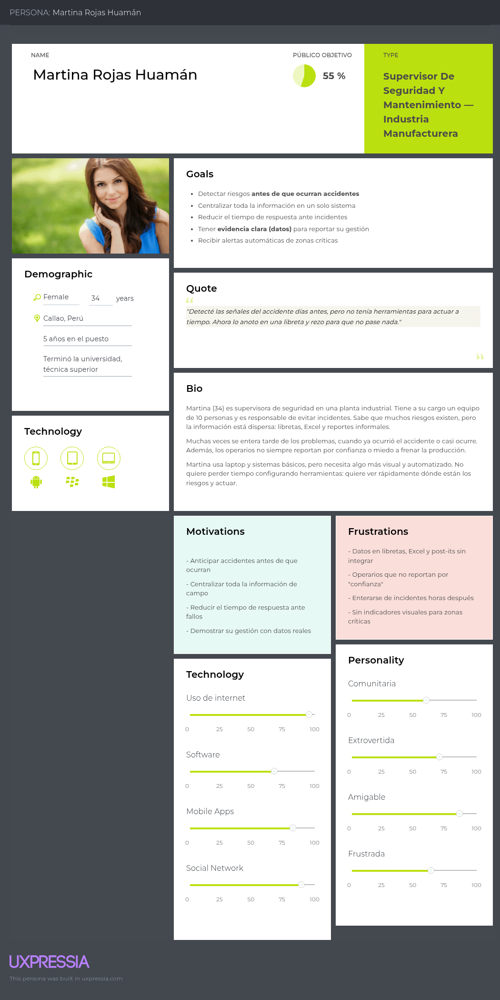
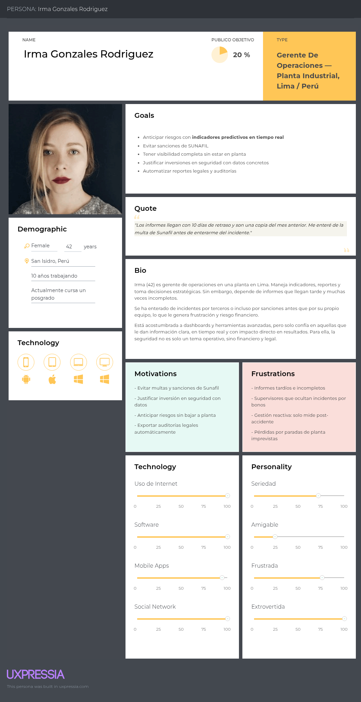
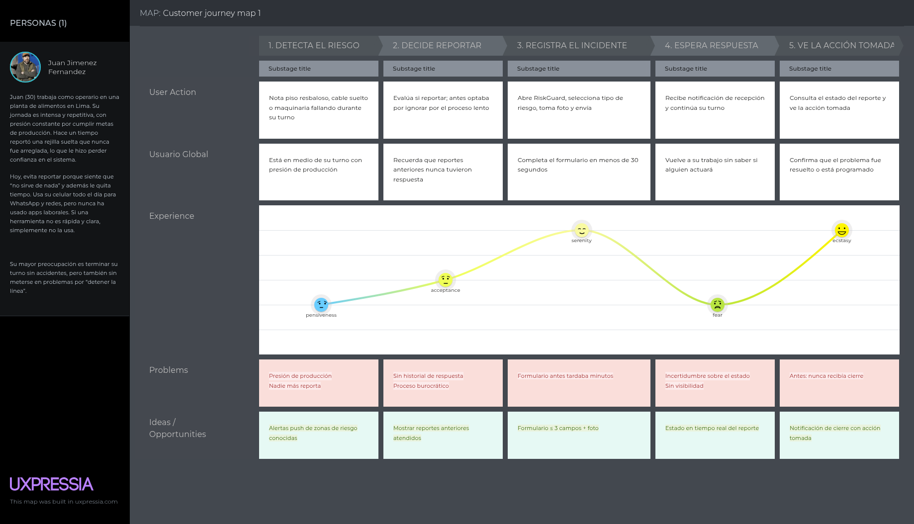
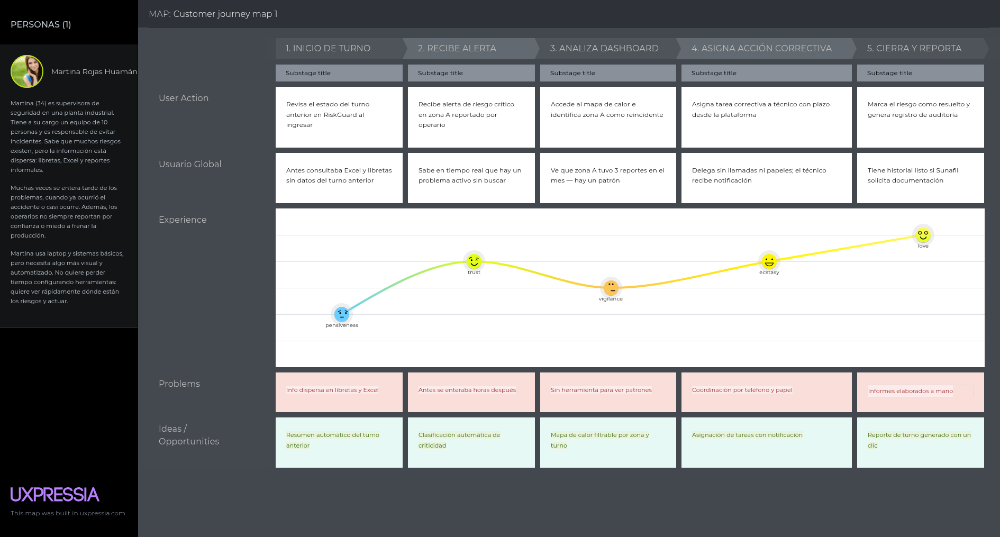
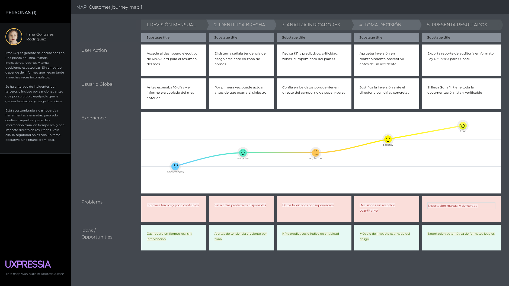
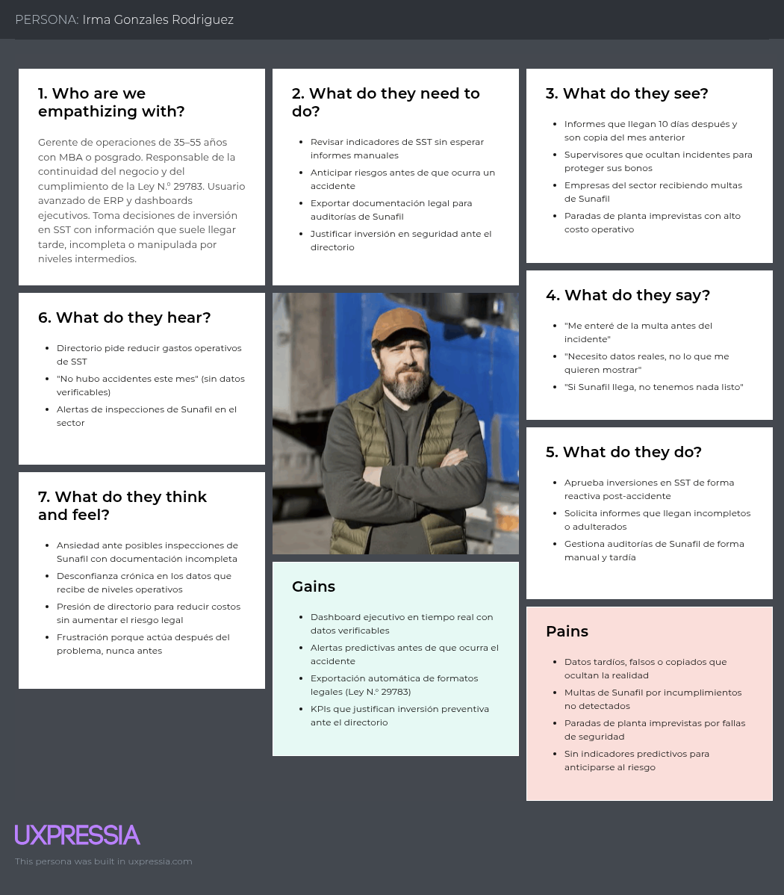
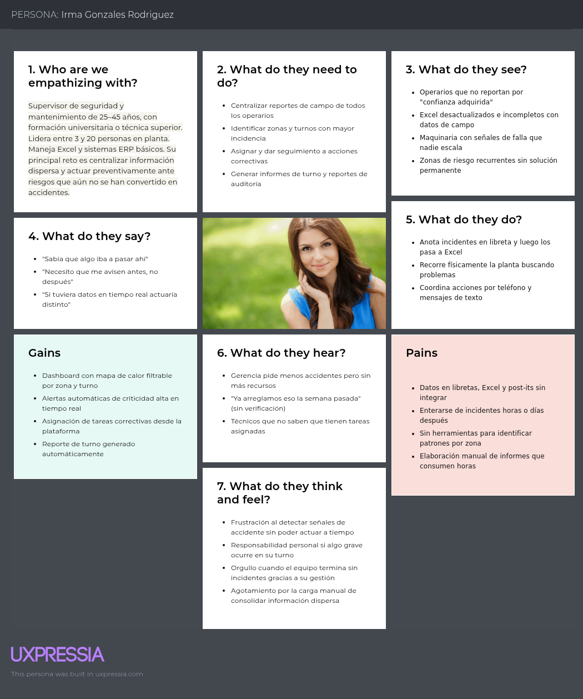
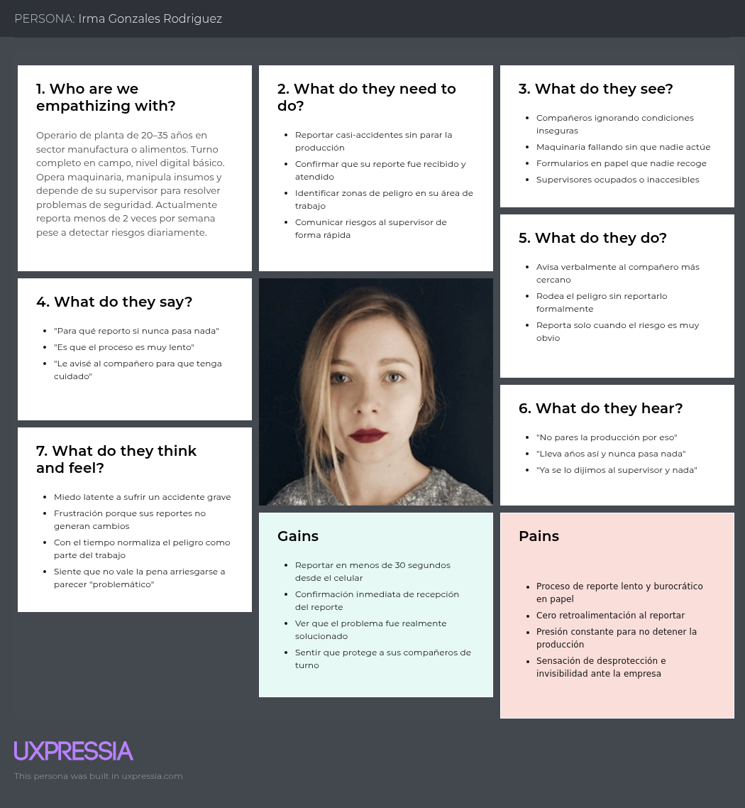

# Capítulo II: Requirements Elicitation & Analysis

## 2.1. Competidores
#### 1. SafetyCulture
Es una plataforma digital de seguridad y operaciones que permite realizar inspecciones, auditorías, capacitaciones y reportes de incidentes desde una sola aplicación. Incluye listas de verificación, gestión de activos y alertas en tiempo real, ayudando a las empresas a mejorar la seguridad, optimizar procesos y cumplir normas.

#### 2. Cority

Cority es una plataforma web de gestión EHS (medio ambiente, salud y seguridad) orientada principalmente a grandes empresas de sectores como minería, manufactura, salud y gobierno. Permite centralizar datos, estandarizar procesos, controlar el cumplimiento normativo e identificar riesgos. Además, cuenta con módulos de salud ocupacional, seguridad, medio ambiente e higiene industrial, y cumple normas como OSHA, HIPAA y ADA.

#### 3. EHS Insight

EHS Insight es una plataforma de gestión EHS en la nube que permite automatizar procesos de seguridad, salud y medio ambiente. Incluye módulos de gestión de incidentes, auditorías, riesgos, impacto ambiental y desempeño empresarial. Además, ofrece acceso desde celular y modo sin conexión, permitiendo registrar datos incluso en zonas sin internet y sincronizarlos después.

#### 4. GOSST - Gestor Online de Seguridad y Salud en el Trabajo

GOSST es una plataforma peruana de Seguridad y Salud en el Trabajo desarrollada para ayudar a las empresas a cumplir la legislación peruana y estándares internacionales mediante una solución 100 % web. La plataforma integra módulos de inspecciones, capacitaciones, participación de trabajadores, gestión de contratistas y control de evaluaciones, facilitando la colaboración entre operarios, supervisores y comités de seguridad.

### 2.1.1. Análisis competitivo
|  | Competitive Analysis Landscape |
|---|---|
| ¿Por qué llevar a cabo este análisis? | Llevamos a cabo este análisis con la finalidad de conocer a los competidores, identificar sus fortalezas y debilidades, y definir estrategias de diferenciación y posicionamiento para nuestra solución. |

|  |  |    **RiskGuard** |    **SafetyCulture** |    **Cority** |    **EHS Insight** |    **GOSST** |
|---|---|---|---|---|---|---|
| **Perfil** | Overview | Plataforma web de seguridad industrial con alertas predictivas, motor de reglas y mapas de calor. | Plataforma de inspecciones y reportes de seguridad orientada a digitalizar procesos. | Software empresarial (EHS) de alto nivel para grandes corporaciones. | Plataforma integral de gestión de seguridad, salud y ambiente. | Software peruano especializado en el cumplimiento de la Ley 29783. |
|  | Ventaja competitiva | Predice riesgos antes de que ocurran usando datos de incidentes, fallas y fatiga. | Global; PYMES y grandes empresas de cualquier sector. | Muy robusta y completa para grandes corporaciones. | Modularidad: las empresas pagan solo por los módulos que usan y reportes automatizados. | Alineación total y directa con los formatos legales peruanos. |
| **Perfil de marketing** | Mercado objetivo | Empresas manufactureras y logísticas del Perú. | PYMES y grandes empresas de distintos sectores a nivel global. | Grandes empresas de minería, manufactura, salud y gobierno. | Empresas medianas y grandes con enfoque en cumplimiento e ISO. | Empresas peruanas pequeñas y medianas de diversos sectores. |
|  | Estrategias de marketing | Demostraciones, alianzas con consultoras SST y ventas directas. | Marketing de contenidos, prueba gratuita y estrategia freemium. | Venta consultiva B2B y presencia en eventos corporativos. | Marketing técnico, demostraciones guiadas y webinars. | Venta directa y asesoría legal sobre cumplimiento normativo. |
|  | Productos y servicios | Registro de incidentes, alertas, mapas de calor, reportes y dashboards. | Inspecciones, checklists, gestión de activos y reportes. | Módulos de seguridad, salud, medio ambiente e higiene industrial. | Gestión de incidentes, auditorías, riesgos y desempeño. | Gestión de inspecciones, capacitaciones e IPERC. |
|  | Precios y costos | Suscripción mensual accesible para empresas medianas. | Plan gratuito y planes pagados por usuario. | Costos elevados y fuerte inversión inicial. | Costo intermedio con módulos opcionales. | Bajo costo frente a competidores internacionales. |
|  | Canales de distribución | Plataforma web y venta directa. | Aplicación web, iOS y Android. | Venta directa con implementación personalizada. | Plataforma web y móvil con acceso offline. | Plataforma web con soporte local en Perú. |
| **Análisis SWOT** | Fortalezas | Analítica predictiva, personalización y facilidad de uso. | Reconocimiento de marca y rápida implementación. | Alto nivel de cumplimiento normativo y funcionalidad. | Fácil implementación y flexibilidad. | Conocimiento profundo del mercado peruano. |
|  | Debilidades | Menor reconocimiento de marca y menos datos históricos. | Menor capacidad predictiva y analítica avanzada. | Complejidad de uso y alto costo. | Menor profundidad funcional frente a plataformas enterprise. | Escalabilidad limitada y menos funcionalidades. |
|  | Oportunidades | Crecimiento de la industria 4.0 y necesidad de prevención de riesgos. | Incorporar inteligencia artificial y analítica predictiva. | Expandirse hacia empresas medianas. | Ingresar a mercados emergentes. | Mayor demanda por cumplimiento normativo en el Perú. |
|  | Amenazas | Competidores globales con mayor inversión y trayectoria. | Aparición de nuevas plataformas más avanzadas. | Soluciones más económicas y fáciles de implementar. | Competidores con mayor posicionamiento internacional. | Ingreso de plataformas extranjeras al mercado peruano. |

### 2.1.2. Estrategias y tácticas frente a competidores

#### Estrategias:

1. **Prevención predictiva y no solo registro:** RiskGuard se diferenciará de competidores como **SafetyCulture**, **EHS Insight** y **GOSST** porque no solo almacenará incidentes, sino que analizará los datos para anticipar accidentes antes de que ocurran. La plataforma utilizará reglas de negocio y variables como fallas de maquinaria, fatiga y falta de capacitación para calcular niveles de riesgo.
2. **Adaptación al contexto peruano:** A diferencia de **Cority** y **SafetyCulture**, RiskGuard estará diseñado específicamente para empresas manufactureras y logísticas del Perú, incorporando formatos de auditoría, terminología y procesos alineados con la **Ley N.° 29783** y las necesidades locales.
3. **Accesibilidad y facilidad de uso:** La plataforma será web, ligera e intuitiva, permitiendo que supervisores, operarios y personal de RR. HH. registren incidentes y riesgos de forma rápida, incluso desde dispositivos de baja gama.

#### Tácticas:

* **Desarrollo de alertas y mapas de calor predictivos**  
  Implementación de dashboards con zonas de riesgo representadas por colores y alertas automáticas cuando el sistema detecte patrones peligrosos.

* **Registro rápido y simplificado**  
  Creación de formularios breves con opciones predeterminadas, carga de fotografías y validaciones automáticas, de modo que un incidente pueda registrarse de manera rápida.

* **Planes accesibles y soporte local**

  Planes de bajo costo para empresas medianas. Además, se brindará soporte técnico local y capacitación inicial, lo que facilitará la adopción frente a competidores internacionales.

#### Aprovechamiento de debilidades de la competencia:

1. Frente a **SafetyCulture**, que se centra principalmente en listas de verificación e inspecciones, RiskGuard ofrecerá un análisis más avanzado y predictivo, capaz de identificar áreas de alto riesgo antes de que ocurra un accidente.
2. En comparación con **Cority**, que está orientado a grandes corporaciones y tiene un costo elevado, RiskGuard será más económico, simple de implementar y accesible para empresas medianas peruanas.
3. Frente a **EHS Insight**, que se limita principalmente al registro y seguimiento de incidentes, RiskGuard incorporará un motor de reglas y probabilidad que permitirá anticipar riesgos y generar alertas automáticas.
4. En comparación con **GOSST**, que está enfocado principalmente en el cumplimiento normativo y la gestión documental, RiskGuard combinará ese cumplimiento con visualizaciones dinámicas, mapas de calor y análisis predictivo en tiempo real.

## 2.2. Entrevistas
### 2.2.1. Diseño de entrevistas
Las entrevistas se diseñaron con un enfoque cualitativo semiestructurado,
orientado a comprender las necesidades reales, frustraciones y comportamientos
de los tres segmentos objetivo de RiskGuard. Se definió un protocolo de
preguntas dividido por segmento, considerando preguntas de apertura,
exploración y cierre sobre disposición de adopción tecnológica.

**Segmento 1: Operarios de planta**

*Preguntas de apertura:*
- ¿Podría describirme brevemente en qué consiste su trabajo diario en planta?
- ¿Cuántos años lleva trabajando en este tipo de entorno industrial?

*Preguntas de exploración:*
- ¿Ha presenciado o experimentado algún casi-accidente en su área de trabajo?
  ¿Lo reportó? ¿Por qué sí o por qué no?
- ¿Cómo es el proceso actual para reportar un incidente o condición insegura
  en su planta? ¿Lo considera práctico?
- ¿Con qué frecuencia deja de reportar situaciones de riesgo por falta de
  tiempo o por la complejidad del proceso?
- ¿Usa el celular durante su jornada laboral? ¿Estaría dispuesto a usarlo
  para registrar un incidente si el proceso fuera rápido y sencillo?
- ¿Alguna vez reportó algo y nunca supo qué pasó con ese reporte?
  ¿Cómo le hizo sentir eso?
- ¿Qué tan seguido identifica condiciones inseguras en su zona que nadie
  más parece notar o reportar?

*Preguntas de cierre:*
- Si existiera una app que le permitiera registrar un casi-accidente en
  menos de 30 segundos desde su celular y le confirmara que fue atendido,
  ¿la usaría? ¿Qué necesitaría para confiar en ella?

**Segmento 2: Supervisores de seguridad y mantenimiento**

*Preguntas de apertura:*
- ¿Cuál es su rol específico dentro de la planta y cuántas personas
  supervisa actualmente?
- ¿Cómo describiría el nivel de cultura de seguridad en su empresa hoy?

*Preguntas de exploración:*
- ¿Cómo centraliza actualmente la información de incidentes y condiciones
  inseguras reportadas por los operarios?
- ¿Con qué herramientas identifica las zonas o turnos con mayor incidencia
  de riesgo en su planta?
- ¿Qué tan frecuente es que los operarios no reporten incidentes? ¿A qué
  lo atribuye principalmente?
- Cuando ocurre un incidente, ¿cuánto tiempo le toma enterarse y tomar
  una acción correctiva?
- ¿Ha tenido situaciones en las que un accidente ocurrió y usted ya había
  detectado señales previas pero no contaba con herramientas para actuar
  a tiempo?
- ¿Qué tan útil sería para usted contar con alertas automáticas que
  prioricen los riesgos críticos antes de que escalen?

*Preguntas de cierre:*
- Si un sistema le mostrara en un dashboard los patrones de riesgo por zona
  y turno, y le enviara alertas automáticas antes de que ocurra un accidente,
  ¿qué impacto tendría eso en su trabajo diario?

**Segmento 3: Gerentes y administradores**

*Preguntas de apertura:*
- ¿Cuál es su rol en la empresa y qué nivel de responsabilidad tiene sobre
  la seguridad y salud en el trabajo?
- ¿Cómo evalúa actualmente el desempeño en seguridad de su planta?

*Preguntas de exploración:*
- ¿Ha tenido que enfrentar multas, sanciones o inspecciones del SUNAFIL
  relacionadas con deficiencias en el registro o monitoreo de riesgos?
  ¿Cuál fue el impacto económico?
- ¿Cuenta con indicadores de seguridad que le permitan anticipar riesgos
  o solo se entera de los problemas cuando ya ocurrió el accidente?
- ¿Cómo justifica ante la dirección o la junta la inversión en seguridad
  ocupacional? ¿Qué datos utiliza?
- ¿Qué tan frecuente es que los reportes de seguridad que recibe sean
  incompletos, tardíos o poco confiables?
- ¿Ha tenido que cancelar o postergar inversiones en su empresa a causa
  de incidentes o paradas de planta por problemas de seguridad?
- ¿Qué información necesitaría ver en un dashboard ejecutivo para tomar
  decisiones preventivas de manera oportuna?

*Preguntas de cierre:*
- Si el sistema exportara automáticamente los formatos de auditoría
  exigidos por la Ley N° 29783 y le mostrara indicadores predictivos
  de riesgo en tiempo real, ¿qué valor tendría eso para su gestión
  y para la continuidad del negocio?

### 2.2.2. Registro de entrevistas
Para consultar las entrevistas realizadas , visitar Anexo A

#### Segmento objetivo #1: Operarios de Planta

*Entrevistado N°1: Fabrizio Vacca Crisostomo*

  

- Sexo: Masculino
- Edad: 26
- Ubicación: Miraflores
- Cargo: Operario en Grupo Pacasmayo

**Resumen:**

Fabrizio lleva cerca de un año y medio trabajando como operario en una planta de producción de alimentos, donde opera maquinaria para garantizar que los insumos estén listos y la producción no se detenga. Confirmó haber presenciado múltiples casi-accidentes, entre ellos una carga que casi se suelta de un montacargas cerca de un compañero, el cual no fue reportado formalmente debido a la presión del tiempo y la complejidad del proceso. Describió el sistema de reporte actual como poco práctico: requiere buscar al supervisor, solicitar un formato físico, llenarlo a mano y entregarlo, proceso que puede tomar días si el supervisor no está disponible. Estimó que deja de reportar condiciones inseguras una o dos veces por semana por la pesadez del proceso, optando por avisar verbalmente a sus compañeros y continuar trabajando. Mencionó haber reportado una rejilla suelta en el conducto de ventilación del almacén de químicos sin recibir nunca respuesta ni retroalimentación, lo que generó en él y sus compañeros la percepción de que los reportes no sirven para nada real. Señaló observar condiciones inseguras casi a diario, como sensores fallidos y palés mal apilados, y que con el tiempo uno se acostumbra al peligro porque nadie actúa. Mostró alta disposición a usar RiskGuard, condicionando su confianza en la app a ver resultados concretos: que los problemas reportados sean atendidos en días y que el sistema confirme la recepción del reporte con una notificación.

---

*Entrevistado N°2: Rocío Acosta*

  

- Sexo: Femenino  
- Edad: 21  
- Ubicación: Pueblo Libre  
- Cargo: Operaria de producción  

**Resumen:**  

Rocío trabaja desde hace aproximadamente seis meses en una planta de producción, donde opera principalmente una máquina de corte y apoya en tareas básicas de mantenimiento. Su principal responsabilidad es cumplir con la producción y evitar fallas en los procesos. Durante su experiencia, ha presenciado múltiples casi-accidentes, principalmente relacionados con herramientas mal ubicadas y pisos resbalosos, los cuales considera frecuentes en su entorno laboral.  
Indicó que el proceso actual de reporte no es práctico, ya que implica avisar al supervisor o llenar formularios en papel, lo cual interrumpe su trabajo y consume tiempo. Debido a esto, reconoce que en varias ocasiones deja de reportar situaciones de riesgo, especialmente cuando hay presión por cumplir con la producción o cuando el incidente parece menor.  
Además, mencionó que ha reportado problemas anteriormente sin recibir seguimiento ni retroalimentación, lo que genera desmotivación y la percepción de que reportar no tiene impacto real. Aun así, identifica con frecuencia condiciones inseguras como cables sueltos o equipos en mal estado que muchas veces no son reportados por otros trabajadores.  
Mostró disposición a utilizar una solución como RiskGuard, siempre que sea rápida, sencilla y no interrumpa su trabajo. Señaló que confiaría en la herramienta si esta confirma la recepción del reporte y demuestra que se toman acciones concretas en base a los incidentes reportados.  

  #### Segmento objetivo #2: Supervisores de Seguridad y Mantenimiento
  
  *Entrevistado N°1: Jorge Surco Villazante*

  

  
- Sexo: Masculino
- Edad: 25
- Ubicacion: Magdalena
- Cargo: Supervisor

**Resumen:**

El entrevistado se desempeña como supervisor y diseñador textil, supervisando a 3 operadores de maquinaria. Describe la cultura de seguridad de su empresa como manejable dado el tamaño reducido del equipo, aunque reconoce que esto podría cambiar conforme la empresa crezca.
Respecto a la gestión de incidentes, el proceso actual es completamente manual: los reportes se anotan en una libreta y luego se trasladan a Excel, sin ninguna herramienta digital para identificar zonas o turnos de mayor riesgo. Señala que los operarios con más de un año de experiencia tienden a dejar de reportar incidentes, atribuyéndolo a la confianza ganada con el tiempo.
Ante un fallo de maquinaria, el supervisor tarda entre 1 y 2 minutos en reaccionar. Además, admite haber detectado señales previas de accidentes sin contar con herramientas para actuar a tiempo, lo que valida directamente la propuesta de RiskGuard.
Considera que las alertas automáticas serían muy útiles, siempre que el costo sea accesible para empresas pequeñas. Finalmente, señala que un dashboard con patrones de riesgo facilitaría su trabajo, aunque de forma humorística reconoce que extrañaría su rutina de recorridos por el taller.

---

*Entrevistado N°2: Álvaro Pablo*

  

- Sexo: Masculino
- Edad: 25
- Ubicación: Barranca
- Cargo: Supervisor de seguridad y mantenimiento  

**Resumen:**  

Álvaro es supervisor de seguridad y mantenimiento en una planta de manufactura, donde lidera a más de 20 personas. Su rol se centra en prevenir accidentes, asegurar el correcto funcionamiento de las operaciones y mantener condiciones seguras en las áreas de trabajo. Considera que el nivel de seguridad en su empresa es aceptable, aunque identifica oportunidades de mejora, especialmente en el uso de indicadores visuales que orienten mejor a los operarios.  
Actualmente, la información sobre incidentes se gestiona mediante fichas o formatos que registran datos del accidente, los cuales son enviados al área de seguridad para su evaluación. Asimismo, utilizan herramientas como matrices de riesgo (IPER/IPCH) y planes de estandarización para identificar zonas críticas y mejorar procesos.  
Álvaro reconoce que muchos operarios no reportan incidentes menores, ya sea porque los consideran poco relevantes o por falta de cultura de seguridad, lo cual representa un problema, ya que todos los eventos deberían ser registrados. También comentó que, en algunos casos, ya se habían detectado fallas en maquinaria antes de que ocurrieran accidentes, pero no se contaba con herramientas para actuar a tiempo.  
Mostró alto interés en soluciones tecnológicas como RiskGuard, destacando que herramientas con alertas automáticas y dashboards de riesgos mejorarían significativamente su capacidad de prevención. Considera que este tipo de sistema optimizaría su trabajo, permitiría actuar antes de que ocurran accidentes y facilitaría una gestión más eficiente de la seguridad en planta.

#### Segmento objetivo #3: Gerentes y Administradores
*Entrevistado N°1: Tiziano Nicoletti*

  

- Sexo: Masculino
- Edad: 23
- Ubicación: Perú
- Cargo: Gerente de Operaciones

**Resumen:**

Tiziano es un joven gerente de operaciones en una planta industrial en Perú, de nacionalidad argentina, con un jefe de seguridad, salud ocupacional y medio ambiente bajo su cargo. Reconoce que su sistema de evaluación de seguridad es reactivo, midiendo el éxito en base a días sin accidentes mediante índices de frecuencia y severidad.
Su mayor dolor de cabeza es la falta de integridad de datos: los informes mensuales llegan con 10 días de retraso y frecuentemente son copia del mes anterior. Además, los supervisores en campo suelen ocultar incidentes peligrosos para no afectar sus bonos, impidiendo una visión real del riesgo.
El año pasado enfrentaron una denuncia anónima de Sunafil por falta de EPP en la zona de hornos, resultando en una pérdida aproximada de 85,000 soles en facturación. Hace dos años, un derrame de material fundido dañó la infraestructura principal, obligando a postergar inversiones clave.
Señala necesitar tres elementos en un tablero ejecutivo: un mapa de calor de riesgos por zona, seguimiento del cumplimiento del plan anual de seguridad, y alertas de desviación de protocolos en tiempo real. Mostró alta disposición hacia una solución que exporte automáticamente formatos de auditoría exigidos por ley y muestre indicadores predictivos de riesgo, calificándola como de alto valor para su gestión actual.

---

*Entrevistado N°2: Ysabel Zavala*

  

- Sexo: Femenino
- Edad: 45
- Ubicación: Perú
- Cargo: Gerente de Operaciones

**Resumen:**
La Sra. Ysabel Zavala, Gerente de Operaciones en una planta industrial en Perú, lidera la gestión de seguridad y salud laboral, asegurando el cumplimiento normativo, supervisando los controles de riesgo y reportando indicadores clave a la alta dirección. Ha identificado que el sistema actual de gestión de riesgos es reactivo, basado en indicadores rezagados como la frecuencia e intensidad de accidentes, lo que impide la anticipación y mitigación proactiva de riesgos. Un desafío significativo es la calidad y oportunidad de la información, afectada por procesos manuales y falta de integración de sistemas, lo que ha generado inspecciones y sanciones de la SUNAFIL, impactando la continuidad operativa y generando costos imprevistos que postergaron inversiones estratégicas. La inversión actual en seguridad y salud laboral se basa en costos de incidentes y cumplimiento de la Ley N° 29783, pero la Sra. Zavala destaca la necesidad de indicadores predictivos para una gestión más eficaz.  Recalca la importancia de un dashboard ejecutivo con información en tiempo real, alertas de riesgo, cumplimiento de inspecciones SUNAFIL y proyecciones de incidentes, considerando que reportes automatizados y análisis predictivo aportarían alto valor estratégico, permitiendo una gestión más proactiva y fortaleciendo la continuidad del negocio.

### 2.2.3. Análisis de entrevistas

A partir de las entrevistas realizadas a los tres segmentos objetivo se  identificaron los siguientes hallazgos y patrones comunes por segmento:

**Segmento 1: Operarios de planta**

- El 100% de los entrevistados confirmó haber presenciado casi-accidentes en su área de trabajo que no fueron reportados formalmente, principalmente 
  por la complejidad y el tiempo que demanda el proceso actual

- El proceso de reporte vigente en ambas plantas es manual: implica buscar al supervisor, solicitar un formato físico, llenarlo a mano y entregarlo, 
  lo que puede tomar días si el supervisor no está disponible. Ninguno de los entrevistados lo considera práctico

- Ambos operarios reconocieron dejar de reportar condiciones inseguras de manera frecuente  entre una y dos veces por semana  optando por avisar verbalmente a sus compañeros y continuar trabajando para no interrumpir 
  la producción

- Los dos entrevistados mencionaron haber reportado incidentes en el pasado sin recibir ninguna retroalimentación ni confirmación de que el reporte fue atendido, lo que generó desmotivación y la percepción de que reportar 
  no tiene impacto real en la seguridad

- Ambos identifican condiciones inseguras con alta frecuencia en sus zonas de trabajo — cables sueltos, pisos resbalosos, sensores fallidos, palés 
  mal apilados — que nadie más reporta. Con el tiempo, se normalizan estas condiciones peligrosas

- Los dos entrevistados mostraron alta disposición a usar RiskGuard, condicionando su confianza a dos factores concretos: que el sistema confirme la recepción del reporte con una notificación y que los problemas 
  reportados sean atendidos en un plazo visible

- El uso del celular durante la jornada es habitual en ambos casos. Coincidieron en que usarían la app si el proceso fuera rápido, 
  de pocos pasos y no interrumpiera su ritmo de trabajo

**Segmento 2: Supervisores de seguridad y mantenimiento**

- Ambos supervisores gestionan la información de incidentes de forma completamente manual: uno mediante libreta y Excel, y el otro mediante 
  fichas físicas enviadas al área de seguridad. Ninguno cuenta con herramientas digitales especializadas para el análisis de datos de 
  seguridad

- Los dos entrevistados identificaron el subregistro de incidentes por parte de los operarios como un problema frecuente. Las causas atribuidas fueron la confianza excesiva de los operarios con más experiencia, 
  la falta de cultura de seguridad y la percepción de que los incidentes menores no merecen ser reportados

- Ambos supervisores admitieron haber detectado señales previas de accidentes sin contar con herramientas para actuar a tiempo, validando directamente la necesidad de un sistema de alertas predictivas 
  como el que propone RiskGuard

- No existe en ninguno de los dos casos una herramienta que permita identificar zonas o turnos con mayor incidencia de riesgo de forma automatizada. La identificación de patrones depende exclusivamente 
  del criterio y la experiencia del supervisor

- El tiempo de reacción ante un incidente varía entre 1 y 2 minutos en el mejor caso, pero esto asume que el supervisor está físicamente presente o cerca. En ausencia del supervisor, el tiempo se extiende 
  de manera indeterminada

- Ambos mostraron alto interés en un dashboard con patrones de riesgo y alertas automáticas, destacando que este tipo de herramienta mejoraría significativamente su capacidad de prevención y les 
  permitiría actuar antes de que ocurran accidentes. La accesibilidad económica fue mencionada como condición importante para la adopción, 
  especialmente en empresas pequeñas

**Segmento 3: Gerentes y administradores**

- Ambos gerentes reconocieron que su sistema actual de gestión de seguridad es reactivo: miden el desempeño en base a indicadores rezagados como días sin accidentes, índices de frecuencia y severidad, 
  en lugar de indicadores predictivos que permitan anticipar riesgos

- Los dos entrevistados señalaron que la calidad y oportunidad de la información de seguridad que reciben es deficiente. Los reportes llegan con retraso, frecuentemente están incompletos o son poco 
  confiables, y en algunos casos los supervisores ocultan incidentes para no afectar sus indicadores o bonos de desempeño

- Ambos gerentes han enfrentado consecuencias legales y económicas directas por deficiencias en el registro y monitoreo de riesgos: 
  inspecciones del SUNAFIL, sanciones, pérdidas de facturación y postergación de inversiones estratégicas. Uno de los casos reportó una pérdida aproximada de 85,000 soles en facturación 
  a raíz de una denuncia ante el SUNAFIL.

- Ninguno de los dos cuenta actualmente con indicadores predictivos de seguridad. La toma de decisiones preventivas se ve limitada  por la falta de datos en tiempo real y la ausencia de herramientas 
  de análisis integradas

- Los dos entrevistados coincidieron en los elementos que necesitarían en un dashboard ejecutivo: mapa de calor de riesgos por zona, seguimiento del cumplimiento del plan anual de seguridad, alertas 
  de desviación de protocolos en tiempo real y proyecciones de  incidentes

- Ambos gerentes mostraron alta valoración hacia una solución que exporte automáticamente los formatos de auditoría exigidos por la Ley N° 29783 y muestre indicadores predictivos de riesgo, considerándola de alto valor estratégico para mejorar la continuidad 
  del negocio y reducir la exposición a sanciones legales

## 2.3. Needfinding

### 2.3.1. User Personas

  #### Segmento Objetivo 1: Operarios de Planta
  
  

  

    <b>Grafico 3</b>: Segmento Objetivo 1
  

  

    <i><b>Fuente</b>: Elaboración propia en UXPRESSIA. </i>
  

---

 #### Segmento Objetivo 2: Supervisores de seguridad y mantenimiento
  
  

  

    <b>Grafico 4</b>: Segmento Objetivo 2
  

   
  

    <i><b>Fuente</b>: Elaboración propia en UXPRESSIA. </i>
  

---

 #### Segmento Objetivo 3: Gerentes y Administradores
  
  

  

    <b>Grafico 5</b>: Segmento Objetivo 3
  

    

  
  

    <i><b>Fuente</b>: Elaboración propia en UXPRESSIA. </i>
  

### 2.3.2. User Task Matrix

#### Segmento 1: Operarios de planta

| Tarea | Frecuencia | Importancia | Dificultad actual | ¿RiskGuard la soporta? |
|---|---|---|---|---|
| Identificar condiciones inseguras en su zona | Alta | Alta | Baja | Sí — alerta push en zonas conocidas |
| Reportar un casi-accidente o condición de riesgo | Media | Muy alta | Muy alta | Sí — formulario rápido ≤ 3 campos + foto |
| Notificar verbalmente al supervisor | Alta | Media | Baja | Parcial — reemplazado por reporte digital |
| Consultar el estado de un reporte enviado | Baja | Alta | Muy alta | Sí — estado en tiempo real por notificación |
| Recibir confirmación de que el riesgo fue atendido | Baja | Muy alta | Muy alta | Sí — notificación de cierre con acción tomada |
| Evitar zonas de riesgo ya conocidas | Alta | Alta | Media | Sí — mapa de riesgos visible en la app |
| Registrar uso de EPP o condiciones de trabajo | Baja | Media | Alta | Sí — checklist de turno configurable |
| Capacitarse en procedimientos de seguridad | Baja | Media | Media | Parcial — módulo de alertas educativas |

---

#### Segmento 2: Supervisores de seguridad y mantenimiento

| Tarea | Frecuencia | Importancia | Dificultad actual | ¿RiskGuard la soporta? |
|---|---|---|---|---|
| Revisar incidentes reportados por operarios | Alta | Muy alta | Muy alta | Sí — bandeja centralizada con clasificación |
| Identificar zonas o turnos con mayor frecuencia de riesgos | Media | Muy alta | Muy alta | Sí — mapa de calor filtrable por zona y turno |
| Asignar acciones correctivas al equipo de mantenimiento | Alta | Muy alta | Alta | Sí — asignación de tareas con plazo y notificación |
| Verificar cierre de acciones correctivas | Media | Alta | Alta | Sí — trazabilidad y estado de cada tarea |
| Elaborar informe de turno o semanal | Alta | Alta | Muy alta | Sí — generación automática de reporte con un clic |
| Recibir alertas de riesgo crítico en tiempo real | Alta | Muy alta | Muy alta | Sí — alertas automáticas por nivel de criticidad |
| Analizar tendencias de riesgo en el tiempo | Baja | Alta | Muy alta | Sí — gráficas de tendencia en el dashboard |
| Coordinar con gerencia sobre el estado de seguridad | Media | Alta | Alta | Sí — exportación de reportes consolidados |
| Supervisar cumplimiento del plan anual de SST | Baja | Alta | Alta | Sí — indicador de avance del plan SST |

---

#### Segmento 3: Gerentes y administradores

| Tarea | Frecuencia | Importancia | Dificultad actual | ¿RiskGuard la soporta? |
|---|---|---|---|---|
| Revisar indicadores de desempeño de SST | Alta | Muy alta | Muy alta | Sí — dashboard ejecutivo en tiempo real |
| Identificar brechas de seguridad por área | Media | Muy alta | Muy alta | Sí — alertas de tendencia creciente por zona |
| Justificar inversión en seguridad ante el directorio | Baja | Alta | Alta | Sí — KPIs predictivos exportables |
| Preparar documentación para auditorías de Sunafil | Baja | Muy alta | Muy alta | Sí — exportación automática en formatos Ley N.° 29783 |
| Evaluar el cumplimiento del plan anual de SST | Baja | Alta | Alta | Sí — indicador de cumplimiento por área |
| Detectar patrones de riesgo antes de un accidente | Baja | Muy alta | Muy alta | Sí — motor de reglas con alertas predictivas |
| Aprobar inversiones preventivas de mantenimiento | Baja | Alta | Media | Parcial — datos de soporte para la decisión |
| Hacer seguimiento de sanciones o acciones legales | Baja | Alta | Alta | Parcial — registro histórico de incidentes |
| Comunicar resultados de SST a socios o clientes | Muy baja | Media | Alta | Sí — reportes formateados para terceros |

### 2.3.3. User Journey Mapping

 #### Segmento Objetivo 1: Operarios de Planta
  
  

  

    <b>Grafico 6</b>: Segmento Objetivo 1
  

  

    <i><b>Fuente</b>: Elaboración propia en UXPRESSIA. </i>
  

---

 #### Segmento Objetivo 2: Supervisores de seguridad y mantenimiento
  
  

  

    <b>Grafico 7</b>: Segmento Objetivo 2
  

   
  

    <i><b>Fuente</b>: Elaboración propia en UXPRESSIA. </i>
  

---

 #### Segmento Objetivo 3: Gerentes y Administradores
  
  

  

    <b>Grafico 8</b>: Segmento Objetivo 3
  

    

  
  

    <i><b>Fuente</b>: Elaboración propia en UXPRESSIA. </i>
  

### 2.3.4. Empathy Mapping

 #### Segmento Objetivo 1: Operarios de Planta
  
  

  

    <b>Grafico 9</b>: Segmento Objetivo 1
  

  

    <i><b>Fuente</b>: Elaboración propia en UXPRESSIA. </i>
  

---

 #### Segmento Objetivo 2: Supervisores de seguridad y mantenimiento
  
  

  

    <b>Grafico 10</b>: Segmento Objetivo 2
  

   
  

    <i><b>Fuente</b>: Elaboración propia en UXPRESSIA. </i>
  

---

 #### Segmento Objetivo 3: Gerentes y Administradores
  
  

  

    <b>Grafico 11</b>: Segmento Objetivo 3
  

    

  
  

    <i><b>Fuente</b>: Elaboración propia en UXPRESSIA. </i>
  

## 2.4. Big Picture EventStorming

El Big Picture Event Storming es una técnica de modelado colaborativo creada por Alberto Brandolini que permite a un equipo explorar y comprender el dominio de un negocio en pocas horas. A diferencia de los enfoques tradicionales de análisis, esta técnica se centra en identificar los *Domain Events* más relevantes del sistema —es decir, los hechos significativos que ocurren en el dominio— y organizarlos cronológicamente para construir una visión compartida del funcionamiento del negocio.

En el caso de RiskGuard, esta técnica fue utilizada para modelar el proceso de gestión de la seguridad y salud en el trabajo dentro de entornos industriales, permitiendo identificar los eventos clave relacionados con el registro de incidentes, la detección de riesgos y la toma de decisiones preventivas. La sesión fue realizada de manera colaborativa por el equipo, utilizando un tablero digital como espacio de trabajo.

---

### Proceso realizado por el equipo

A continuación, se describen las etapas desarrolladas durante la sesión de Event Storming aplicada al dominio de RiskGuard.

---

### Paso 1: Unstructured Exploration

En esta etapa inicial, el equipo realizó una lluvia de ideas identificando los *Domain Events* más relevantes del dominio de seguridad industrial. Cada participante propuso eventos redactados en tiempo pasado, tales como “Incidente reportado”, “Condición insegura detectada”, “Alerta generada” y “Acción correctiva asignada”.

No se aplicaron filtros ni ordenamiento en esta fase, con el objetivo de maximizar la cantidad de eventos y capturar el conocimiento del equipo respecto a la gestión de riesgos laborales.

[fotos]

---

### Paso 2: Timeline (Línea de tiempo)

Posteriormente, los eventos identificados fueron organizados cronológicamente siguiendo el flujo natural del proceso de gestión de seguridad.

Se definió inicialmente el *happy path*, que describe el escenario ideal desde la detección de una condición insegura hasta su mitigación. Luego, se incorporaron escenarios alternativos como la falta de reporte o la demora en la atención.

[fotos]

---

### Paso 3: Pain Points (Puntos críticos)

Una vez estructurado el flujo, el equipo identificó los principales problemas del proceso actual, marcándolos como *pain points*.

Entre los más relevantes se encontraron el subregistro de incidentes, la falta de retroalimentación a los operarios, la ausencia de análisis de datos y la demora en la toma de decisiones, evidenciando oportunidades claras de mejora.

[fotos]

---

### Paso 4: Pivotal Events (Eventos cruciales)

Se identificaron eventos clave que representan cambios significativos en el proceso, como “Incidente reportado”, “Riesgo clasificado” y “Acción correctiva ejecutada”.

Estos eventos permitieron dividir el flujo en etapas claras y facilitar la comprensión del ciclo de vida de la gestión de riesgos.

[fotos]

---

### Paso 5: Commands (Comandos)

Se definieron los *commands* que desencadenan los eventos, formulados en modo imperativo, tales como “Registrar incidente”, “Clasificar riesgo”, “Generar alerta” y “Asignar acción correctiva”.

Además, se asociaron estos comandos con los actores correspondientes, como operarios, supervisores y gerentes.

[fotos]

---

### Paso 6: Policies (Políticas)

Se identificaron *policies* que automatizan el comportamiento del sistema, conectando eventos con comandos.

Por ejemplo, cuando ocurre el evento “Riesgo alto detectado”, se activa automáticamente el comando “Generar alerta crítica”, modelando así la lógica de automatización del sistema.

[fotos]

---

### Paso 7: Read Models (Modelos de lectura)

Se definieron los *read models* que los actores utilizan para tomar decisiones dentro del sistema.

Entre ellos destacan dashboards de seguridad, mapas de calor de riesgos y reportes de incidentes, los cuales permiten evaluar la situación en tiempo real.

[fotos]

---

### Paso 8: External Systems (Sistemas externos)

Se identificaron sistemas externos que interactúan con la plataforma, como sistemas ERP, bases de datos corporativas o dispositivos IoT utilizados en planta.

Estos sistemas pueden enviar información o recibir notificaciones del sistema.

[fotos]

---

### Paso 9: Aggregates (Agregados)

Se agruparon los comandos y eventos relacionados en *aggregates*, organizando el dominio en unidades coherentes.

Se identificaron agregados como “Gestión de Incidentes”, “Gestión de Riesgos” y “Gestión de Alertas”.

[fotos]

---

### Paso 10: Bounded Contexts (Contextos delimitados)

Finalmente, se definieron posibles *bounded contexts* agrupando agregados relacionados.

Se identificaron contextos como “Registro de Incidentes”, “Análisis de Riesgos” y “Gestión de Seguridad”, los cuales representan divisiones claras dentro del dominio y sirven como base para el diseño de la arquitectura del sistema.

[fotos]

---

El Event Storming permitió al equipo construir una visión compartida del dominio de RiskGuard, identificar problemas críticos del proceso actual y definir una base sólida para el diseño del sistema. Más allá del modelo generado, el principal valor de la sesión fue la alineación del equipo y la construcción de un lenguaje común para describir la gestión de la seguridad en entornos industriales.

## 2.5. Ubiquitous Language

A continuación se presenta el vocabulario compartido del dominio de negocio de RiskGuard. La definición precisa de estos términos garantiza que el equipo de desarrollo, los diseñadores y los stakeholders trabajen bajo un mismo marco conceptual a lo largo de todas las fases del proyecto, desde el modelado de la landing page hasta la especificación de los endpoints del backend.

Los términos se listan en inglés, idioma base del dominio, junto con su descripción funcional en español.

*Glosario del Dominio*

| Término | Definición |
|---|---|
| **User** | Entidad del sistema que representa a una persona registrada en la plataforma. Se clasifica en cuatro roles: Operator, Supervisor, Manager y Administrator, cada uno con permisos y vistas diferenciadas. |
| **Operator** | Usuario de primera línea que opera maquinaria o procesos productivos en planta. Es el actor principal del flujo de reporte de incidentes y condiciones inseguras. Accede a la plataforma desde dispositivos móviles o web para registrar eventos de riesgo en tiempo real. |
| **Supervisor** | Usuario de mando medio responsable de monitorear zonas de planta, gestionar alertas activas, asignar acciones correctivas y verificar el cierre de tickets. Accede al dashboard de monitoreo y al mapa de calor operativo. |
| **Manager** | Usuario de alta dirección que consulta el dashboard ejecutivo, revisa indicadores predictivos, aprueba inversiones en seguridad y exporta reportes de cumplimiento normativo. No interviene en la gestión operativa directa de tickets. |
| **Administrator** | Usuario con acceso completo al sistema. Gestiona cuentas de usuario, roles, sectores, activos, configuración de reglas de alerta y parámetros del motor predictivo. |
| **Incident** | Evento no planificado registrado en el sistema que puede causar o ha causado daño a una persona, equipo o proceso dentro de la planta. Origen principal de los tickets de acción correctiva. |
| **Near Miss** | Situación riesgosa registrada como incidente que no causó daño pero tenía el potencial de hacerlo. Su registro es clave para la detección temprana de patrones de riesgo. |
| **Unsafe Condition** | Estado del entorno laboral registrado en el sistema que incrementa la probabilidad de un accidente. Se clasifica por tipo de peligro: físico, químico, ergonómico u otro. |
| **Risk** | Combinación de la probabilidad de ocurrencia de un evento peligroso y su impacto potencial, calculada automáticamente por el motor de reglas del sistema. |
| **Risk Level** | Clasificación del riesgo calculada por el sistema según su gravedad: Bajo, Medio, Alto o Crítico. Determina la prioridad de atención y el flujo de escalamiento del ticket. |
| **IPERC** | Identificación de Peligros y Evaluación de Riesgos y Controles. Metodología peruana de análisis de riesgo implementada en el motor predictivo del sistema para calcular el nivel de criticidad de cada incidente a partir de índices de probabilidad y severidad. |
| **Risk Engine** | Motor de reglas del backend que procesa los datos de incidentes reportados para calcular niveles de criticidad mediante la lógica IPERC, detectar patrones recurrentes y generar alertas predictivas automáticas. |
| **Ticket** | Unidad de gestión del sistema asignada a cada incidente reportado. Contiene el historial completo del incidente, su nivel de riesgo, el técnico asignado, las acciones correctivas aplicadas y el estado actual. Es inmutable una vez cerrado. |
| **Ticket Status** | Estado actual de un ticket dentro de su ciclo de vida: Pendiente, En Progreso, Medida Implementada o Cerrado. Determina las acciones disponibles para cada rol. |
| **Corrective Action** | Medida técnica asignada a un técnico de mantenimiento para mitigar o eliminar el riesgo identificado en un ticket. Queda registrada en el historial del ticket para trazabilidad legal. |
| **SLA** | Acuerdo de nivel de servicio interno que define el tiempo máximo permitido para resolver un ticket según su nivel de riesgo. El incumplimiento del SLA genera un escalamiento automático hacia los roles gerenciales. |
| **SLA Breach** | Evento que ocurre cuando un ticket supera su tiempo máximo de resolución sin alcanzar el estado Cerrado. Genera una notificación de escalamiento inmutable registrada en el historial del ticket. |
| **Alert** | Notificación generada automáticamente por el sistema ante un riesgo, patrón recurrente o incumplimiento de SLA. Clasificada por prioridad: operativa, de advertencia o crítica. |
| **Critical Alert** | Alerta de máxima prioridad generada cuando el sistema registra un incidente con nivel de riesgo Crítico. Activa el protocolo de notificación externa por correo electrónico al supervisor responsable. |
| **Recurrent Pattern** | Patrón detectado por el motor predictivo cuando el mismo tipo de riesgo supera un umbral de ocurrencias dentro de un período definido en una misma zona. Genera una alerta de patrón recurrente en el dashboard del supervisor. |
| **Heat Map** | Representación visual del dashboard que muestra la concentración de riesgos activos por sector de la planta mediante codificación por intensidad de color. Se actualiza automáticamente al registrarse o resolverse un incidente. |
| **Sector** | Área física delimitada de la planta registrada en el sistema. Unidad geográfica base para la georreferenciación de incidentes, la visualización del mapa de calor y la generación de reportes segmentados. |
| **Asset** | Máquina o equipo industrial registrado en el sistema y vinculado a un sector activo. Puede asociarse a tickets de incidentes o a planes de mantenimiento preventivo. |
| **Technician** | Personal de mantenimiento registrado en el sistema con una especialidad técnica asignada. Es el responsable de ejecutar las acciones correctivas delegadas mediante tickets. |
| **Preventive Maintenance** | Ticket de mantenimiento programado sobre un activo específico, independiente de incidentes activos. Pone el activo en estado En Mantenimiento durante su ejecución, bloqueando la generación de alertas predictivas sobre ese equipo. |
| **Dashboard** | Interfaz visual del sistema que centraliza métricas, alertas activas, mapa de calor y tendencias de accidentabilidad. Disponible en versión operativa para supervisores y en versión ejecutiva para gerentes. |
| **Executive Dashboard** | Vista del dashboard reservada para el rol Manager. Muestra indicadores consolidados de SST, porcentaje de cumplimiento del plan anual, tendencias históricas y acceso a exportación de reportes de auditoría. |
| **Predictive Indicator** | Indicador calculado por el motor de reglas a partir de datos históricos de los últimos 30 días. Anticipa tendencias de riesgo creciente, tipos de incidente recurrentes y sectores con mayor tiempo promedio de resolución. |
| **SST Compliance** | Porcentaje de cumplimiento del Plan Anual de Seguridad y Salud en el Trabajo, calculado en base a tickets cerrados versus actividades planificadas. Se diferencia visualmente por semáforo: verde (≥80%), amarillo (50–79%) y rojo (<50%). |
| **Audit Report** | Documento generado automáticamente por el sistema con los datos reales de incidentes registrados en un período seleccionado. Compatible con los formatos referenciales de la Ley N° 29783 y exportable en PDF o Excel para inspecciones de SUNAFIL. |
| **Notification** | Mensaje interno del sistema enviado al centro de notificaciones del usuario cuando cambia el estado de un ticket, se genera una alerta o se produce un escalamiento. Puede marcarse como leída. |
| **Escalation** | Proceso automático por el cual el sistema notifica a roles superiores cuando un riesgo crítico supera su umbral de tiempo sin atención, garantizando que la gerencia tenga visibilidad sobre incidentes no resueltos dentro del SLA. |
| **Evidence** | Archivo adjunto, generalmente fotográfico, vinculado a un ticket de incidente al momento de su registro. Sirve como respaldo visual para la evaluación del riesgo por parte del supervisor. |
| **Report** | Registro formal de un incidente o condición insegura creado por un operario a través del formulario de reporte. Genera automáticamente un ticket con número único de seguimiento. |
