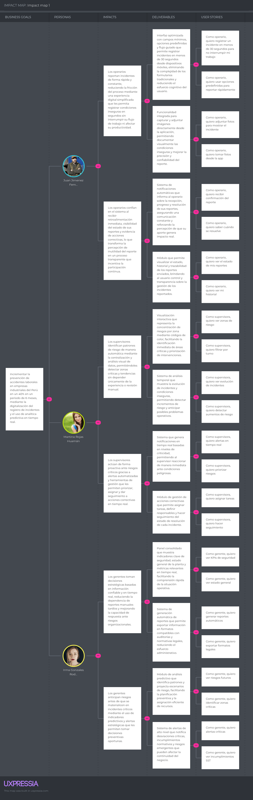

# Capítulo III: Requirements Specification

## 3.1. User Stories

## Epics

<table align="center">
    <tr>
        <td align="center">
        <b>Epic ID</b>
        </td>
        <td align="center">
        <b>Descripción de la épica</b>
        </td>
    </tr>
    <tr>
        <td align="center"><b>EP01</b></td>
        <td align="center">Operario de Planta</td>
    </tr>
    <tr>
        <td align="center"><b>EP02</b></td>
        <td align="center">Motor Predictivo y Análisis de Riesgos</td>
    </tr>
    <tr>
        <td align="center"><b>EP03</b></td>
        <td align="center">Gestión de Alertas y Mitigación de Incidentes</td>
    </tr>
    <tr>
        <td align="center"><b>EP04</b></td>
        <td align="center">Dashboard Ejecutivo y Reportes de Cumplimiento</td>
    </tr>
    <tr>
        <td align="center"><b>EP05</b></td>
        <td align="center">Configuración del Sistema</td>
    </tr>
    <tr>
        <td align="center"><b>EP06</b></td>
        <td align="center">Presencia Digital y Estrategia de Conversion de Usuarios</td>
    </tr>
</table>

## User Stories
<table align="center">
  <tr>
    <td><b>User Story ID</b></td><td>US01</td>
    <td><b>Epic ID</b></td><td>EP01</td>
  </tr>
  <tr>
    <td><b>Título</b></td>
    <td colspan="3">Autenticación de Operario</td>
  </tr>
  <tr>
    <td><b>Descripción</b></td>
    <td colspan="3">Como Operario de Planta, quiero iniciar sesión en RiskGuard con mis credenciales asignadas, para acceder a las funciones correspondientes a mi rol.</td>
  </tr>
  <tr>
    <td colspan="4">
      <b>Criterios de aceptación:</b>
      <ol>
        <li>El acceso debe realizarse mediante correo y contraseña preconfigurados.</li>
        <li>El sistema valida el formato del correo antes de enviar la petición.</li>
        <li>En caso de error, muestra el mensaje "Correo o contraseña incorrectos".</li>
        <li>Tras inicio de sesión exitoso, redirige al operario a su vista de funciones.</li>
        <li>Tras 5 intentos fallidos consecutivos, la cuenta se bloquea por 15 minutos.</li>
      </ol>
      <b>Escenario 1:</b> Inicio de sesión exitoso 
      <ul>
        <li><b>Given</b> que el Operario se encuentra en la pantalla de inicio de sesión,</li>
        <li><b>When</b> ingresa su correo y contraseña correctos y hace clic en "Ingresar",</li>
        <li><b>Then</b> el sistema valida las credenciales,</li>
        <li><b>And</b> redirige al operario a su vista principal de funciones.</li>
      </ul>
      <b>Escenario 2:</b> Credenciales inválidas 
      <ul>
        <li><b>Given</b> que el Operario se encuentra en la pantalla de inicio de sesión,</li>
        <li><b>When</b> ingresa alguna credencial incorrecta y hace clic en "Ingresar",</li>
        <li><b>Then</b> el sistema deniega el acceso,</li>
        <li><b>And</b> muestra el mensaje "Correo o contraseña incorrectos".</li>
      </ul>
      <b>Escenario 3:</b> Bloqueo por intentos fallidos 
      <ul>
        <li><b>Given</b> que el Operario acumula 5 intentos fallidos consecutivos,</li>
        <li><b>When</b> intenta ingresar nuevamente,</li>
        <li><b>Then</b> el sistema bloquea la cuenta temporalmente,</li>
        <li><b>And</b> muestra el mensaje "Demasiados intentos fallidos. Intente en 15 minutos".</li>
      </ul>
    </td>
  </tr>
</table>

---

<table align="center">
  <tr>
    <td><b>User Story ID</b></td><td>US02</td>
    <td><b>Epic ID</b></td><td>EP01</td>
  </tr>
  <tr>
    <td><b>Título</b></td>
    <td colspan="3">Cierre de Sesión del Operario</td>
  </tr>
  <tr>
    <td><b>Descripción</b></td>
    <td colspan="3">Como Operario de Planta, quiero cerrar sesión de forma segura desde la aplicación, para proteger mi cuenta en dispositivos compartidos del área de trabajo.</td>
  </tr>
  <tr>
    <td colspan="4">
      <b>Criterios de aceptación:</b>
      <ol>
        <li>El sistema incluye una opción de "Cerrar sesión" accesible desde el menú principal.</li>
        <li>Al cerrar sesión, el sistema invalida el token de autenticación del operario.</li>
        <li>Tras cerrar sesión, el sistema redirige al operario a la pantalla de inicio de sesión.</li>
        <li>Si el operario tiene un reporte en proceso no enviado, el sistema solicita confirmación antes de cerrar sesión.</li>
      </ol>
      <b>Escenario 1:</b> Cierre de sesión exitoso 
      <ul>
        <li><b>Given</b> que el Operario se encuentra en cualquier pantalla de la aplicación,</li>
        <li><b>When</b> hace clic en "Cerrar sesión" desde el menú,</li>
        <li><b>Then</b> el sistema invalida su token de autenticación,</li>
        <li><b>And</b> redirige al operario a la pantalla de inicio de sesión.</li>
      </ul>
      <b>Escenario 2:</b> Cierre con reporte en proceso 
      <ul>
        <li><b>Given</b> que el Operario tiene un formulario de reporte con datos ingresados sin enviar,</li>
        <li><b>When</b> intenta cerrar sesión,</li>
        <li><b>Then</b> el sistema muestra el mensaje "Tienes un reporte sin enviar. ¿Deseas salir de todas formas?",</li>
        <li><b>And</b> ofrece las opciones "Continuar reportando" y "Salir sin guardar".</li>
      </ul>
      <b>Escenario 3:</b> Intento de acceso tras cerrar sesión 
      <ul>
        <li><b>Given</b> que el Operario cerró sesión correctamente,</li>
        <li><b>When</b> intenta acceder a una URL protegida directamente,</li>
        <li><b>Then</b> el sistema detecta que no hay token válido,</li>
        <li><b>And</b> redirige automáticamente a la pantalla de inicio de sesión.</li>
      </ul>
    </td>
  </tr>
</table>

---

<table align="center">
  <tr>
    <td><b>User Story ID</b></td><td>US03</td>
    <td><b>Epic ID</b></td><td>EP01</td>
  </tr>
  <tr>
    <td><b>Título</b></td>
    <td colspan="3">Registro Rápido de Casi-Accidente</td>
  </tr>
  <tr>
    <td><b>Descripción</b></td>
    <td colspan="3">Como Operario de Planta, quiero registrar un casi-accidente desde mi celular en menos de 30 segundos, para asegurarme de que la información llegue al sistema sin interrumpir mi flujo de trabajo.</td>
  </tr>
  <tr>
    <td colspan="4">
      <b>Criterios de aceptación:</b>
      <ol>
        <li>El formulario tiene un máximo de 4 campos obligatorios: tipo de incidente, sector, descripción breve y nivel de urgencia.</li>
        <li>El sistema muestra el formulario en menos de 2 segundos tras hacer clic en "Nuevo Reporte".</li>
        <li>Al enviar, el sistema confirma la recepción con un mensaje visible de éxito.</li>
        <li>El reporte queda registrado con fecha, hora y usuario automáticamente.</li>
        <li>El operario puede acceder al formulario desde la pantalla principal sin pasos previos.</li>
      </ol>
      <b>Escenario 1:</b> Registro exitoso 
      <ul>
        <li><b>Given</b> que el Operario se encuentra en su pantalla principal,</li>
        <li><b>When</b> hace clic en "Nuevo Reporte", completa los campos obligatorios y presiona "Enviar",</li>
        <li><b>Then</b> el sistema registra el incidente en la base de datos,</li>
        <li><b>And</b> muestra el mensaje "Reporte enviado correctamente".</li>
      </ul>
      <b>Escenario 2:</b> Campos incompletos 
      <ul>
        <li><b>Given</b> que el Operario está completando el formulario de reporte,</li>
        <li><b>When</b> intenta enviar sin completar todos los campos obligatorios,</li>
        <li><b>Then</b> el sistema bloquea el envío,</li>
        <li><b>And</b> resalta en rojo los campos pendientes indicando cuáles son requeridos.</li>
      </ul>
      <b>Escenario 3:</b> Confirmación de reporte enviado 
      <ul>
        <li><b>Given</b> que el Operario completó y envió el formulario correctamente,</li>
        <li><b>When</b> el sistema procesa el registro,</li>
        <li><b>Then</b> el operario visualiza una confirmación con el número de reporte asignado,</li>
        <li><b>And</b> puede volver a la pantalla principal con un solo clic.</li>
      </ul>
    </td>
  </tr>
</table>

---

<table align="center">
  <tr>
    <td><b>User Story ID</b></td><td>US04</td>
    <td><b>Epic ID</b></td><td>EP01</td>
  </tr>
  <tr>
    <td><b>Título</b></td>
    <td colspan="3">Adjuntar Evidencia Fotográfica al Reporte</td>
  </tr>
  <tr>
    <td><b>Descripción</b></td>
    <td colspan="3">Como Operario de Planta, quiero adjuntar una foto desde mi celular al momento de reportar un incidente, para proporcionar evidencia visual que facilite la evaluación del riesgo por parte del supervisor.</td>
  </tr>
  <tr>
    <td colspan="4">
      <b>Criterios de aceptación:</b>
      <ol>
        <li>El formulario de reporte incluye un botón opcional para adjuntar foto.</li>
        <li>El sistema acepta imágenes en formato JPG o PNG con un tamaño máximo de 5 MB.</li>
        <li>Si la imagen supera el tamaño permitido, el sistema muestra un mensaje de error claro.</li>
        <li>La imagen queda vinculada al reporte y visible para el supervisor en el detalle del ticket.</li>
        <li>El operario puede eliminar la foto adjunta antes de enviar el reporte.</li>
      </ol>
      <b>Escenario 1:</b> Adjuntar foto exitosamente 
      <ul>
        <li><b>Given</b> que el Operario está completando el formulario de reporte,</li>
        <li><b>When</b> hace clic en "Adjuntar foto" y selecciona una imagen válida desde su galería,</li>
        <li><b>Then</b> el sistema muestra una miniatura de previsualización de la imagen,</li>
        <li><b>And</b> la imagen queda lista para enviarse junto al reporte.</li>
      </ul>
      <b>Escenario 2:</b> Imagen supera el tamaño máximo 
      <ul>
        <li><b>Given</b> que el Operario intenta adjuntar una imagen al formulario,</li>
        <li><b>When</b> selecciona un archivo que supera los 5 MB,</li>
        <li><b>Then</b> el sistema rechaza el archivo,</li>
        <li><b>And</b> muestra el mensaje "La imagen supera el tamaño permitido. Máximo 5 MB".</li>
      </ul>
      <b>Escenario 3:</b> Eliminar foto antes de enviar 
      <ul>
        <li><b>Given</b> que el Operario adjuntó una foto al formulario,</li>
        <li><b>When</b> hace clic en el ícono de eliminar sobre la miniatura,</li>
        <li><b>Then</b> el sistema elimina la imagen adjunta del formulario,</li>
        <li><b>And</b> el operario puede adjuntar una foto diferente o enviar el reporte sin imagen.</li>
      </ul>
    </td>
  </tr>
</table>

---

<table align="center">
  <tr>
    <td><b>User Story ID</b></td><td>US05</td>
    <td><b>Epic ID</b></td><td>EP01</td>
  </tr>
  <tr>
    <td><b>Título</b></td>
    <td colspan="3">Selección de Sector al Registrar Incidente</td>
  </tr>
  <tr>
    <td><b>Descripción</b></td>
    <td colspan="3">Como Operario de Planta, quiero seleccionar el sector de la planta donde ocurrió el incidente al momento de reportarlo, para que el sistema pueda georreferenciar el riesgo correctamente y el supervisor identifique la zona afectada.</td>
  </tr>
  <tr>
    <td colspan="4">
      <b>Criterios de aceptación:</b>
      <ol>
        <li>El formulario incluye un campo de selección con la lista de sectores activos registrados en el sistema.</li>
        <li>El sistema no muestra sectores con estado "Inactivo" en la lista.</li>
        <li>El sector es un campo obligatorio para enviar el reporte.</li>
        <li>El sector seleccionado queda registrado en el ticket del incidente.</li>
      </ol>
      <b>Escenario 1:</b> Selección de sector exitosa 
      <ul>
        <li><b>Given</b> que el Operario está completando el formulario de reporte,</li>
        <li><b>When</b> despliega la lista de sectores y selecciona el sector correspondiente,</li>
        <li><b>Then</b> el sistema registra el sector seleccionado en el formulario,</li>
        <li><b>And</b> lo vincula al ticket del incidente al momento del envío.</li>
      </ul>
      <b>Escenario 2:</b> No hay sectores activos disponibles 
      <ul>
        <li><b>Given</b> que el Operario intenta seleccionar un sector en el formulario,</li>
        <li><b>When</b> despliega la lista y no existen sectores activos registrados,</li>
        <li><b>Then</b> el sistema muestra el mensaje "No hay sectores disponibles. Contacte a su supervisor",</li>
        <li><b>And</b> bloquea el envío del formulario hasta que exista al menos un sector activo.</li>
      </ul>
      <b>Escenario 3:</b> Intento de envío sin seleccionar sector 
      <ul>
        <li><b>Given</b> que el Operario completó el formulario pero omitió seleccionar sector,</li>
        <li><b>When</b> hace clic en "Enviar",</li>
        <li><b>Then</b> el sistema bloquea el envío,</li>
        <li><b>And</b> muestra el mensaje "Debe seleccionar el sector donde ocurrió el incidente".</li>
      </ul>
    </td>
  </tr>
</table>

---

<table align="center">
  <tr>
    <td><b>User Story ID</b></td><td>US06</td>
    <td><b>Epic ID</b></td><td>EP01</td>
  </tr>
  <tr>
    <td><b>Título</b></td>
    <td colspan="3">Selección del Nivel de Urgencia del Incidente</td>
  </tr>
  <tr>
    <td><b>Descripción</b></td>
    <td colspan="3">Como Operario de Planta, quiero indicar el nivel de urgencia del incidente que estoy reportando, para que el sistema priorice correctamente la alerta hacia el supervisor.</td>
  </tr>
  <tr>
    <td colspan="4">
      <b>Criterios de aceptación:</b>
      <ol>
        <li>El formulario incluye un campo de selección con tres niveles: Bajo, Medio y Alto.</li>
        <li>El nivel de urgencia es un campo obligatorio para enviar el reporte.</li>
        <li>El nivel seleccionado queda registrado en el ticket y determina la prioridad de la alerta generada.</li>
        <li>Los niveles están diferenciados visualmente por color: verde, amarillo y rojo.</li>
      </ol>
      <b>Escenario 1:</b> Selección de nivel Alto 
      <ul>
        <li><b>Given</b> que el Operario está completando el formulario de reporte,</li>
        <li><b>When</b> selecciona el nivel de urgencia "Alto",</li>
        <li><b>Then</b> el campo queda resaltado en rojo,</li>
        <li><b>And</b> al enviar, el sistema genera una alerta de prioridad crítica hacia el supervisor.</li>
      </ul>
      <b>Escenario 2:</b> Envío sin seleccionar nivel 
      <ul>
        <li><b>Given</b> que el Operario intenta enviar el formulario sin seleccionar nivel de urgencia,</li>
        <li><b>When</b> hace clic en "Enviar",</li>
        <li><b>Then</b> el sistema bloquea el envío,</li>
        <li><b>And</b> muestra el mensaje "Debe seleccionar el nivel de urgencia del incidente".</li>
      </ul>
      <b>Escenario 3:</b> Cambio de nivel antes de enviar 
      <ul>
        <li><b>Given</b> que el Operario seleccionó un nivel de urgencia en el formulario,</li>
        <li><b>When</b> decide cambiarlo antes de enviar,</li>
        <li><b>Then</b> el sistema actualiza el campo con el nuevo nivel seleccionado,</li>
        <li><b>And</b> el color del indicador cambia acorde al nuevo nivel elegido.</li>
      </ul>
    </td>
  </tr>
</table>

---

<table align="center">
  <tr>
    <td><b>User Story ID</b></td><td>US07</td>
    <td><b>Epic ID</b></td><td>EP01</td>
  </tr>
  <tr>
    <td><b>Título</b></td>
    <td colspan="3">Selección del Tipo de Incidente</td>
  </tr>
  <tr>
    <td><b>Descripción</b></td>
    <td colspan="3">Como Operario de Planta, quiero seleccionar el tipo de incidente de una lista predefinida al momento de reportar, para categorizar correctamente el riesgo y facilitar el análisis posterior del sistema.</td>
  </tr>
  <tr>
    <td colspan="4">
      <b>Criterios de aceptación:</b>
      <ol>
        <li>El formulario incluye un campo de selección con tipos predefinidos: Condición insegura, Casi-accidente, Falla de equipo, Riesgo ergonómico, Riesgo químico y Otro.</li>
        <li>El tipo de incidente es obligatorio para enviar el reporte.</li>
        <li>El tipo seleccionado queda registrado en el ticket y es usado por el motor de reglas para calcular el nivel de riesgo.</li>
        <li>Si se selecciona "Otro", se habilita un campo de texto adicional obligatorio.</li>
      </ol>
      <b>Escenario 1:</b> Selección de tipo exitosa 
      <ul>
        <li><b>Given</b> que el Operario está completando el formulario,</li>
        <li><b>When</b> selecciona "Falla de equipo" de la lista,</li>
        <li><b>Then</b> el sistema registra el tipo en el formulario,</li>
        <li><b>And</b> lo incluye en el ticket al momento del envío.</li>
      </ul>
      <b>Escenario 2:</b> Envío sin tipo seleccionado 
      <ul>
        <li><b>Given</b> que el Operario intenta enviar el formulario sin seleccionar tipo,</li>
        <li><b>When</b> hace clic en "Enviar",</li>
        <li><b>Then</b> el sistema bloquea el envío,</li>
        <li><b>And</b> muestra el mensaje "Debe seleccionar el tipo de incidente".</li>
      </ul>
      <b>Escenario 3:</b> Selección de tipo "Otro" 
      <ul>
        <li><b>Given</b> que el Operario selecciona el tipo "Otro",</li>
        <li><b>When</b> el sistema detecta esa selección,</li>
        <li><b>Then</b> habilita un campo de texto adicional obligatorio para describir el tipo,</li>
        <li><b>And</b> bloquea el envío si ese campo queda vacío.</li>
      </ul>
    </td>
  </tr>
</table>

---

<table align="center">
  <tr>
    <td><b>User Story ID</b></td><td>US08</td>
    <td><b>Epic ID</b></td><td>EP01</td>
  </tr>
  <tr>
    <td><b>Título</b></td>
    <td colspan="3">Registro de Condición Insegura Vinculada a un Activo</td>
  </tr>
  <tr>
    <td><b>Descripción</b></td>
    <td colspan="3">Como Operario de Planta, quiero vincular mi reporte a un activo específico de la planta, para indicar con precisión qué máquina o equipo presenta la condición insegura.</td>
  </tr>
  <tr>
    <td colspan="4">
      <b>Criterios de aceptación:</b>
      <ol>
        <li>El formulario incluye un campo opcional para vincular el reporte a un activo del sector seleccionado.</li>
        <li>La lista de activos se filtra automáticamente según el sector elegido.</li>
        <li>Solo se muestran activos con estado "Activo".</li>
        <li>Si no se selecciona activo, el reporte se registra igualmente vinculado solo al sector.</li>
      </ol>
      <b>Escenario 1:</b> Vincular reporte a un activo 
      <ul>
        <li><b>Given</b> que el Operario seleccionó un sector en el formulario,</li>
        <li><b>When</b> despliega la lista de activos y selecciona la máquina correspondiente,</li>
        <li><b>Then</b> el sistema vincula el activo al reporte,</li>
        <li><b>And</b> el ticket queda registrado con la referencia exacta del activo afectado.</li>
      </ul>
      <b>Escenario 2:</b> Sector sin activos registrados 
      <ul>
        <li><b>Given</b> que el Operario seleccionó un sector sin activos activos asociados,</li>
        <li><b>When</b> intenta desplegar la lista de activos,</li>
        <li><b>Then</b> el sistema muestra el mensaje "No hay activos registrados en este sector",</li>
        <li><b>And</b> permite continuar el reporte sin vincular activo.</li>
      </ul>
      <b>Escenario 3:</b> Envío sin activo seleccionado 
      <ul>
        <li><b>Given</b> que el Operario no seleccionó ningún activo en el formulario,</li>
        <li><b>When</b> hace clic en "Enviar",</li>
        <li><b>Then</b> el sistema procesa el reporte correctamente vinculado solo al sector,</li>
        <li><b>And</b> no muestra ningún error por el campo de activo vacío.</li>
      </ul>
    </td>
  </tr>
</table>

---

<table align="center">
  <tr>
    <td><b>User Story ID</b></td><td>US09</td>
    <td><b>Epic ID</b></td><td>EP01</td>
  </tr>
  <tr>
    <td><b>Título</b></td>
    <td colspan="3">Descripción de Texto Libre en el Reporte</td>
  </tr>
  <tr>
    <td><b>Descripción</b></td>
    <td colspan="3">Como Operario de Planta, quiero ingresar una descripción en texto libre al momento de reportar un incidente, para detallar con mis propias palabras lo que observé y dar más contexto al supervisor.</td>
  </tr>
  <tr>
    <td colspan="4">
      <b>Criterios de aceptación:</b>
      <ol>
        <li>El formulario incluye un campo de texto libre con un límite de 300 caracteres.</li>
        <li>El campo muestra un contador de caracteres restantes en tiempo real.</li>
        <li>La descripción es obligatoria para enviar el reporte.</li>
        <li>El sistema no permite enviar una descripción con solo espacios en blanco.</li>
      </ol>
      <b>Escenario 1:</b> Descripción ingresada correctamente 
      <ul>
        <li><b>Given</b> que el Operario está completando el formulario,</li>
        <li><b>When</b> ingresa una descripción válida en el campo de texto,</li>
        <li><b>Then</b> el contador muestra los caracteres restantes en tiempo real,</li>
        <li><b>And</b> la descripción queda registrada en el ticket al momento del envío.</li>
      </ul>
      <b>Escenario 2:</b> Descripción que supera el límite 
      <ul>
        <li><b>Given</b> que el Operario está escribiendo en el campo de descripción,</li>
        <li><b>When</b> alcanza el límite de 300 caracteres,</li>
        <li><b>Then</b> el sistema deja de aceptar nuevos caracteres,</li>
        <li><b>And</b> el contador muestra "0 caracteres restantes" resaltado en rojo.</li>
      </ul>
      <b>Escenario 3:</b> Descripción con solo espacios en blanco 
      <ul>
        <li><b>Given</b> que el Operario ingresa solo espacios en el campo de descripción,</li>
        <li><b>When</b> hace clic en "Enviar",</li>
        <li><b>Then</b> el sistema bloquea el envío,</li>
        <li><b>And</b> muestra el mensaje "La descripción no puede estar vacía".</li>
      </ul>
    </td>
  </tr>
</table>

---

<table align="center">
  <tr>
    <td><b>User Story ID</b></td><td>US10</td>
    <td><b>Epic ID</b></td><td>EP01</td>
  </tr>
  <tr>
    <td><b>Título</b></td>
    <td colspan="3">Confirmación de Recepción del Reporte</td>
  </tr>
  <tr>
    <td><b>Descripción</b></td>
    <td colspan="3">Como Operario de Planta, quiero recibir una confirmación visible después de enviar mi reporte, para saber que la información llegó correctamente al sistema y no quedó perdida.</td>
  </tr>
  <tr>
    <td colspan="4">
      <b>Criterios de aceptación:</b>
      <ol>
        <li>El sistema muestra un mensaje de confirmación inmediatamente después del envío exitoso.</li>
        <li>La confirmación incluye el número de ticket asignado al reporte.</li>
        <li>En caso de fallo en el envío, el sistema muestra un mensaje de error con opción de reintentar.</li>
        <li>La confirmación permanece visible hasta que el operario la cierre manualmente.</li>
      </ol>
      <b>Escenario 1:</b> Confirmación exitosa 
      <ul>
        <li><b>Given</b> que el Operario envió correctamente el formulario de reporte,</li>
        <li><b>When</b> el sistema procesa el registro,</li>
        <li><b>Then</b> muestra el mensaje "Reporte enviado. Número de ticket: #XXXX",</li>
        <li><b>And</b> el operario puede volver a la pantalla principal con un solo clic.</li>
      </ul>
      <b>Escenario 2:</b> Fallo en el envío por error de conexión 
      <ul>
        <li><b>Given</b> que el Operario intenta enviar el reporte sin conexión a internet,</li>
        <li><b>When</b> hace clic en "Enviar",</li>
        <li><b>Then</b> el sistema muestra el mensaje "Error al enviar. Verifique su conexión e intente nuevamente",</li>
        <li><b>And</b> conserva los datos ingresados para que el operario no deba rellenar el formulario nuevamente.</li>
      </ul>
      <b>Escenario 3:</b> Reintento tras fallo 
      <ul>
        <li><b>Given</b> que el sistema mostró un error al enviar el reporte,</li>
        <li><b>When</b> el operario recupera la conexión y hace clic en "Reintentar",</li>
        <li><b>Then</b> el sistema procesa el envío con los mismos datos,</li>
        <li><b>And</b> muestra la confirmación con el número de ticket asignado.</li>
      </ul>
    </td>
  </tr>
</table>

---

<table align="center">
  <tr>
    <td><b>User Story ID</b></td><td>US11</td>
    <td><b>Epic ID</b></td><td>EP01</td>
  </tr>
  <tr>
    <td><b>Título</b></td>
    <td colspan="3">Notificación de Atención del Reporte</td>
  </tr>
  <tr>
    <td><b>Descripción</b></td>
    <td colspan="3">Como Operario de Planta, quiero recibir una notificación cuando mi reporte haya sido revisado o atendido por el supervisor, para saber que mi reporte tuvo un impacto real y no fue ignorado.</td>
  </tr>
  <tr>
    <td colspan="4">
      <b>Criterios de aceptación:</b>
      <ol>
        <li>El sistema envía una notificación al operario cuando el supervisor cambia el estado del ticket a "En Progreso" o "Resuelto".</li>
        <li>La notificación muestra el número de ticket y el nuevo estado asignado.</li>
        <li>Las notificaciones se acumulan en un centro de notificaciones accesible desde la pantalla principal.</li>
        <li>El operario puede marcar las notificaciones como leídas.</li>
      </ol>
      <b>Escenario 1:</b> Notificación de ticket en progreso 
      <ul>
        <li><b>Given</b> que el Operario envió un reporte previamente,</li>
        <li><b>When</b> el supervisor asigna el ticket a un técnico y cambia su estado a "En Progreso",</li>
        <li><b>Then</b> el sistema envía una notificación al operario indicando "Tu reporte #XXXX está siendo atendido",</li>
        <li><b>And</b> la notificación aparece en su centro de notificaciones.</li>
      </ul>
      <b>Escenario 2:</b> Notificación de ticket resuelto 
      <ul>
        <li><b>Given</b> que el ticket del operario fue atendido por el técnico asignado,</li>
        <li><b>When</b> el supervisor cambia el estado del ticket a "Resuelto",</li>
        <li><b>Then</b> el sistema notifica al operario "Tu reporte #XXXX ha sido resuelto",</li>
        <li><b>And</b> el operario puede consultar el detalle de la resolución desde la notificación.</li>
      </ul>
      <b>Escenario 3:</b> Marcar notificación como leída 
      <ul>
        <li><b>Given</b> que el Operario tiene notificaciones pendientes en su centro de notificaciones,</li>
        <li><b>When</b> hace clic sobre una notificación,</li>
        <li><b>Then</b> el sistema la marca como leída,</li>
        <li><b>And</b> actualiza el contador de notificaciones no leídas.</li>
      </ul>
    </td>
  </tr>
</table>

---

<table align="center">
  <tr>
    <td><b>User Story ID</b></td><td>US12</td>
    <td><b>Epic ID</b></td><td>EP01</td>
  </tr>
  <tr>
    <td><b>Título</b></td>
    <td colspan="3">Historial de Reportes del Operario</td>
  </tr>
  <tr>
    <td><b>Descripción</b></td>
    <td colspan="3">Como Operario de Planta, quiero consultar el historial de los reportes que he enviado, para hacer seguimiento del estado de cada uno y verificar que fueron atendidos.</td>
  </tr>
  <tr>
    <td colspan="4">
      <b>Criterios de aceptación:</b>
      <ol>
        <li>El sistema muestra únicamente los reportes enviados por el operario autenticado.</li>
        <li>Cada entrada del historial muestra: número de ticket, fecha, sector, tipo de incidente y estado actual.</li>
        <li>El operario puede filtrar su historial por estado: Pendiente, En Progreso o Resuelto.</li>
        <li>El operario puede acceder al detalle completo de cada reporte haciendo clic sobre él.</li>
      </ol>
      <b>Escenario 1:</b> Consulta del historial con reportes registrados 
      <ul>
        <li><b>Given</b> que el Operario ingresa a la sección "Mis Reportes",</li>
        <li><b>When</b> el sistema recupera sus registros,</li>
        <li><b>Then</b> muestra la lista de reportes enviados con su estado actual,</li>
        <li><b>And</b> los ordena del más reciente al más antiguo.</li>
      </ul>
      <b>Escenario 2:</b> Filtrado por estado 
      <ul>
        <li><b>Given</b> que el Operario visualiza su historial de reportes,</li>
        <li><b>When</b> selecciona el filtro "Pendiente",</li>
        <li><b>Then</b> el sistema muestra únicamente los tickets que aún no han sido atendidos,</li>
        <li><b>And</b> oculta los reportes con estado "En Progreso" o "Resuelto".</li>
      </ul>
      <b>Escenario 3:</b> Historial vacío 
      <ul>
        <li><b>Given</b> que el Operario ingresa a "Mis Reportes" por primera vez,</li>
        <li><b>When</b> el sistema consulta su historial,</li>
        <li><b>Then</b> muestra el mensaje "Aún no has enviado ningún reporte",</li>
        <li><b>And</b> muestra un botón directo para crear el primer reporte.</li>
      </ul>
    </td>
  </tr>
</table>

---

<table align="center">
  <tr>
    <td><b>User Story ID</b></td><td>US13</td>
    <td><b>Epic ID</b></td><td>EP01</td>
  </tr>
  <tr>
    <td><b>Título</b></td>
    <td colspan="3">Consulta del Detalle de un Reporte Enviado</td>
  </tr>
  <tr>
    <td><b>Descripción</b></td>
    <td colspan="3">Como Operario de Planta, quiero ver el detalle completo de un reporte que envié, para conocer la descripción registrada, el sector, la foto adjunta y el estado actual de atención.</td>
  </tr>
  <tr>
    <td colspan="4">
      <b>Criterios de aceptación:</b>
      <ol>
        <li>El detalle muestra todos los campos ingresados al momento del reporte.</li>
        <li>Si se adjuntó foto, esta se muestra en el detalle.</li>
        <li>El estado actual del ticket se muestra de forma destacada con color según nivel.</li>
        <li>Si el ticket fue resuelto, se muestra la descripción de la acción correctiva tomada.</li>
      </ol>
      <b>Escenario 1:</b> Ver detalle de reporte pendiente 
      <ul>
        <li><b>Given</b> que el Operario accede a su historial de reportes,</li>
        <li><b>When</b> hace clic sobre un ticket con estado "Pendiente",</li>
        <li><b>Then</b> el sistema muestra el detalle completo del reporte,</li>
        <li><b>And</b> el estado aparece resaltado en amarillo indicando que está en espera.</li>
      </ul>
      <b>Escenario 2:</b> Ver detalle de reporte resuelto 
      <ul>
        <li><b>Given</b> que el Operario accede al detalle de un ticket con estado "Resuelto",</li>
        <li><b>When</b> el sistema carga la información,</li>
        <li><b>Then</b> muestra la descripción de la acción correctiva registrada por el técnico,</li>
        <li><b>And</b> el estado aparece en verde indicando que fue atendido.</li>
      </ul>
      <b>Escenario 3:</b> Ver foto adjunta en el detalle 
      <ul>
        <li><b>Given</b> que el reporte incluye una foto adjunta,</li>
        <li><b>When</b> el Operario accede al detalle del ticket,</li>
        <li><b>Then</b> el sistema muestra la imagen en tamaño completo al hacer clic sobre la miniatura,</li>
        <li><b>And</b> el operario puede cerrarla para volver al detalle del reporte.</li>
      </ul>
    </td>
  </tr>
</table>

---

<table align="center">
  <tr>
    <td><b>User Story ID</b></td><td>US14</td>
    <td><b>Epic ID</b></td><td>EP01</td>
  </tr>
  <tr>
    <td><b>Título</b></td>
    <td colspan="3">Visualización de Alertas Activas en el Sector</td>
  </tr>
  <tr>
    <td><b>Descripción</b></td>
    <td colspan="3">Como Operario de Planta, quiero ver las alertas activas en mi sector al ingresar a la aplicación, para estar informado de los riesgos identificados en mi zona de trabajo antes de iniciar mi turno.</td>
  </tr>
  <tr>
    <td colspan="4">
      <b>Criterios de aceptación:</b>
      <ol>
        <li>La pantalla principal muestra un resumen de alertas activas del sector asignado al operario.</li>
        <li>Cada alerta indica tipo de riesgo, nivel de urgencia y estado actual.</li>
        <li>Las alertas se muestran ordenadas por nivel de urgencia de mayor a menor.</li>
        <li>Si no hay alertas activas en el sector, el sistema muestra el mensaje "Tu sector opera dentro de los parámetros seguros".</li>
      </ol>
      <b>Escenario 1:</b> Sector con alertas activas 
      <ul>
        <li><b>Given</b> que el Operario inicia sesión en la aplicación,</li>
        <li><b>When</b> el sistema carga su pantalla principal,</li>
        <li><b>Then</b> muestra las alertas activas de su sector ordenadas por urgencia,</li>
        <li><b>And</b> cada alerta está diferenciada visualmente por color según su nivel.</li>
      </ul>
      <b>Escenario 2:</b> Sector sin alertas activas 
      <ul>
        <li><b>Given</b> que el Operario inicia sesión y su sector no tiene alertas activas,</li>
        <li><b>When</b> el sistema carga la pantalla principal,</li>
        <li><b>Then</b> muestra el mensaje "Tu sector opera dentro de los parámetros seguros",</li>
        <li><b>And</b> mantiene visible el botón de "Nuevo Reporte".</li>
      </ul>
      <b>Escenario 3:</b> Ver detalle de alerta activa 
      <ul>
        <li><b>Given</b> que el Operario visualiza una alerta activa en su pantalla principal,</li>
        <li><b>When</b> hace clic sobre ella,</li>
        <li><b>Then</b> el sistema muestra el detalle de la alerta con descripción, sector y estado,</li>
        <li><b>And</b> el operario puede volver a la pantalla principal desde el detalle.</li>
      </ul>
    </td>
  </tr>
</table>

---

<table align="center">
  <tr>
    <td><b>User Story ID</b></td><td>US15</td>
    <td><b>Epic ID</b></td><td>EP01</td>
  </tr>
  <tr>
    <td><b>Título</b></td>
    <td colspan="3">Edición de Reporte Antes del Envío</td>
  </tr>
  <tr>
    <td><b>Descripción</b></td>
    <td colspan="3">Como Operario de Planta, quiero poder revisar y corregir los datos de mi reporte antes de enviarlo, para asegurarme de que la información registrada es precisa y completa.</td>
  </tr>
  <tr>
    <td colspan="4">
      <b>Criterios de aceptación:</b>
      <ol>
        <li>El operario puede modificar cualquier campo del formulario antes de hacer clic en "Enviar".</li>
        <li>Los cambios se reflejan en tiempo real en el formulario.</li>
        <li>El sistema no guarda datos parciales hasta que el operario confirme el envío.</li>
        <li>El operario puede cancelar el reporte en cualquier momento antes del envío.</li>
      </ol>
      <b>Escenario 1:</b> Corrección de campo antes del envío 
      <ul>
        <li><b>Given</b> que el Operario completó el formulario pero detectó un error en la descripción,</li>
        <li><b>When</b> edita el campo de descripción con el texto correcto,</li>
        <li><b>Then</b> el formulario actualiza el contenido en tiempo real,</li>
        <li><b>And</b> el sistema envía la versión corregida al hacer clic en "Enviar".</li>
      </ul>
      <b>Escenario 2:</b> Cambio de sector antes del envío 
      <ul>
        <li><b>Given</b> que el Operario seleccionó un sector incorrecto,</li>
        <li><b>When</b> lo cambia por el sector correcto antes de enviar,</li>
        <li><b>Then</b> el sistema actualiza la lista de activos disponibles al nuevo sector,</li>
        <li><b>And</b> limpia la selección de activo previa para evitar inconsistencias.</li>
      </ul>
      <b>Escenario 3:</b> Cancelar reporte en proceso 
      <ul>
        <li><b>Given</b> que el Operario está completando el formulario,</li>
        <li><b>When</b> hace clic en "Cancelar",</li>
        <li><b>Then</b> el sistema muestra el mensaje "¿Deseas descartar este reporte?",</li>
        <li><b>And</b> si confirma, descarta los datos y regresa a la pantalla principal.</li>
      </ul>
    </td>
  </tr>
</table>

---

<table align="center">
  <tr>
    <td><b>User Story ID</b></td><td>US16</td>
    <td><b>Epic ID</b></td><td>EP02</td>
  </tr>
  <tr>
    <td><b>Título</b></td>
    <td colspan="3">Visualización de Métricas de Impacto Predictivo</td>
  </tr>
  <tr>
    <td><b>Descripción</b></td>
    <td colspan="3">
      Como visitante, quiero visualizar indicadores reales de siniestralidad y beneficios del sistema en la Landing Page de RiskGuard, para comprender el impacto de la analítica predictiva en la reducción de riesgos industriales.
    </td>
  </tr>
  <tr>
    <td colspan="4">
      <b>Criterios de aceptación:</b>
      <ol>
        <li>El sistema muestra métricas reales como 50%, 83% y 90.7% relacionadas a reducción de accidentes y mejora del clima laboral.</li>
        <li>Las métricas se presentan en formato visual mediante tarjetas o gráficos.</li>
        <li>La sección está ubicada dentro del flujo principal del landing.</li>
        <li>El contenido es visible sin necesidad de autenticación.</li>
        <li>La visualización es responsive para desktop y dispositivos móviles.</li>
      </ol>
      <b>Escenario 1:</b> Visualización de métricas 
      <ul>
        <li><b>Given</b> que el visitante se encuentra navegando en la Landing Page,</li>
        <li><b>When</b> se desplaza hasta la sección “La realidad de la industria peruana”,</li>
        <li><b>Then</b> el sistema muestra métricas de reducción de accidentes, clima laboral,mejoras</li>
        <li><b>And</b> estas métricas se visualizan de forma clara y destacada.</li>
      </ul>
      <b>Escenario 2:</b> Carga de la sección 
      <ul>
        <li><b>Given</b> que el visitante accede al landing,</li>
        <li><b>When</b> la sección de métricas se renderiza,</li>
        <li><b>Then</b> el contenido carga en menos de 3 segundos,</li>
        <li><b>And</b> no presenta errores visuales.</li>
      </ul>
      <b>Escenario 3:</b> Acceso sin autenticación 
      <ul>
        <li><b>Given</b> que el visitante no ha iniciado sesión,</li>
        <li><b>When</b> navega por la landing,</li>
        <li><b>Then</b> puede visualizar las métricas sin restricciones,</li>
        <li><b>And</b> el sistema no solicita autenticación.</li>
      </ul>
    </td>
  </tr>
</table>

<table align="center">
  <tr>
    <td><b>User Story ID</b></td><td>US17</td>
    <td><b>Epic ID</b></td><td>EP02</td>
  </tr>
  <tr>
    <td><b>Título</b></td>
    <td colspan="3">Interacción con Botones de Conversión</td>
  </tr>
  <tr>
    <td><b>Descripción</b></td>
    <td colspan="3">
      Como visitante, quiero interactuar con los botones “Iniciar prueba gratuita” y “Hablar con ventas”, para contactar con el servicio de RiskGuard.
    </td>
  </tr>
  <tr>
    <td colspan="4">
      <b>Criterios de aceptación:</b>
      <ol>
        <li>Debe existir al menos un CTA visible en el landing.</li>
        <li>El sistema redirige correctamente al hacer clic.</li>
        <li>Funciona en desktop y móvil.</li>
        <li>Registra la interacción del usuario.</li>
        <li>Debe permitir múltiples clics sin error.</li>
      </ol>
      <b>Escenario 1:</b> Redirección correcta 
      <ul>
        <li><b>Given</b> que el visitante está en el landing,</li>
        <li><b>When</b> hace clic en “Iniciar prueba gratuita”,</li>
        <li><b>Then</b> el sistema redirige al formulario,</li>
      </ul>
      <b>Escenario 2:</b> Registro de interacción 
      <ul>
        <li><b>Given</b> que el usuario hace clic,</li>
        <li><b>When</b> se ejecuta la acción,</li>
        <li><b>Then</b> el sistema registra el evento,</li>
      </ul>
      <b>Escenario 3:</b> Compatibilidad móvil 
      <ul>
        <li><b>Given</b> que el usuario accede desde móvil,</li>
        <li><b>When</b> presiona el botón,</li>
        <li><b>Then</b> responde correctamente,</li>
        <li><b>And</b> mantiene diseño adaptado.</li>
      </ul>
    </td>
  </tr>
</table>

<table align="center">
  <tr>
    <td><b>User Story ID</b></td><td>US18</td>
    <td><b>Epic ID</b></td><td>EP02</td>
  </tr>
  <tr>
    <td><b>Título</b></td>
    <td colspan="3">Visualización de Alerta por Riesgo Recurrente en sector</td>
  </tr>
  <tr>
    <td><b>Descripción</b></td>
    <td colspan="3">Como supervisor de seguridad, quiero recibir una alerta cuando el mismo tipo de riesgo se repita más de 3 veces en 30 días en una misma sector, para intervenir antes de que ocurra un accidente.</td>
  </tr>
  <tr>
    <td colspan="4">
      <b>Criterios de aceptación:</b>
      <ol>
        <li>El sistema detecta automáticamente cuando un mismo tipo de riesgo supera 3 ocurrencias en una misma sector dentro de los últimos 30 días.</li>
        <li>La alerta muestra el tipo de riesgo, el sector afectada, el número de ocurrencias y la fecha del primer reporte del período.</li>
        <li>La alerta es visible en el dashboard principal sin necesidad de buscarla.</li>
        <li>Si el riesgo tiene menos de 3 ocurrencias en el período, el sistema no genera ninguna alerta de recurrencia.</li>
      </ol>
      <b>Escenario 1:</b> Patrón recurrente detectado 
      <ul>
        <li><b>Given</b> que el supervisor de seguridad se encuentra en el dashboard de monitoreo de RiskGuard,</li>
        <li><b>When</b> el sistema detecta que el mismo tipo de riesgo ha ocurrido por cuarta vez en el sector de Almacén dentro de los últimos 30 días,</li>
        <li><b>Then</b> el sistema muestra una alerta de patrón recurrente en el dashboard,</li>
        <li><b>And</b> la alerta indica el tipo de riesgo, el sector afectada, el número de ocurrencias y la fecha del primer reporte del período.</li>
      </ul>
      <b>Escenario 2:</b> Riesgo sin patrón recurrente 
      <ul>
        <li><b>Given</b> que el supervisor de seguridad se encuentra en el dashboard de monitoreo,</li>
        <li><b>When</b> el riesgo registrado tiene menos de 3 ocurrencias en los últimos 30 días en esa sector,</li>
        <li><b>Then</b> el sistema no genera ninguna alerta de recurrencia para ese riesgo.</li>
      </ul>
      <b>Escenario 3:</b> Ver detalle de la alerta de recurrencia 
      <ul>
        <li><b>Given</b> que el supervisor de seguridad visualiza una alerta de patrón recurrente en el dashboard,</li>
        <li><b>When</b> hace clic sobre la alerta,</li>
        <li><b>Then</b> el sistema muestra el historial de ocurrencias del riesgo en esa sector con fechas y detalles de cada reporte,</li>
        <li><b>And</b> el supervisor puede volver al dashboard con un solo clic.</li>
      </ul>
    </td>
  </tr>
</table>

---

<table align="center">
  <tr>
    <td><b>User Story ID</b></td><td>US19</td>
    <td><b>Epic ID</b></td><td>EP02</td>
  </tr>
  <tr>
    <td><b>Título</b></td>
    <td colspan="3">Visualización de Mapa de Calor de Riesgos de la Planta</td>
  </tr>
  <tr>
    <td><b>Descripción</b></td>
    <td colspan="3">Como supervisor de seguridad, quiero ver un mapa de calor actualizado de la planta con la concentración de riesgos activos por zona, para priorizar mis recursos de inspección donde más se necesitan.</td>
  </tr>
  <tr>
    <td colspan="4">
      <b>Criterios de aceptación:</b>
      <ol>
        <li>El mapa muestra todas las sectors de la planta con un color que representa su nivel de concentración de riesgos activos</li>
        <li>Las sectors con mayor concentración de riesgos críticos se destacan con la intensidad de color más alta.</li>
        <li>Al hacer clic en un sector del mapa, el sistema muestra el detalle de los riesgos activos de esa zona.</li>
        <li>El mapa se actualiza automáticamente cuando se registra un nuevo riesgo o se resuelve uno existente.</li>
        <li>Si ninguna sector tiene riesgos activos, todas las zonas aparecen en el nivel de intensidad más bajo con un mensaje informativo.</li>
      </ol>
      <b>Escenario 1:</b> Zona crítica identificada en el mapa 
      <ul>
        <li><b>Given</b> que el supervisor de seguridad se encuentra en la pantalla del mapa de calor de RiskGuard,</li>
        <li><b>When</b> el sector de Almacén tiene 4 riesgos activos de criticidad alta sin resolver,</li>
        <li><b>Then</b> el sistema resalta el sector de Almacén con la intensidad de color más alta del mapa,</li>
        <li><b>And</b> la diferencia visual con las zonas de menor concentración es clara y distinguible.</li>
      </ul>
      <b>Escenario 2:</b> Planta sin riesgos activos 
      <ul>
        <li><b>Given</b> que el supervisor de seguridad accede al mapa de calor,</li>
        <li><b>When</b> ninguna sector de la planta tiene riesgos activos registrados,</li>
        <li><b>Then</b> el sistema muestra todas las sectors en el nivel de intensidad más bajo,</li>
        <li><b>And</b> muestra el mensaje "No hay riesgos activos registrados en la planta".</li>
      </ul>
      <b>Escenario 3:</b> Ver detalle de sector desde el mapa 
      <ul>
        <li><b>Given</b> que el supervisor de seguridad visualiza el mapa de calor con sectors resaltadas,</li>
        <li><b>When</b> hace clic sobre el sector de Producción,</li>
        <li><b>Then</b> el sistema muestra la lista de riesgos activos de ese sector con su tipo, criticidad y estado,</li>
        <li><b>And</b> el supervisor puede volver al mapa con un solo clic.</li>
      </ul>
    </td>
  </tr>
</table>

---
<table align="center">
  <tr>
    <td><b>User Story ID</b></td><td>US20</td>
    <td><b>Epic ID</b></td><td>EP02</td>
  </tr>
  <tr>
    <td><b>Título</b></td>
    <td colspan="3">Notificación de Riesgo Crítico Sin Atender</td>
  </tr>
  <tr>
    <td><b>Descripción</b></td>
    <td colspan="3">Como supervisor de seguridad, quiero que el sistema me notifique cuando un riesgo crítico lleve más de 24 horas sin ser atendido, para escalar la situación a gerencia a tiempo.</td>
  </tr>
  <tr>
    <td colspan="4">
      <b>Criterios de aceptación:</b>
      <ol>
        <li>El sistema evalúa periódicamente los riesgos críticos activos y verifica si tienen acción correctiva asignada.</li>
        <li>Cuando un riesgo crítico supera las 24 horas sin acción correctiva asignada, el sistema envía una notificación al supervisor de seguridad.</li>
        <li>La notificación indica el nombre del sector, el tipo de riesgo y el tiempo transcurrido desde su registro.</li>
        <li>Si el riesgo tiene acción correctiva asignada dentro del plazo, no se genera ninguna notificación de escalamiento.</li>
      </ol>
      <b>Escenario 1:</b> Notificación de escalamiento enviada 
      <ul>
        <li><b>Given</b> que existe un riesgo crítico registrado hace más de 24 horas sin acción correctiva asignada,</li>
        <li><b>When</b> el sistema evalúa los riesgos activos pendientes,</li>
        <li><b>Then</b> el supervisor de seguridad recibe una notificación de escalamiento en su centro de notificaciones,</li>
        <li><b>And</b> la notificación detalla el sector afectada, el tipo de riesgo y el tiempo transcurrido sin atención.</li>
      </ul>
      <b>Escenario 2:</b> Sin notificación cuando el riesgo fue atendido a tiempo 
      <ul>
        <li><b>Given</b> que un riesgo crítico tiene acción correctiva asignada dentro de las primeras 24 horas de su registro,</li>
        <li><b>When</b> el sistema evalúa los riesgos activos,</li>
        <li><b>Then</b> el sistema no genera ninguna notificación de escalamiento para ese riesgo.</li>
      </ul>
      <b>Escenario 3:</b> Ver detalle del riesgo desde la notificación 
      <ul>
        <li><b>Given</b> que el supervisor de seguridad recibió una notificación de escalamiento,</li>
        <li><b>When</b> hace clic sobre la notificación,</li>
        <li><b>Then</b> el sistema lo redirige al detalle del ticket del riesgo crítico sin atender,</li>
        <li><b>And</b> puede asignar una acción correctiva directamente desde esa pantalla.</li>
      </ul>
    </td>
  </tr>
</table>

---

<table align="center">
  <tr>
    <td><b>User Story ID</b></td><td>US21</td>
    <td><b>Epic ID</b></td><td>EP02</td>
  </tr>
  <tr>
    <td><b>Título</b></td>
    <td colspan="3">Filtrado de Patrones de Riesgo por Tipo de Peligro</td>
  </tr>
  <tr>
    <td><b>Descripción</b></td>
    <td colspan="3">Como supervisor de seguridad, quiero filtrar los patrones de riesgo detectados por tipo de peligro (físico, químico, ergonómico, otros), para analizar de forma segmentada cuál categoría representa mayor amenaza en la planta.</td>
  </tr>
  <tr>
    <td colspan="4">
      <b>Criterios de aceptación:</b>
      <ol>
        <li>El panel de patrones incluye un filtro por tipo de peligro con las categorías: físico, químico, ergonómico, otros.</li>
        <li>Al aplicar el filtro, el sistema muestra únicamente los patrones recurrentes de la categoría seleccionada.</li>
        <li>Si no existen patrones de la categoría seleccionada en el período, el sistema muestra un mensaje informativo.</li>
        <li>El supervisor de seguridad puede combinar el filtro de tipo de peligro con el selector de sector.</li>
      </ol>
      <b>Escenario 1:</b> Filtro aplicado con resultados 
      <ul>
        <li><b>Given</b> que el supervisor de seguridad se encuentra en el panel de patrones de riesgo de RiskGuard,</li>
        <li><b>When</b> selecciona el filtro de tipo de peligro "Ergonómico",</li>
        <li><b>Then</b> el sistema muestra únicamente los patrones recurrentes de tipo ergonómico,</li>
        <li><b>And</b> oculta los patrones de las demás categorías de peligro.</li>
      </ul>
      <b>Escenario 2:</b> Sin patrones para el tipo seleccionado 
      <ul>
        <li><b>Given</b> que el supervisor de seguridad aplica el filtro de tipo de peligro "Quimico",</li>
        <li><b>When</b> el sistema busca patrones de esa categoría en el período actual,</li>
        <li><b>Then</b> el sistema muestra el mensaje "No hay patrones recurrentes de tipo químico en el período consultado".</li>
      </ul>
    </td>
  </tr>
</table>

---

<table align="center">
  <tr>
    <td><b>User Story ID</b></td><td>TS22</td>
    <td><b>Epic ID</b></td><td>EP02</td>
  </tr>
  <tr>
    <td><b>Título</b></td>
    <td colspan="3">Servicio de Notificaciones Push</td>
  </tr>
  <tr>
    <td><b>Descripción</b></td>
    <td colspan="3">Como desarrollador, quiero implementar el endpoint POST /api/v1/notificaciones/push para enviar alertas críticas en tiempo real a los dispositivos móviles.</td>
  </tr>
  <tr>
    <td colspan="4">
      <b>Criterios de aceptación:</b>
      <ol>
        <li>El sistema envía notificaciones push en tiempo real.</li>
        <li>Integra servicios externos (Firebase, etc.).</li>
        <li>Maneja reintentos automáticos.</li>
        <li>Permite cola de mensajes si el usuario está offline.</li>
        <li>Registra cada envío en logs.</li>
      </ol>
      <b>Escenario 1:</b> Envío exitoso 
      <ul>
        <li><b>Given</b> que existe una alerta crítica,</li>
        <li><b>When</b> el sistema envía la notificación,</li>
        <li><b>Then</b> el endpoint responde con HTTP 202,</li>
        <li><b>And</b> la notificación es entregada al dispositivo del usuario.</li>
      </ul>
      <b>Escenario 2:</b> Error en servicio externo 
      <ul>
        <li><b>Given</b> que falla el proveedor de notificaciones,</li>
        <li><b>When</b> el sistema intenta enviar el mensaje,</li>
        <li><b>Then</b> se ejecuta un reintento automático,</li>
        <li><b>And</b> el error queda registrado en logs.</li>
      </ul>
      <b>Escenario 3:</b> Usuario offline 
      <ul>
        <li><b>Given</b> que el usuario no tiene conexión,</li>
        <li><b>When</b> se envía la notificación,</li>
        <li><b>Then</b> el sistema la almacena en cola,</li>
        <li><b>And</b> la envía cuando el usuario se reconecta.</li>
      </ul>
    </td>
  </tr>
</table>

---

<table align="center">
  <tr>
    <td><b>User Story ID</b></td><td>TS23</td>
    <td><b>Epic ID</b></td><td>EP02</td>
  </tr>
  <tr>
    <td><b>Título</b></td>
    <td colspan="3">Endpoint para Obtener Patrones de Riesgo Recurrentes</td>
  </tr>
  <tr>
    <td><b>Descripción</b></td>
    <td colspan="3">Como desarrollador, quiero consumir el endpoint GET /api/v1/predictivo/patrones que devuelva los patrones de riesgo recurrentes por sector y período, para mostrar las alertas predictivas en el dashboard del supervisor de seguridad.</td>
  </tr>
  <tr>
    <td colspan="4">
      <b>Criterios de aceptación:</b>
      <ol>
        <li>El endpoint GET /api/v1/predictivo/patrones acepta el identificador del sector y el número de días como parámetros de consulta obligatorios.</li>
        <li>El endpoint retorna los patrones detectados con tipo de riesgo, frecuencia de ocurrencia y fecha de primera ocurrencia en el período.</li>
        <li>Si el sector no tiene registros suficientes, el endpoint retorna una respuesta HTTP 200 con lista vacía y un mensaje descriptivo.</li>
        <li>Si el sector enviada no existe en el sistema, el endpoint retorna HTTP 404 indicando que el recurso no fue encontrado.</li>
      </ol>
      <b>Escenario 1:</b> Solicitud exitosa con patrones detectados 
      <ul>
        <li><b>Given</b> que el sector consultada tiene registros suficientes en el período indicado,</li>
        <li><b>When</b> el desarrollador realiza GET /api/v1/predictivo/patrones?area=almacen&dias=30,</li>
        <li><b>Then</b> el endpoint responde con HTTP 200 y la lista de patrones detectados con tipo de riesgo, frecuencia y fecha de primera ocurrencia.</li>
      </ul>
      <b>Escenario 2:</b> Sector sin datos suficientes para detectar patrones 
      <ul>
        <li><b>Given</b> que el sector consultada tiene menos de 3 registros en el período indicado,</li>
        <li><b>When</b> el desarrollador realiza GET /api/v1/predictivo/patrones con esos parámetros,</li>
        <li><b>Then</b> el endpoint responde con HTTP 200, lista vacía y el mensaje "Datos insuficientes para detectar patrones en el período indicado".</li>
      </ul>
      <b>Escenario 3:</b> Sector no encontrada en el sistema 
      <ul>
        <li><b>Given</b> que el desarrollador envía un identificador de sector que no existe en el sistema,</li>
        <li><b>When</b> el endpoint procesa la solicitud,</li>
        <li><b>Then</b> el endpoint retorna HTTP 404 con el mensaje "sector no encontrada en el sistema".</li>
      </ul>
    </td>
  </tr>
</table>

---

<table align="center">
  <tr>
    <td><b>User Story ID</b></td><td>TS24</td>
    <td><b>Epic ID</b></td><td>EP02</td>
  </tr>
  <tr>
    <td><b>Título</b></td>
    <td colspan="3">Endpoint para Obtener Datos del Mapa de Calor</td>
  </tr>
  <tr>
    <td><b>Descripción</b></td>
    <td colspan="3">Como desarrollador, quiero consumir el endpoint GET /api/v1/predictivo/mapa-calor que retorne la concentración de riesgos activos por sector clasificada por nivel de intensidad, para alimentar el mapa de calor del dashboard en tiempo real.</td>
  </tr>
  <tr>
    <td colspan="4">
      <b>Criterios de aceptación:</b>
      <ol>
        <li>El endpoint GET /api/v1/predictivo/mapa-calor retorna todas las sectores registradas con su nivel de intensidad calculado</li>
        <li>El nivel de intensidad se calcula en base a la cantidad de riesgos activos sin resolver de cada sector.</li>
        <li>Si ninguna sector tiene riesgos activos, el endpoint retorna todas las sectors con nivel de intensidad bajo y HTTP 200.</li>
        <li>El endpoint no requiere parámetros adicionales y retorna siempre el estado actual de toda la planta.</li>
      </ol>
      <b>Escenario 1:</b> Solicitud exitosa con riesgos activos registrados 
      <ul>
        <li><b>Given</b> que al menos un sector de la planta tiene riesgos activos registrados,</li>
        <li><b>When</b> el desarrollador realiza GET /api/v1/predictivo/mapa-calor,</li>
        <li><b>Then</b> el endpoint responde con HTTP 200 con cada sector y su nivel de intensidad calculado según la concentración de riesgos activos.</li>
      </ul>
      <b>Escenario 2:</b> Sin riesgos activos en ningun sector de la planta 
      <ul>
        <li><b>Given</b> que ninguna sector tiene riesgos activos registrados en ese momento,</li>
        <li><b>When</b> el desarrollador realiza GET /api/v1/predictivo/mapa-calor,</li>
        <li><b>Then</b> el endpoint responde con HTTP 200 con todas las sectors en nivel de intensidad "bajo".</li>
      </ul>
      <b>Escenario 3:</b> Sector recién actualizada reflejada en el mapa 
      <ul>
        <li><b>Given</b> que se acaba de registrar un nuevo riesgo crítico en el sector de Producción,</li>
        <li><b>When</b> el desarrollador realiza GET /api/v1/predictivo/mapa-calor inmediatamente después,</li>
        <li><b>Then</b> el endpoint retorna el sector de Producción con el nivel de intensidad actualizado reflejando el nuevo riesgo.</li>
      </ul>
    </td>
  </tr>
</table>

---

<table align="center">
  <tr>
    <td><b>User Story ID</b></td><td>TS25</td>
    <td><b>Epic ID</b></td><td>EP02</td>
  </tr>
  <tr>
    <td><b>Título</b></td>
    <td colspan="3">Endpoint para Obtener Riesgos Críticos Sin Atender</td>
  </tr>
  <tr>
    <td><b>Descripción</b></td>
    <td colspan="3">Como desarrollador, quiero consumir el endpoint GET /api/v1/predictivo/no-atendidos que retorne los riesgos críticos sin acción correctiva asignada que superen el tiempo indicado, para que el módulo de notificaciones escale automáticamente al supervisor de seguridad.</td>
  </tr>
  <tr>
    <td colspan="4">
      <b>Criterios de aceptación:</b>
      <ol>
        <li>El endpoint GET /api/v1/predictivo/no-atendidos acepta el número de horas como parámetro obligatorio para definir el umbral de tiempo sin atención.</li>
        <li>El endpoint retorna los riesgos críticos activos sin acción correctiva que superen el umbral, incluyendo sector, tipo de riesgo, nivel de criticidad y horas transcurridas sin atención.</li>
        <li>Si todos los riesgos han sido atendidos dentro del plazo, el endpoint retorna HTTP 200 con lista vacía.</li>
        <li>Si el parámetro de horas no es enviado o tiene un valor inválido, el endpoint retorna HTTP 400 indicando que el parámetro es requerido.</li>
      </ol>
      <b>Escenario 1:</b> Riesgos sin atender encontrados en el sistema 
      <ul>
        <li><b>Given</b> que existen riesgos críticos sin acción correctiva asignada por más de 24 horas,</li>
        <li><b>When</b> el desarrollador realiza GET /api/v1/predictivo/no-atendidos?horas=24,</li>
        <li><b>Then</b> el endpoint responde con HTTP 200 y la lista de riesgos que superaron el umbral con sector, tipo, criticidad y horas transcurridas sin atención.</li>
      </ul>
      <b>Escenario 2:</b> Todos los riesgos críticos fueron atendidos a tiempo 
      <ul>
        <li><b>Given</b> que todos los riesgos críticos activos tienen acción correctiva asignada dentro del plazo,</li>
        <li><b>When</b> el desarrollador realiza GET /api/v1/predictivo/no-atendidos?horas=24,</li>
        <li><b>Then</b> el endpoint responde con HTTP 200 y lista vacía confirmando que no hay riesgos sin atender.</li>
      </ul>
      <b>Escenario 3:</b> Parámetro de horas no enviado en la solicitud 
      <ul>
        <li><b>Given</b> que el desarrollador realiza GET /api/v1/predictivo/no-atendidos sin enviar el parámetro de horas,</li>
        <li><b>When</b> el endpoint procesa la solicitud,</li>
        <li><b>Then</b> el endpoint retorna HTTP 400 con el mensaje "El parámetro 'horas' es requerido para procesar esta solicitud".</li>
      </ul>
    </td>
  </tr>
</table>

---

<table align="center">
  <tr>
    <td><b>User Story ID</b></td><td>US26</td>
    <td><b>Epic ID</b></td><td>EP02</td>
  </tr>
  <tr>
    <td><b>Título</b></td>
    <td colspan="3">Visualización de Resumen de Riesgos del Día</td>
  </tr>
  <tr>
    <td><b>Descripción</b></td>
    <td colspan="3">Como supervisor de seguridad, quiero ver cuántos riesgos nuevos se registraron hoy en cada sector, para tener una visión rápida del estado de la planta al inicio de mi turno.</td>
  </tr>
  <tr>
    <td colspan="4">
      <b>Criterios de aceptación:</b>
      <ol>
        <li>El dashboard muestra el total de riesgos registrados en el día actual agrupados por sector.</li>
        <li>Cada sector indica cuántos riesgos son nuevos, cuántos están en progreso y cuántos fueron resueltos en el día.</li>
        <li>Si no se registraron riesgos en el día, el sistema muestra el mensaje "No se han reportado riesgos hoy".</li>
      </ol>
      <b>Escenario 1:</b> Resumen del día con riesgos registrados 
      <ul>
        <li><b>Given</b> que el supervisor de seguridad se encuentra en el dashboard de RiskGuard,</li>
        <li><b>When</b> accede al panel,</li>
        <li><b>Then</b> el sistema muestra el total de riesgos registrados hoy agrupados por sector,</li>
        <li><b>And</b> cada sector indica la cantidad de riesgos nuevos, en progreso y resueltos.</li>
      </ul>
      <b>Escenario 2:</b> Sin riesgos registrados en el día 
      <ul>
        <li><b>Given</b> que el supervisor de seguridad accede al dashboard al inicio del turno,</li>
        <li><b>When</b> no se han registrado riesgos durante el día actual,</li>
        <li><b>Then</b> el sistema muestra el mensaje "No se han reportado riesgos hoy".</li>
      </ul>
    </td>
  </tr>
</table>

---

<table align="center">
  <tr>
    <td><b>User Story ID</b></td><td>US27</td>
    <td><b>Epic ID</b></td><td>EP02</td>
  </tr>
  <tr>
    <td><b>Título</b></td>
    <td colspan="3">Marcar Alerta de Patrón Recurrente como Revisada</td>
  </tr>
  <tr>
    <td><b>Descripción</b></td>
    <td colspan="3">Como supervisor de seguridad, quiero marcar una alerta de patrón recurrente como revisada, para indicar que ya tomé conocimiento de ella y mantener el dashboard organizado.</td>
  </tr>
  <tr>
    <td colspan="4">
      <b>Criterios de aceptación:</b>
      <ol>
        <li>Cada alerta de patrón recurrente en el dashboard incluye una opción de "Marcar como revisada".</li>
        <li>Al marcar una alerta como revisada, esta se mueve a la sección de alertas revisadas y deja de aparecer en el panel principal.</li>
        <li>El supervisor puede consultar el historial de alertas revisadas desde la misma pantalla.</li>
      </ol>
      <b>Escenario 1:</b> Marcar alerta como revisada exitosamente 
      <ul>
        <li><b>Given</b> que el supervisor de seguridad visualiza una alerta de patrón recurrente en el dashboard,</li>
        <li><b>When</b> hace clic en "Marcar como revisada",</li>
        <li><b>Then</b> el sistema mueve la alerta fuera del panel principal,</li>
      </ul>
      <b>Escenario 2:</b> Sin alertas pendientes en el panel 
      <ul>
        <li><b>Given</b> que el supervisor de seguridad marcó todas las alertas de patrón como revisadas,</li>
        <li><b>When</b> accede al panel principal de alertas,</li>
        <li><b>Then</b> el sistema muestra el mensaje "No hay alertas de patrón pendientes por revisar".</li>
      </ul>
    </td>
  </tr>
</table>

---

<table align="center">
  <tr>
    <td><b>User Story ID</b></td><td>TS28</td>
    <td><b>Epic ID</b></td><td>EP02</td>
  </tr>
  <tr>
    <td><b>Título</b></td>
    <td colspan="3">Endpoint para Marcar Alerta de Patrón como Revisada</td>
  </tr>
  <tr>
    <td><b>Descripción</b></td>
    <td colspan="3">Como desarrollador, quiero implementar el endpoint PATCH /api/v1/predictivo/alertas/{id}/revisada que permita marcar una alerta de patrón recurrente como revisada, para retirarla del panel principal y registrar quién la atendió.</td>
  </tr>
  <tr>
    <td colspan="4">
      <b>Criterios de aceptación:</b>
      <ol>
        <li>El endpoint acepta el identificador de la alerta en la URL y actualiza su estado a "revisada".</li>
        <li>Si la alerta no existe en el sistema, el endpoint retorna HTTP 404.</li>
        <li>El endpoint requiere token con rol Supervisor o superior; de lo contrario retorna HTTP 403.</li>
      </ol>
      <b>Escenario 1:</b> Alerta marcada como revisada exitosamente 
      <ul>
        <li><b>Given</b> que existe una alerta de patrón recurrente en estado pendiente,</li>
        <li><b>When</b> el desarrollador realiza PATCH /api/v1/predictivo/alertas/{id}/revisada con token válido,</li>
        <li><b>Then</b> el endpoint responde con HTTP 200 y actualiza el estado de la alerta a "revisada" registrando la fecha y el usuario.</li>
      </ul>
      <b>Escenario 2:</b> Alerta no encontrada en el sistema 
      <ul>
        <li><b>Given</b> que el identificador de alerta enviado no existe en el sistema,</li>
        <li><b>When</b> el endpoint procesa la solicitud,</li>
        <li><b>Then</b> el endpoint retorna HTTP 404 indicando que la alerta no fue encontrada.</li>
      </ul>
    </td>
  </tr>
</table>

<table align="center">
  <tr>
    <td><b>User Story ID</b></td><td>TS29</td>
    <td><b>Epic ID</b></td><td>EP02</td>
  </tr>
  <tr>
    <td><b>Título</b></td>
    <td colspan="3">Endpoint para Obtener Resumen Diario de Riesgos por Sector</td>
  </tr>
  <tr>
    <td><b>Descripción</b></td>
    <td colspan="3">Como desarrollador, quiero implementar el endpoint GET /api/v1/predictivo/resumen-diario que retorne el total de riesgos registrados en el día agrupados por sector, para alimentar el panel de resumen del dashboard del supervisor.</td>
  </tr>
  <tr>
    <td colspan="4">
      <b>Criterios de aceptación:</b>
      <ol>
        <li>El endpoint retorna todos los sectores con el total de riesgos nuevos, en progreso y resueltos del día actual.</li>
        <li>Si no se han registrado riesgos en el día, el endpoint retorna HTTP 200 con lista vacía.</li>
        <li>El endpoint no requiere parámetros y calcula automáticamente el día actual.</li>
      </ol>
      <b>Escenario 1:</b> Solicitud exitosa con riesgos del día 
      <ul>
        <li><b>Given</b> que se han registrado riesgos durante el día actual en al menos un sector,</li>
        <li><b>When</b> el desarrollador realiza GET /api/v1/predictivo/resumen-diario con token válido,</li>
        <li><b>Then</b> el endpoint responde con HTTP 200 y el listado de sectores con sus conteos de riesgos nuevos, en progreso y resueltos del día.</li>
      </ul>
      <b>Escenario 2:</b> Sin riesgos registrados en el día 
      <ul>
        <li><b>Given</b> que no se han registrado riesgos durante el día actual,</li>
        <li><b>When</b> el desarrollador realiza GET /api/v1/predictivo/resumen-diario,</li>
        <li><b>Then</b> el endpoint responde con HTTP 200 y lista vacía.</li>
      </ul>
    </td>
  </tr>
</table>

---

<table align="center">
  <tr>
    <td><b>User Story ID</b></td><td>TS30</td>
    <td><b>Epic ID</b></td><td>EP02</td>
  </tr>
  <tr>
    <td><b>Título</b></td>
    <td colspan="3">Endpoint de Cálculo de Matriz IPERC</td>
  </tr>
  <tr>
    <td><b>Descripción</b></td>
    <td colspan="3">Como desarrollador, quiero implementar el endpoint POST /api/v1/predictivo/iperc que reciba los índices de probabilidad y severidad, para calcular el nivel de criticidad del riesgo según la lógica IPERC del sistema.</td>
  </tr>
  <tr>
    <td colspan="4">
      <b>Criterios de aceptación:</b>
      <ol>
        <li>El endpoint recibe los parámetros <b>probability_index</b> y <b>severity_index</b>.</li>
        <li>El sistema valida que los valores estén dentro del rango permitido.</li>
        <li>Se calcula el nivel de riesgo.</li>
        <li>Se retorna el color asociado al nivel de riesgo.</li>
        <li>El tiempo de respuesta es menor a 2 segundos.</li>
        <li>Se manejan errores de validación y errores internos.</li>
      </ol>
      <b>Escenario 1:</b> Cálculo de riesgo exitoso 
      <ul>
        <li><b>Given</b> se procesa el request válido con probability_index y severity_index,</li>
        <li><b>When</b> el API procesa la solicitud en el endpoint POST /api/v1/predictivo/iperc,</li>
        <li><b>Then</b> el sistema calcula correctamente el nivel de criticidad del riesgo,</li>
        <li><b>And</b> retorna un HTTP 200 OK</li>
      </ul>
      <b>Escenario 2:</b> Valores fuera de rango 
      <ul>
        <li><b>Given</b> que los valores enviados están fuera del rango permitido,</li>
        <li><b>When</b> el API valida la solicitud,</li>
        <li><b>Then</b> responde con HTTP 400 Bad Request,</li>
        <li><b>And</b> retorna un mensaje de error de validación de parámetros.</li>
      </ul>
    </td>
  </tr>
</table>

---
<table align="center">
    <tr>
        <td><b>User Story ID</b></td>
        <td>US31</b></td>
        <td><b>Epic ID</b></td>
        <td>EP03</b></td>
    </tr>
    <tr>
        <td><b>Título</b></td>
        <td colspan="3">Autenticación Segura de Supervisor</b></td>
    </tr>
    <tr>
        <td><b>Descripción</b></td>
        <td colspan="3"></b>Como Supervisor de Seguridad, quiero iniciar sesión en la plataforma utilizando mis credenciales preconfiguradas, para acceder a las funciones establecidas de acuerdo mi rol</td>
    </tr>
    <tr>
        <td colspan="4">
            <b>Criterios de aceptación:</b>  
            <ol>
                <li>El acceso debe realizarse obligatoriamente mediante un correo y contraseña previamente establecidos en la base de datos durante el despliegue del sistema.</li>
                <li>El sistema debe validar en el frontend que el correo tenga un formato válido antes de enviar la petición.</li>
                <li>En caso de error de autenticación, el sistema debe mostrar el mensaje indicando "Correo o contraseña incorrectos" .</li>
                <li>Las contraseñas en la base de datos deben estar encriptadas (hasheadas).</li>
                <li>Tras un inicio de sesión exitoso, el sistema debe generar un token de seguridad y redirigir al supervisor a la pantalla de funciones segun su rol</li>
                <li>Como medida de seguridad, tras 5 intentos fallidos de inicio de sesión consecutivos, la cuenta debe bloquearse temporalmente por 15 minutos</li>
            </ol>
            <b>Escenario 1:</b> Inicio de sesión exitoso 
            <ul>
                <li><b>Given</b> que el Supervisor se encuentra en la pantalla de inicio de sesión de RiskGuard</li>
                <li><b>When</b> ingresa su correo corporativo preconfigurado y su contraseña correcta,</li>
                <li><b>And</b> hace clic en el botón "Ingresar",</li>
                <li><b>Then</b> el sistema valida las credenciales,</li>
                <li><b>And</b> autoriza el acceso y redirige al usuario a la vista principal en donde se encuentran sus funciones como supervisor</li>
            </ul>
            <b>Escenario 2:</b> Intento fallido por credenciales inválidas 
            <ul>
                <li><b>Given</b> que el Supervisor se encuentra en la pantalla de inicio de sesión de RiskGuard</li>
                <li><b>When</b> ingresa alguna credencial de manera incorrecta</li>
                <li><b>And</b> hace clic en el botón "Ingresar",</li>
                <li><b>Then</b> el sistema deniega el acceso a la plataforma,</li>
                <li><b>And</b> muestra una mensaje indicando "Correo o contraseña incorrectos, intentelo nuevamente", manteniendo los campos limpios para un nuevo intento.</li>
            </ul>
            <b>Escenario 3:</b> Bloqueo preventivo por múltiples intentos fallidos consecutivos 
            <ul>
                <li><b>Given</b> que el Supervisor intenta acceder al sistema,</li>
                <li><b>When</b> acumula 5 intentos de autenticación fallidos consecutivos,</li>
                <li><b>And</b> hace clic en el botón "Ingresar",</li>
                <li><b>Then</b> el sistema bloquea temporalmente las peticiones para ese usuario,</li>
                <li><b>And</b> muestra el mensaje indicando "Demasiados intentos fallidos. Por favor, intente nuevamente en 15 minutos".</li>
            </ul>
        </b></td>
    </tr>
</table>

---

<table align="center">
    <tr>
        <td><b>User Story ID</b></td>
        <td>US32</b></td>
        <td><b>Epic ID</b></td>
        <td>EP03</b></td>
    </tr>
    <tr>
        <td><b>Título</b></td>
        <td colspan="3">Configuración de Sectores y Áreas Operativas</b></td>
    </tr>
    <tr>
        <td><b>Descripción</b></td>
        <td colspan="3">Como Supervisor de Seguridad, quiero administrar y gestionar los sectores fisicos de la planta, para georreferenciar correctamente las incidencias reportadas y organizar el catálogo de activos.</b></td>
    </tr>
    <tr>
        <td colspan="4">
            <b>Criterios de aceptación:</b>  
            <ol>
                <li>El sistema debe contar con un módulo de "Gestión de Sectores" accesible desde el apartado de funciones de Supervisor de seguridad</li>
                <li>El formulario de creación debe solicitar obligatoriamente nombre del sector y descripcion</li>
                <li>El sistema debe validar que no se puedan registrar dos sectores con el mismo nombre exacto para evitar conflictos en la base de datos</li>
                <li>Los sectores creados deben listarse en una tabla con opciones para "Editar" o "Desactivar".</li>
                <li>Un sector no se puede eliminar definitivamente si tiene historial de riesgos asociados; solo se puede cambiar su estado a "Inactivo" para que no aparezca en los nuevos formularios de los operarios</li>
            </ol>
            <b>Escenario 1:</b> Registro exitoso de nuevo scetor 
            <ul>
                <li><b>Given</b> que el Supervisor se encuentra en el módulo de "Gestión de Sectores",</li>
                <li><b>When</b> hace clic en "Nuevo Sector", ingresa un nombre en especifico y una descripcion,</li>
                <li><b>Then</b> el sistema registra el nuevo sector en la base de datos con estado "Activo",</li>
                <li><b>And</b> actualiza la tabla de sectores mostrando el nuevo sector en la primera fila</li>
            </ul>
            <b>Escenario 2:</b> Validación de sector duplicado 
            <ul>
                <li><b>Given</b> que el Supervisor se encuentra en el módulo de "Gestión de Sectores",</li>
                <li><b>When</b> hace clic en "Nuevo Sector", ingresa un nombre en especifico y una descripcion,</li>
                <li><b>Then</b> el sistema bloquea la creación del registro,</li>
                <li><b>And</b> muestra un mensaje indicando: "El nombre del área ya existe. Por favor, elija un nombre diferente"</li>
            </ul>
            <b>Escenario 3:</b> Desactivación de un área con historial 
            <ul>
                <li><b>Given</b> que el Supervisor necesita retirar un sector que ya no se usa en la planta,</li>
                <li><b>When</b> selecciona la opción "Desactivar" sobre el sector</li>
                <li><b>Then</b> el sistema cambia el estado del sector a "Inactivo", conservando sus datos históricos de incidencias,</li>
                <li><b>And</b> el sector aparece como "Inactivo" en la lista de sectores</li>
            </ul>
        </b></td>
    </tr>
</table>

---

<table align="center">
    <tr>
        <td><b>User Story ID</b></td>
        <td>US33</b></td>
        <td><b>Epic ID</b></td>
        <td>EP03</b></td>
    </tr>
    <tr>
        <td><b>Título</b></td>
        <td colspan="3">Configuración y Gestión de Activos Industriales</b></td>
    </tr>
    <tr>
        <td><b>Descripción</b></td>
        <td colspan="3">Como Supervisor de Seguridad, quiero registrar y administrar la maquinaria y equipos de la planta, para vincularlos a su scetor operativo correspondiente y permitir la asignación precisa de reportes de inspección a cada activo</b></td>
    </tr>
    <tr>
        <td colspan="4">
            <b>Criterios de aceptación:</b>  
            <ol>
                <li>El sistema requiere obligatoriamente un código identificador único, nombre, descripción y el identificador de un sector previamente registrado para crear un nuevo activo</li>
                <li>El sistema rechaza el registro o actualización de un activo si el sector de destino se encuentra en estado "Inactivo"</li>
                <li>El sistema valida la unicidad del código identificador en toda la base de datos antes de procesar el registro de un nuevo activo.</li>
                <li>El sistema permite la actualización de los datos del activo, incluyendo su transferencia o reubicación hacia un sector diferente que se encuentre activo</li>
                <li>El sistema cambio de estado a "Inactivo" en lugar de una eliminación total cuando se solicita remover un activo que posee historial de inspecciones previas</li>
            </ol>
            <b>Escenario 1:</b> Registro exitoso de un activo vinculado a un sector 
            <ul>
                <li><b>Given</b> que el supervisor cuenta con la información de una nueva maquinaria y tiene identificado el sector activo al cual asignara la maquinaria,</li>
                <li><b>When</b> envía la solicitud de registro del activo con su respectivo código único,</li>
                <li><b>Then</b> el sistema almacena el activo en la base de datos,</li>
                <li><b>And</b> establece la relación referencial entre el activo y el sector especificado</li>
                <li><b>And</b> muestra el activo en la lista de activos con estado "Activo"</li>
            </ul>
            <b>Escenario 2:</b> Validación por sector inactivo 
            <ul>
                <li><b>Given</b> que un sector específico se encuentra con estado "Inactivo" en la base de datos,</li>
                <li><b>When</b> el supervisor envía una solicitud para registrar o trasladar un activo hacia dicho sector,</li>
                <li><b>Then</b> el sistema rechaza la operación,</li>
                <li><b>And</b> retorna un error de validación indicando que el sector de destino no es válido para asignaciones</li>
            </ul>
            <b>Escenario 3:</b> Reubicación de un activo existente 
            <ul>
                <li><b>Given</b> que un activo se encuentra registrado y asociado a un sector,</li>
                <li><b>When</b> el supervisor envía una solicitud de actualización modificando la asociación hacia un sector,</li>
                <li><b>Then</b> el sistema actualiza la ubicación del activo en los registros,</li>
                <li><b>And</b> mantiene intacto el historial de reportes previos generados en su ubicación original</li>
            </ul>
        </b></td>
    </tr>
</table>

---

<table align="center">
    <tr>
        <td><b>User Story ID</b></td>
        <td>US34</b></td>
        <td><b>Epic ID</b></td>
        <td>EP03</b></td>
    </tr>
    <tr>
        <td><b>Título</b></td>
        <td colspan="3">Gestión y Administración de Personal Técnico</b></td>
    </tr>
    <tr>
        <td><b>Descripción</b></td>
        <td colspan="3">Como Supervisor de Seguridad, quiero registrar y administrar al personal de mantenimiento en el sistema, para disponer de una lista actualizada de técnicos calificados a quienes delegar los tickets de acción correctiva</b></td>
    </tr>
    <tr>
        <td colspan="4">
            <b>Criterios de aceptación:</b>  
            <ol>
                <li>El sistema requiere obligatoriamente el número de documento de identidad, nombres completos, especialidad técnica y estado operativo ("Activo" o "Inactivo") para procesar el registro de un nuevo técnico.</li>
                <li>El sistema rechaza el registro de un nuevo técnico si el número de documento de identidad ingresado ya existe en la base de datos.</li>
                <li>El sistema permite la actualización de los datos de contacto y la especialidad del personal técnico registrado.</li>
                <li>El sistema cambia de estado a "Inactivo" en lugar de una eliminación total cuando el supervisor da de baja a un técnico, preservando la integridad del historial de los tickets que resolvió en el pasado.</li>
                <li>El sistema filtra y expone exclusivamente al personal en estado "Activo" durante el proceso de asignación de tickets de acción correctiva</li>
            </ol>
            <b>Escenario 1:</b> Registro exitoso de un nuevo técnico 
            <ul>
                <li><b>Given</b> que el supervisor dispone de los datos de un nuevo colaborador de mantenimiento,</li>
                <li><b>When</b> envía la solicitud de registro con el número de documento, nombre y especialidad,</li>
                <li><b>Then</b> el sistema almacena el perfil del técnico en la base de datos</li>
                <li><b>And</b> le asigna el estado predeterminado de "Activo" para habilitar su disponibilidad en la asignación de tickets</li>
            </ul>
            <b>Escenario 2:</b> Validación por documento de identidad duplicado 
            <ul>
                <li><b>Given</b> que un técnico ya se encuentra registrado activamente en la plataforma,</li>
                <li><b>When</b> el supervisor intenta registrar un nuevo perfil utilizando el mismo número de documento de identidad,</li>
                <li><b>Then</b> el sistema rechaza la solicitud de inserción,</li>
                <li><b>And</b> retorna un mensaje de error validando la duplicidad del documento</li>
            </ul>
            <b>Escenario 3:</b> Inhabilitación de personal 
            <ul>
                <li><b>Given</b> que un técnico registrado finaliza su vínculo laboral con la empresa y posee un historial de mitigación de riesgos,</li>
                <li><b>When</b> el supervisor emite la solicitud para dar de baja dicho perfil,</li>
                <li><b>Then</b> el sistema actualiza el estado del técnico a "Inactivo",</li>
                <li><b>And</b> lo oculta de la lista de personal disponible para nuevas asignaciones, manteniendo intactos los registros de sus trabajos previos</li>
            </ul>
        </b></td>
    </tr>
</table>

---

<table align="center">
    <tr>
        <td><b>User Story ID</b></td>
        <td>US35</b></td>
        <td><b>Epic ID</b></td>
        <td>EP03</b></td>
    </tr>
    <tr>
        <td><b>Título</b></td>
        <td colspan="3">Asignación de Tickets de Acción Correctiva</b></td>
    </tr>
    <tr>
        <td><b>Descripción</b></td>
        <td colspan="3">Como Supervisor de Seguridad, quiero asignar un ticket de incidente a un técnico de mantenimiento específico, para delegar la responsabilidad de la reparación y cambiar el estado de la alerta a un proceso de mitigación activo.</b></td>
    </tr>
    <tr>
        <td colspan="4">
            <b>Criterios de aceptación:</b>  
            <ol>
                <li>El sistema requiere obligatoriamente el identificador de un técnico de mantenimiento con estado "Activo" para procesar la asignación del ticket</li>
                <li>El sistema actualiza automáticamente el estado del ticket de "Pendiente" a "En Progreso" una vez que la asignación es procesada con éxito</li>
                <li>El sistema registra de forma inmutable la fecha, hora y el identificador del técnico asignado en el historial de trazabilidad del ticket.</li>
                <li>El sistema permite la reasignación de un ticket que se encuentra "En Progreso" hacia un técnico diferente, registrando el cambio en el historial.</li>
            </ol>
            <b>Escenario 1:</b> Asignación inicial exitosa 
            <ul>
                <li><b>Given</b> que existe un ticket de acción correctiva en estado "Pendiente",</li>
                <li><b>When</b> el supervisor envía la solicitud de asignación vinculando a un técnico de mantenimiento en estado activo,</li>
                <li><b>Then</b> el sistema procesa la vinculación en la base de datos</li>
                <li><b>And</b> actualiza el estado del ticket a "En Progreso".</li>
            </ul>
            <b>Escenario 2:</b> Validación por datos incompletos 
            <ul>
                <li><b>Given</b> que el supervisor intenta delegar la responsabilidad de un incidente,</li>
                <li><b>When</b> envía la solicitud de asignación sin especificar el identificador de un técnico válido,</li>
                <li><b>Then</b> el sistema rechaza la operación,</li>
                <li><b>And</b> retorna un mensaje de error indicando que se requiere un responsable para continuar.</li>
            </ul>
            <b>Escenario 3:</b> Reasignación de ticket activo 
            <ul>
                <li><b>Given</b> que un ticket se encuentra "En Progreso" asignado previamente a un técnico en específico,</li>
                <li><b>When</b> el supervisor emite una nueva solicitud de asignación para el mismo ticket vinculando a un técnico diferente,</li>
                <li><b>Then</b> el sistema actualiza al responsable activo de la tarea,</li>
                <li><b>And</b> añade un registro en el historial detallando la transferencia de responsabilidad entre ambos técnicos.</li>
            </ul>
        </b></td>
    </tr>
</table>

---

<table align="center">
    <tr>
        <td><b>User Story ID</b></td>
        <td>US36</b></td>
        <td><b>Epic ID</b></td>
        <td>EP03</b></td>
    </tr>
    <tr>
        <td><b>Título</b></td>
        <td colspan="3">Exploración Sectorizada y Filtrado de Alertas Activas</b></td>
    </tr>
    <tr>
        <td><b>Descripción</b></td>
        <td colspan="3"></b>Como Supervisor de Seguridad, quiero acceder a las alertas activas seleccionando previamente un sector específico, para enfocar mi análisis en un sector a la vez y aplicar filtros de riesgo sobre sus incidentes correspondientes.</td>
    </tr>
    <tr>
        <td colspan="4">
            <b>Criterios de aceptación:</b>  
            <ol>
                <li>El sistema requiere la selección de un sector físico válido (previamente registrado) antes de desplegar la lista de alertas activas.</li>
                <li>El sistema recupera y despliega exclusivamente los tickets de incidentes que están referenciados al sector previamente seleccionado.</li>
                <li>El sistema permite aplicar filtros secundarios sobre los resultados del sector, basándose en el nivel de riesgo y el estado de resolución del ticket </li>
                <li>El sistema actualiza el conjunto de resultados del sector en evaluación cuando se modifican los parámetros de filtrado secundario.</li>
                <li>El sistema retorna un mensaje de estado informativo cuando el sector seleccionado no posee alertas activas o cuando los filtros secundarios aplicados no producen coincidencias</li>
            </ol>
            <b>Escenario 1:</b> Acceso a un sector con múltiples alertas 
            <ul>
                <li><b>Given</b> que el supervisor necesita evaluar una zona específica de la planta,</li>
                <li><b>When</b> selecciona un sector en especifico para su exploración,</li>
                <li><b>Then</b> el sistema procesa la solicitud y retorna únicamente los tickets de incidentes asociados a dicho sector,</li>
                <li><b>And</b> mantiene ocultas las alertas pertenecientes a otras áreas operativas</li>
            </ul>
            <b>Escenario 2:</b> Filtrado dentro de un sector específicos 
            <ul>
                <li><b>Given</b> que el sistema muestra todas las alertas correspondientes a un sector en especifico,</li>
                <li><b>When</b> el supervisor aplica algun filtro secundario,</li>
                <li><b>Then</b> el sistema filtra los resultados internos del sector</li>
                <li><b>And</b> retorna exclusivamente los tickets basados en los filtros secundarios aplicados</li>
            </ul>
            <b>Escenario 3:</b> Exploración de un sector sin incidentes 
            <ul>
                <li><b>Given</b> que el supervisor explora el estado operativo de un sector específico,</li>
                <li><b>When</b> selecciona un sector el cual posee un historial reciente limpio,</li>
                <li><b>Then</b> el sistema procesa la consulta sin retornar tickets de incidentes,</li>
                <li><b>And</b> emite el mensaje informativo indicando que el sector opera dentro de los parámetros seguros y no posee alertas activas</li>
            </ul>
        </b></td>
    </tr>
</table>

<table align="center">
    <tr>
        <td><b>User Story ID</b></td>
        <td>US37</b></td>
        <td><b>Epic ID</b></td>
        <td>EP03</b></td>
    </tr>
    <tr>
        <td><b>Título</b></td>
        <td colspan="3">Verificación y Cierre de Medidas de Control</b></td>
    </tr>
    <tr>
        <td><b>Descripción</b></td>
        <td colspan="3"></b>Como Supervisor de Seguridad, quiero evaluar la efectividad de las medidas correctivas implementadas, para garantizar que el riesgo ha sido mitigado satisfactoriamente antes de proceder al cierre definitivo del incidente en el sistema</td>
    </tr>
    <tr>
        <td colspan="4">
            <b>Criterios de aceptación:</b>  
            <ol>
                <li>El sistema permite el proceso de verificación exclusivamente para aquellos tickets que se encuentran en estado "Medida Implementada".</li>
                <li>El sistema requiere la selección de un veredicto final (Aprobación o Rechazo) para completar la evaluación de la medida de control.</li>
                <li>El sistema valida el ingreso de un comentario de justificación técnica únicamente cuando el veredicto seleccionado es un rechazo</li>
                <li>El sistema actualiza el estado del ticket a "Cerrado" y registra la marca de tiempo final cuando se procesa una aprobación.</li>
                <li>El sistema revierte el estado del ticket a "En Progreso" cuando se procesa un rechazo, manteniendo la vinculación con el técnico responsable para su reevaluación.</li>
            </ol>
            <b>Escenario 1:</b> Aprobación de medida y cierre de ticket 
            <ul>
                <li><b>Given</b> que un ticket de acción correctiva se encuentra en estado "Medida Implementada",</li>
                <li><b>When</b> el supervisor emite un veredicto de aprobación tras la inspección del riesgo,</li>
                <li><b>Then</b> el sistema registra el cierre definitivo del ticket,</li>
                <li><b>And</b> procede a la actualización del nivel de riesgo del sector correspondiente en la base de datos</li>
            </ul>
            <b>Escenario 2:</b> Rechazo de medida por persistencia de riesgo 
            <ul>
                <li><b>Given</b> que el supervisor inspecciona una medida de control implementada y determina que la falla persiste,</li>
                <li><b>When</b> envía un veredicto de rechazo junto con la justificación técnica del hallazgo,</li>
                <li><b>Then</b> el sistema cambia el estado del ticket nuevamente a "En Progreso",</li>
            </ul>
            <b>Escenario 3:</b> Validación de datos obligatorios en el rechazo 
            <ul>
                <li><b>Given</b> que el supervisor decide rechazar una medida de control implementada,</li>
                <li><b>When</b> intenta procesar el veredicto de rechazo sin registrar el comentario de justificación,</li>
                <li><b>Then</b> el sistema impide la actualización del estado del ticket,</li>
                <li><b>And</b> emite una mensaje indicando que le falto sustentar el motivo del rechazo.</li>
            </ul>
        </b></td>
    </tr>
</table>
<table align="center">
    <tr>
        <td><b>User Story ID</b></td>
        <td>US38</b></td>
        <td><b>Epic ID</b></td>
        <td>EP03</b></td>
    </tr>
    <tr>
        <td><b>Título</b></td>
        <td colspan="3">Visualización del Mapa de Calor Operativo</b></td>
    </tr>
    <tr>
        <td><b>Descripción</b></td>
        <td colspan="3"></b>Como Supervisor de Seguridad, quiero visualizar la distribución de los niveles de riesgo de los sectores de la planta, para identificar de forma inmediata qué sectores requieren intervención prioritaria</td>
    </tr>
    <tr>
        <td colspan="4">
            <b>Criterios de aceptación:</b>  
            <ol>
                <li>El sistema recupera el último nivel de criticidad (IPERC) calculado por el motor predictivo para todos los sectores físicos registrados en estado "Activo"</li>
                <li>El sistema clasifica cada sector evaluado cruzando su puntaje de riesgo con los umbrales del sistema</li>
                <li>El sistema asigna un indicador paramétrico de estado (clasificación visual) a cada sector basándose exclusivamente en el nivel de riesgo más alto de los incidentes activos en esa ubicación.</li>
                <li>El sistema permite la selección de un sector específico dentro de la visualización espacial para recuperar y exponer el listado de tickets activos que originan su estado actual</li>
                <li>El sistema procesa la disminución del nivel de alerta de un sector automáticamente cuando todos los tickets críticos asociados a dicha ubicación alcanzan el estado "Cerrado"</li>
            </ol>
            <b>Escenario 1:</b> Identificación de sector en estado crítico 
            <ul>
                <li><b>Given</b> que el motor predictivo registra un nuevo incidente que supera el umbral de criticidad máxima en un sector específico,</li>
                <li><b>When</b> el supervisor solicita la visualización del mapa de calor operativo,</li>
                <li><b>Then</b> el sistema procesa la clasificación de riesgo actualizada,</li>
                <li><b>And</b> expone el sector afectado con el indicador de estado de máxima alerta.</li>
            </ul>
            <b>Escenario 2:</b> Exploración de contexto desde el mapa 
            <ul>
                <li><b>Given</b> que un sector específico presenta un indicador de riesgo activo en el mapa de calor,</li>
                <li><b>When</b> el supervisor emite la solicitud de selección sobre dicho sector,</li>
                <li><b>Then</b> el sistema recupera la información de la base de datos,</li>
                <li><b>And</b> expone los datos de los incidentes que justifican el estado de alerta de la zona</li>
            </ul>
            <b>Escenario 3:</b> Normalización del estado del sector 
            <ul>
                <li><b>Given</b> que un sector se encuentra en estado de alerta debido a un ticket de incidente activo,</li>
                <li><b>When</b> el sistema registra el cierre definitivo de dicho ticket y no existen otras alertas pendientes en la zona,</li>
                <li><b>Then</b> el sistema recalcula el estado general del sector,</li>
                <li><b>And</b> actualiza el indicador hacia un estado de riesgo tolerable o normal.</li>
            </ul>
        </b></td>
    </tr>
</table>

<table align="center">
    <tr>
        <td><b>User Story ID</b></td>
        <td>US39</b></td>
        <td><b>Epic ID</b></td>
        <td>EP03</b></td>
    </tr>
    <tr>
        <td><b>Título</b></td>
        <td colspan="3">Notificación Externa Automática por Incidentes Críticos</b></td>
    </tr>
    <tr>
        <td><b>Descripción</b></td>
        <td colspan="3"></b>Como Supervisor de Seguridad, quiero recibir notificaciones automáticas a través de canales externos cuando el sistema registre un incidente de riesgo crítico, para garantizar un tiempo de respuesta inmediato ante emergencias sin requerir un monitoreo activo de la plataforma</td>
    </tr>
    <tr>
        <td colspan="4">
            <b>Criterios de aceptación:</b>  
            <ol>
                <li>El sistema ejecuta el envío automático de un mensaje de alerta a la dirección de correo configurada del supervisor inmediatamente después de la creación de un ticket con nivel de riesgo "Critico"</li>
                <li>El sistema incluye en el cuerpo del mensaje el identificador del ticket, la clasificación del riesgo, el nombre del sector afectado y la marca de tiempo del incidente.</li>
                <li>El sistema omite la ejecución del protocolo de notificación externa cuando los incidentes evaluados poseen un nivel de riesgo diferente a "Critico"</li>
            </ol>
            <b>Escenario 1:</b> Emisión exitosa de alerta por riesgo crítico 
            <ul>
                <li><b>Given</b> que se registra un nuevo incidente que supera el umbral máximo de peligro,</li>
                <li><b>When</b> el sistema genera formalmente el ticket de acción correctiva,</li>
                <li><b>Then</b> el sistema extrae los datos principales del incidente,</li>
                <li><b>And</b> envía un mensaje de correo electrónico al supervisor registrado indicando la existencia de la emergencia.</li>
            </ul>
            <b>Escenario 2:</b> Omisión de notificación por riesgo operativo 
            <ul>
                <li><b>Given</b> que el sistema evalúa un reporte de incidencia,</li>
                <li><b>When</b> el sistema registra el evento con un nivel de riesgo inferior al umbral de criticidad,</li>
                <li><b>Then</b> el sistema almacena el incidente para su revisión en la plataforma,</li>
                <li><b>And</b> omite el disparo del evento de notificación hacia el correo electrónico externo del supervisor.</li>
            </ul>
        </b></td>
    </tr>
</table>

<table align="center">
    <tr>
        <td><b>User Story ID</b></td>
        <td>US40</b></td>
        <td><b>Epic ID</b></td>
        <td>EP03</b></td>
    </tr>
    <tr>
        <td><b>Título</b></td>
        <td colspan="3">Escalamiento Automático por Incumplimiento de SLA</b></td>
    </tr>
    <tr>
        <td><b>Descripción</b></td>
        <td colspan="3"></b>Como Supervisor de Seguridad, quiero que el sistema escale automáticamente los tickets de incidentes que superen su tiempo máximo de resolución permitido (SLA), para alertar a la gerencia sobre posibles negligencias operativas y evitar la materialización de accidentes graves</td>
    </tr>
    <tr>
        <td colspan="4">
            <b>Criterios de aceptación:</b>  
            <ol>
                <li>El sistema asigna internamente un límite de tiempo (SLA) a cada ticket generado basándose estrictamente en su nivel de riesgo</li>
                <li>El sistema monitorea en segundo plano el tiempo transcurrido desde la creación del ticket hasta su cierre.</li>
                <li>El sistema marca automáticamente el ticket con una etiqueta de "SLA Incumplido" si el tiempo transcurrido supera el límite establecido y el estado del ticket no es "Cerrado" o "Mitigado".</li>
                <li>El sistema dispara automáticamente un evento de notificación de escalamiento hacia los roles gerenciales preconfigurados al momento de registrarse un incumplimiento.</li>
                <li>El sistema registra el evento de incumplimiento de forma inmutable en el historial del ticket para fines de auditoría.</li>
            </ol>
            <b>Escenario 1:</b> Incumplimiento de SLA en incidente crítico 
            <ul>
                <li><b>Given</b> que un ticket de nivel "Crítico" se encuentra "En Progreso" y se acerca a su límite de tiempo permitido (SLA),</li>
                <li><b>When</b> el reloj del sistema determina que el tiempo transcurrido ha superado el umbral máximo sin registrar un cierre,</li>
                <li><b>Then</b> el sistema actualiza la prioridad del ticket a "SLA Incumplido" o "Escalado",</li>
                <li><b>And</b> envía la notificación de alerta a la gerencia reportando la demora en la mitigación.</li>
            </ul>
            <b>Escenario 2:</b> Resolución dentro del tiempo permitido 
            <ul>
                <li><b>Given</b> que un técnico se encuentra mitigando un incidente con un SLA activo,</li>
                <li><b>When</b> el supervisor aprueba la medida de control y el ticket pasa a estado "Cerrado" antes de vencer el límite de tiempo,</li>
                <li><b>Then</b> el sistema detiene el contador de SLA para dicho ticket,</li>
                <li><b>And</b> omite cualquier protocolo de escalamiento o notificación gerencial.</li>
            </ul>
        </b></td>
    </tr>
</table>

<table align="center">
    <tr>
        <td><b>User Story ID</b></td>
        <td>US41</b></td>
        <td><b>Epic ID</b></td>
        <td>EP03</b></td>
    </tr>
    <tr>
        <td><b>Título</b></td>
        <td colspan="3">Programación de Mantenimiento Preventivo de Activos</b></td>
    </tr>
    <tr>
        <td><b>Descripción</b></td>
        <td colspan="3"></b>Como Supervisor de Seguridad, quiero programar tickets de mantenimiento preventivo sobre máquinas específicas independientes de su nivel de riesgo actual, para aislar temporalmente el activo y realizar revisiones periódicas que eviten fallas críticas futuras</td>
    </tr>
    <tr>
        <td colspan="4">
            <b>Criterios de aceptación:</b>  
            <ol>
                <li>El sistema permite la creación de un ticket preventivo seleccionando un activo industrial específico, independientemente de si dicho activo posee o no incidentes activos en su historial.</li>
                <li>El sistema requiere obligatoriamente la asignación de un técnico responsable, una descripción y la definición de una ventana de tiempo futura  para procesar el registro.</li>
                <li>El sistema actualiza automáticamente el estado del activo a "En Mantenimiento" al llegar la fecha y hora programada, notificando este cambio en el registro del sector.</li>
                <li>El sistema bloquea la creación de alertas predictivas regulares para dicho activo mientras se encuentre bajo el estado de "En Mantenimiento".</li>
                <li>El sistema retorna el activo a su estado operativo normal  una vez que el supervisor verifica y cierra el ticket de mantenimiento preventivo.</li>
            </ol>
            <b>Escenario 1:</b> Programación exitosa sobre una máquina 
            <ul>
                <li><b>Given</b> que un activo industrial opera con un nivel de riesgo tolerable y requiere una revisión de rutina,</li>
                <li><b>When</b> el supervisor envía el formulario de mantenimiento asignando una fecha futura y un técnico responsable,</li>
                <li><b>Then</b> el sistema registra el ticket preventivo,</li>
                <li><b>And</b> lo mantiene en estado de espera hasta alcanzar la fecha programada.</li>
            </ul>
            <b>Escenario 2:</b> Clausura temporal del activo 
            <ul>
                <li><b>Given</b> que un ticket de mantenimiento preventivo ha alcanzado su fecha y hora programada de ejecución,</li>
                <li><b>When</b> el sistema actualiza el estado del ticket a "En Progreso",</li>
                <li><b>Then</b> el sistema cambia simultáneamente el estado del activo industrial a "En Mantenimiento",</li>
                <li><b>And</b> aísla el equipo temporalmente para evitar que el motor predictivo genere alertas de inoperatividad sobre esa máquina.</li>
            </ul>
            <b>Escenario 3:</b> Reactivación tras el cierre del mantenimiento 
            <ul>
                <li><b>Given</b> que un técnico ha culminado las labores de rutina sobre una máquina clausurada temporalmente,</li>
                <li><b>When</b> el supervisor registra la verificación y el cierre definitivo del ticket preventivo,</li>
                <li><b>Then</b> el sistema actualiza el estado del activo devolviéndolo a operativo,</li>
                <li><b>And</b> rehabilita la generación de alertas sobre el equipo.</li>
            </ul>
        </b></td>
    </tr>
</table>

<table align="center">
    <tr>
        <td><b>User Story ID</b></td>
        <td>US42</b></td>
        <td><b>Epic ID</b></td>
        <td>EP03</b></td>
    </tr>
    <tr>
        <td><b>Título</b></td>
        <td colspan="3">Generación y Exportación de Reportes de Cumplimiento</b></td>
    </tr>
    <tr>
        <td><b>Descripción</b></td>
        <td colspan="3"></b>Como Supervisor de Seguridad, quiero generar y exportar reportes consolidados sobre el historial de incidentes y el rendimiento operativo, para documentar el cumplimiento normativo de la planta y sustentar la toma de decisiones gerenciales</td>
    </tr>
    <tr>
        <td colspan="4">
            <b>Criterios de aceptación:</b>  
            <ol>
                <li>El sistema requiere obligatoriamente la definición de un rango de fechas válido para procesar la consulta del reporte.</li>
                <li>El sistema permite la aplicación de filtrar por sectores en especifico</li>
                <li>El sistema calcula e incluye automáticamente en el reporte métricas clave como el volumen total de incidentes, el nivel de riesgo promedio y la tasa de cumplimiento de los tiempos de resolución (SLA).</li>
                <li>El sistema consolida la información y genera un archivo descargable en formatos estándar respetando los filtros aplicados.</li>
                <li>El sistema bloquea la consulta y retorna un error de validación si la fecha de inicio ingresada es cronológicamente posterior a la fecha de fin.</li>
            </ol>
            <b>Escenario 1:</b> Generación exitosa de reporte global 
            <ul>
                <li><b>Given</b> que el supervisor necesita el consolidado de incidentes de un intervalo de fechas en especifico,</li>
                <li><b>When</b> envía la solicitud de generación ingresando el rango de fechas correspondiente sin aplicar filtros de sector,</li>
                <li><b>Then</b> el sistema extrae la data histórica de toda la planta desde la base de datos</li>
                <li><b>And</b> compila y retorna un archivo descargable con las métricas operativas.</li>
            </ul>
            <b>Escenario 2:</b> Validación de consistencia en el rango de fechas 
            <ul>
                <li><b>Given</b> que el supervisor configura los parámetros para la extracción de un reporte,</li>
                <li><b>When</b> ingresa una fecha de inicio que es lógicamente posterior a la fecha de fin de la consulta,</li>
                <li><b>Then</b> el sistema rechaza la ejecución del cálculo,</li>
                <li><b>And</b> emite un mensaje de error indicando que el rango temporal estructurado es inválido.</li>
            </ul>
            <b>Escenario 3:</b> Generación de reporte filtrado por sector crítico 
            <ul>
                <li><b>Given</b> que la gerencia solicita una auditoría específica sobre el área operativa más vulnerable,</li>
                <li><b>When</b> el supervisor ejecuta la generación del reporte aplicando el filtro secundario de un sector físico específico</li>
                <li><b>Then</b> el sistema extrae los registros correspondientes,</li>
                <li><b>And</b> exporta un documento que contiene exclusivamente el historial de tickets y mantenimientos asociados a dicha ubicación.</li>
            </ul>
        </b></td>
    </tr>
</table>

---

<table align="center">
  <tr>
    <td><b>User Story ID</b></td><td>US43</td>
    <td><b>Epic ID</b></td><td>EP04</td>
  </tr>
  <tr>
    <td><b>Título</b></td>
    <td colspan="3">Autenticación Segura de Gerente o Administrador</td>
  </tr>
  <tr>
    <td><b>Descripción</b></td>
    <td colspan="3">Como Gerente o Administrador, quiero iniciar sesión en RiskGuard con mis credenciales preconfiguradas, para acceder al dashboard ejecutivo y a las funciones correspondientes a mi rol de alta dirección.</td>
  </tr>
  <tr>
    <td colspan="4">
      <b>Criterios de aceptación:</b>
      <ol>
        <li>El acceso debe realizarse mediante correo y contraseña preconfigurados en la base de datos.</li>
        <li>El sistema valida que el correo tenga formato válido antes de enviar la petición.</li>
        <li>En caso de error, muestra el mensaje "Correo o contraseña incorrectos".</li>
        <li>Tras inicio de sesión exitoso, redirige al gerente a su vista de dashboard ejecutivo.</li>
        <li>Tras 5 intentos fallidos consecutivos, la cuenta se bloquea por 15 minutos.</li>
      </ol>
      <b>Escenario 1:</b> Inicio de sesión exitoso 
      <ul>
        <li><b>Given</b> que el Gerente se encuentra en la pantalla de inicio de sesión,</li>
        <li><b>When</b> ingresa su correo y contraseña correctos y hace clic en "Ingresar",</li>
        <li><b>Then</b> el sistema valida las credenciales,</li>
        <li><b>And</b> redirige al gerente a su dashboard ejecutivo.</li>
      </ul>
      <b>Escenario 2:</b> Credenciales inválidas 
      <ul>
        <li><b>Given</b> que el Gerente se encuentra en la pantalla de inicio de sesión,</li>
        <li><b>When</b> ingresa alguna credencial incorrecta y hace clic en "Ingresar",</li>
        <li><b>Then</b> el sistema deniega el acceso,</li>
        <li><b>And</b> muestra el mensaje "Correo o contraseña incorrectos".</li>
      </ul>
      <b>Escenario 3:</b> Bloqueo por intentos fallidos 
      <ul>
        <li><b>Given</b> que el Gerente acumula 5 intentos fallidos consecutivos,</li>
        <li><b>When</b> intenta ingresar nuevamente,</li>
        <li><b>Then</b> el sistema bloquea la cuenta temporalmente,</li>
        <li><b>And</b> muestra el mensaje "Demasiados intentos fallidos. Intente en 15 minutos".</li>
      </ul>
    </td>
  </tr>
</table>

---

<table align="center">
  <tr>
    <td><b>User Story ID</b></td><td>US44</td>
    <td><b>Epic ID</b></td><td>EP04</td>
  </tr>
  <tr>
    <td><b>Título</b></td>
    <td colspan="3">Visualización del Dashboard Ejecutivo de Seguridad</td>
  </tr>
  <tr>
    <td><b>Descripción</b></td>
    <td colspan="3">Como Gerente, quiero ver un dashboard ejecutivo con los indicadores clave de seguridad de la planta al ingresar a la plataforma, para tener una visión consolidada del estado de la SST sin necesidad de bajar al campo.</td>
  </tr>
  <tr>
    <td colspan="4">
      <b>Criterios de aceptación:</b>
      <ol>
        <li>El dashboard muestra: total de incidentes activos, incidentes resueltos en el mes, sectores en estado crítico y cumplimiento del plan anual de SST.</li>
        <li>Los indicadores se actualizan en tiempo real sin recargar la página.</li>
        <li>Cada indicador está diferenciado visualmente por color según su estado (verde, amarillo, rojo).</li>
        <li>El gerente puede acceder al detalle de cada indicador haciendo clic sobre él.</li>
        <li>El dashboard carga en menos de 3 segundos.</li>
      </ol>
      <b>Escenario 1:</b> Dashboard con incidentes activos 
      <ul>
        <li><b>Given</b> que el Gerente inicia sesión en la plataforma,</li>
        <li><b>When</b> el sistema carga su dashboard ejecutivo,</li>
        <li><b>Then</b> muestra todos los indicadores clave con su estado actual,</li>
        <li><b>And</b> los sectores críticos aparecen resaltados en rojo.</li>
      </ul>
      <b>Escenario 2:</b> Dashboard sin incidentes activos 
      <ul>
        <li><b>Given</b> que el Gerente ingresa al dashboard y no existen incidentes activos,</li>
        <li><b>When</b> el sistema carga los indicadores,</li>
        <li><b>Then</b> todos los indicadores aparecen en verde,</li>
        <li><b>And</b> muestra el mensaje "La planta opera dentro de los parámetros seguros".</li>
      </ul>
      <b>Escenario 3:</b> Acceso al detalle de un indicador 
      <ul>
        <li><b>Given</b> que el Gerente visualiza el dashboard ejecutivo,</li>
        <li><b>When</b> hace clic sobre el indicador de "Sectores en estado crítico",</li>
        <li><b>Then</b> el sistema muestra el listado de sectores con sus alertas activas,</li>
        <li><b>And</b> el gerente puede volver al dashboard con un solo clic.</li>
      </ul>
    </td>
  </tr>
</table>

---

<table align="center">
  <tr>
    <td><b>User Story ID</b></td><td>US45</td>
    <td><b>Epic ID</b></td><td>EP04</td>
  </tr>
  <tr>
    <td><b>Título</b></td>
    <td colspan="3">Visualización de Tendencias de Accidentabilidad</td>
  </tr>
  <tr>
    <td><b>Descripción</b></td>
    <td colspan="3">Como Gerente, quiero ver gráficas de tendencia de incidentes y accidentes por mes, para identificar si la accidentabilidad de la planta está mejorando o empeorando y tomar decisiones estratégicas a tiempo.</td>
  </tr>
  <tr>
    <td colspan="4">
      <b>Criterios de aceptación:</b>
      <ol>
        <li>El sistema muestra una gráfica de línea con la evolución mensual de incidentes de los últimos 12 meses.</li>
        <li>La gráfica diferencia visualmente entre incidentes por tipo: condición insegura, casi-accidente, falla de equipo y otros.</li>
        <li>El gerente puede filtrar la gráfica por sector específico o ver la tendencia global de la planta.</li>
        <li>Si hay un mes con incremento significativo respecto al anterior, el sistema lo resalta con un indicador visual.</li>
        <li>La gráfica es exportable en formato PNG con un solo clic.</li>
      </ol>
      <b>Escenario 1:</b> Visualización de tendencia global 
      <ul>
        <li><b>Given</b> que el Gerente accede a la sección de tendencias,</li>
        <li><b>When</b> el sistema carga la gráfica,</li>
        <li><b>Then</b> muestra la evolución mensual de los últimos 12 meses diferenciada por tipo de incidente,</li>
        <li><b>And</b> resalta los meses con incrementos significativos.</li>
      </ul>
      <b>Escenario 2:</b> Filtrado por sector 
      <ul>
        <li><b>Given</b> que el Gerente visualiza la gráfica de tendencias global,</li>
        <li><b>When</b> selecciona un sector específico del filtro,</li>
        <li><b>Then</b> el sistema actualiza la gráfica mostrando solo los datos de ese sector,</li>
        <li><b>And</b> el título de la gráfica refleja el sector seleccionado.</li>
      </ul>
      <b>Escenario 3:</b> Exportar gráfica 
      <ul>
        <li><b>Given</b> que el Gerente visualiza una gráfica de tendencias,</li>
        <li><b>When</b> hace clic en "Exportar imagen",</li>
        <li><b>Then</b> el sistema descarga la gráfica en formato PNG,</li>
        <li><b>And</b> el archivo incluye el rango de fechas y el sector consultado en el nombre del archivo.</li>
      </ul>
    </td>
  </tr>
</table>

---

<table align="center">
  <tr>
    <td><b>User Story ID</b></td><td>US46</td>
    <td><b>Epic ID</b></td><td>EP04</td>
  </tr>
  <tr>
    <td><b>Título</b></td>
    <td colspan="3">Exportación de Formatos de Auditoría para SUNAFIL</td>
  </tr>
  <tr>
    <td><b>Descripción</b></td>
    <td colspan="3">Como Gerente, quiero exportar automáticamente los formatos de auditoría exigidos por la Ley N° 29783 con los datos reales del sistema, para prepararme ante inspecciones de SUNAFIL sin depender de reportes manuales tardíos o incompletos.</td>
  </tr>
  <tr>
    <td colspan="4">
      <b>Criterios de aceptación:</b>
      <ol>
        <li>El sistema genera el documento con los datos reales registrados en la plataforma hasta la fecha de exportación.</li>
        <li>El formato exportado es compatible con los formatos referenciales de la Ley N° 29783.</li>
        <li>El gerente puede seleccionar el rango de fechas del reporte antes de exportar.</li>
        <li>El documento se descarga en formato PDF o Excel según selección del gerente.</li>
        <li>El sistema muestra un mensaje de error si no hay datos en el rango seleccionado.</li>
      </ol>
      <b>Escenario 1:</b> Exportación exitosa en PDF 
      <ul>
        <li><b>Given</b> que el Gerente accede a la sección de exportación de auditoría,</li>
        <li><b>When</b> selecciona un rango de fechas válido y el formato PDF,</li>
        <li><b>Then</b> el sistema genera el documento con los datos del período,</li>
        <li><b>And</b> lo descarga automáticamente en el dispositivo del gerente.</li>
      </ul>
      <b>Escenario 2:</b> Rango sin datos registrados 
      <ul>
        <li><b>Given</b> que el Gerente selecciona un rango de fechas sin incidentes registrados,</li>
        <li><b>When</b> hace clic en "Exportar",</li>
        <li><b>Then</b> el sistema muestra el mensaje "No hay datos registrados en el período seleccionado",</li>
        <li><b>And</b> no genera ningún archivo de descarga.</li>
      </ul>
      <b>Escenario 3:</b> Exportación en Excel 
      <ul>
        <li><b>Given</b> que el Gerente prefiere el formato Excel para análisis posterior,</li>
        <li><b>When</b> selecciona el formato Excel y hace clic en "Exportar",</li>
        <li><b>Then</b> el sistema genera el archivo con los datos estructurados en columnas,</li>
        <li><b>And</b> lo descarga con el nombre "RiskGuard_Auditoria_[fecha_inicio]_[fecha_fin].xlsx".</li>
      </ul>
    </td>
  </tr>
</table>

---

<table align="center">
  <tr>
    <td><b>User Story ID</b></td><td>US47</td>
    <td><b>Epic ID</b></td><td>EP04</td>
  </tr>
  <tr>
    <td><b>Título</b></td>
    <td colspan="3">Seguimiento del Cumplimiento del Plan Anual de SST</td>
  </tr>
  <tr>
    <td><b>Descripción</b></td>
    <td colspan="3">Como Gerente, quiero ver el porcentaje de cumplimiento del plan anual de Seguridad y Salud en el Trabajo en tiempo real, para detectar brechas de ejecución antes de que se conviertan en observaciones durante una inspección de SUNAFIL.</td>
  </tr>
  <tr>
    <td colspan="4">
      <b>Criterios de aceptación:</b>
      <ol>
        <li>El sistema muestra el porcentaje de cumplimiento del plan anual de SST calculado en base a los tickets cerrados versus los planificados en el período.</li>
        <li>El indicador se diferencia visualmente: verde (≥80%), amarillo (50–79%), rojo (&lt;50%).</li>
        <li>El gerente puede ver el detalle de las actividades cumplidas e incumplidas por sector.</li>
        <li>Si el cumplimiento cae por debajo del 50%, el sistema genera una alerta visible en el dashboard.</li>
      </ol>
      <b>Escenario 1:</b> Cumplimiento en nivel aceptable 
      <ul>
        <li><b>Given</b> que el Gerente accede al indicador de cumplimiento del plan anual,</li>
        <li><b>When</b> el sistema calcula el porcentaje actual,</li>
        <li><b>Then</b> muestra el indicador en verde si es igual o mayor al 80%,</li>
        <li><b>And</b> no genera ninguna alerta de desviación.</li>
      </ul>
      <b>Escenario 2:</b> Cumplimiento crítico con alerta 
      <ul>
        <li><b>Given</b> que el cumplimiento del plan cae por debajo del 50%,</li>
        <li><b>When</b> el sistema recalcula el indicador,</li>
        <li><b>Then</b> muestra el indicador en rojo en el dashboard ejecutivo,</li>
        <li><b>And</b> genera una alerta con el mensaje "El cumplimiento del plan de SST está por debajo del umbral mínimo".</li>
      </ul>
      <b>Escenario 3:</b> Detalle por sector 
      <ul>
        <li><b>Given</b> que el Gerente quiere identificar qué sector tiene mayor brecha,</li>
        <li><b>When</b> hace clic sobre el indicador de cumplimiento,</li>
        <li><b>Then</b> el sistema muestra el porcentaje de cumplimiento desglosado por sector,</li>
        <li><b>And</b> ordena los sectores de menor a mayor cumplimiento.</li>
      </ul>
    </td>
  </tr>
</table>

---

<table align="center">
  <tr>
    <td><b>User Story ID</b></td><td>US48</td>
    <td><b>Epic ID</b></td><td>EP04</td>
  </tr>
  <tr>
    <td><b>Título</b></td>
    <td colspan="3">Visualización de Indicadores Predictivos de Riesgo</td>
  </tr>
  <tr>
    <td><b>Descripción</b></td>
    <td colspan="3">Como Gerente, quiero ver indicadores predictivos que anticipen posibles accidentes en la planta antes de que ocurran, para justificar inversiones preventivas ante el directorio con datos concretos y no solo registros reactivos.</td>
  </tr>
  <tr>
    <td colspan="4">
      <b>Criterios de aceptación:</b>
      <ol>
        <li>El dashboard ejecutivo muestra al menos tres indicadores predictivos: sectores con tendencia creciente de riesgo, tipos de incidente recurrentes y sectores con mayor tiempo promedio de resolución.</li>
        <li>Cada indicador predictivo incluye una descripción breve de la proyección de riesgo.</li>
        <li>Los indicadores se calculan con base en los datos de los últimos 30 días.</li>
        <li>El gerente puede exportar los indicadores predictivos junto con su interpretación en un resumen ejecutivo en PDF.</li>
      </ol>
      <b>Escenario 1:</b> Indicadores con proyección de riesgo alto 
      <ul>
        <li><b>Given</b> que el Gerente accede a la sección de indicadores predictivos,</li>
        <li><b>When</b> el motor de reglas detecta un sector con tendencia creciente de incidentes,</li>
        <li><b>Then</b> el sistema resalta ese sector como zona de atención prioritaria,</li>
        <li><b>And</b> muestra la proyección de riesgo con su descripción interpretativa.</li>
      </ul>
      <b>Escenario 2:</b> Sin sectores con tendencia creciente 
      <ul>
        <li><b>Given</b> que en los últimos 30 días no existe ningún sector con tendencia creciente de incidentes,</li>
        <li><b>When</b> el sistema calcula los indicadores predictivos,</li>
        <li><b>Then</b> muestra el mensaje "No se detectaron tendencias de riesgo creciente en el período consultado".</li>
      </ul>
      <b>Escenario 3:</b> Exportar resumen ejecutivo predictivo 
      <ul>
        <li><b>Given</b> que el Gerente necesita presentar los indicadores al directorio,</li>
        <li><b>When</b> hace clic en "Exportar resumen ejecutivo",</li>
        <li><b>Then</b> el sistema genera un PDF con los indicadores predictivos y su interpretación,</li>
        <li><b>And</b> lo descarga con el nombre "RiskGuard_Resumen_Ejecutivo_[fecha].pdf".</li>
      </ul>
    </td>
  </tr>
</table>

---

<table align="center">
  <tr>
    <td><b>User Story ID</b></td><td>US49</td>
    <td><b>Epic ID</b></td><td>EP04</td>
  </tr>
  <tr>
    <td><b>Título</b></td>
    <td colspan="3">Notificación de Alerta Crítica No Resuelta a Gerencia</td>
  </tr>
  <tr>
    <td><b>Descripción</b></td>
    <td colspan="3">Como Gerente, quiero recibir una notificación cuando un riesgo crítico lleve más de 48 horas sin ser resuelto por el supervisor, para escalar el problema internamente y evitar sanciones legales o paradas de planta.</td>
  </tr>
  <tr>
    <td colspan="4">
      <b>Criterios de aceptación:</b>
      <ol>
        <li>El sistema evalúa periódicamente los riesgos críticos y verifica si superaron las 48 horas sin resolución.</li>
        <li>La notificación al gerente se activa solo si el riesgo también supera las 24 horas sin acción correctiva asignada por el supervisor.</li>
        <li>La notificación indica sector, tipo de riesgo, tiempo transcurrido sin resolución y supervisor responsable.</li>
        <li>El gerente puede ver el detalle del ticket directamente desde la notificación.</li>
      </ol>
      <b>Escenario 1:</b> Notificación de escalamiento enviada 
      <ul>
        <li><b>Given</b> que existe un riesgo crítico sin resolución por más de 48 horas,</li>
        <li><b>When</b> el sistema evalúa los riesgos activos pendientes,</li>
        <li><b>Then</b> el Gerente recibe una notificación en su centro de notificaciones,</li>
        <li><b>And</b> la notificación detalla el sector, tipo de riesgo, horas transcurridas y supervisor responsable.</li>
      </ul>
      <b>Escenario 2:</b> Sin notificación cuando el riesgo fue resuelto a tiempo 
      <ul>
        <li><b>Given</b> que un riesgo crítico fue resuelto antes de las 48 horas,</li>
        <li><b>When</b> el sistema evalúa los riesgos activos,</li>
        <li><b>Then</b> el sistema no genera ninguna notificación de escalamiento al gerente.</li>
      </ul>
      <b>Escenario 3:</b> Acceso al ticket desde la notificación 
      <ul>
        <li><b>Given</b> que el Gerente recibe una notificación de escalamiento,</li>
        <li><b>When</b> hace clic sobre la notificación,</li>
        <li><b>Then</b> el sistema lo redirige al detalle del ticket crítico sin resolver,</li>
        <li><b>And</b> puede ver el historial completo del ticket incluyendo el supervisor asignado.</li>
      </ul>
    </td>
  </tr>
</table>

---

<table align="center">
  <tr>
    <td><b>User Story ID</b></td><td>US50</td>
    <td><b>Epic ID</b></td><td>EP04</td>
  </tr>
  <tr>
    <td><b>Título</b></td>
    <td colspan="3">Registro Histórico de Incidentes para Trazabilidad Legal</td>
  </tr>
  <tr>
    <td><b>Descripción</b></td>
    <td colspan="3">Como Gerente, quiero acceder al historial completo e inmutable de todos los incidentes registrados en la plataforma, para contar con evidencia documentada ante auditorías de SUNAFIL o procesos legales derivados de accidentes laborales.</td>
  </tr>
  <tr>
    <td colspan="4">
      <b>Criterios de aceptación:</b>
      <ol>
        <li>El sistema muestra el historial de todos los incidentes con fecha, sector, tipo, nivel de criticidad, operario que reportó y estado final.</li>
        <li>Los registros históricos son de solo lectura y no pueden ser modificados ni eliminados desde ningún rol.</li>
        <li>El gerente puede filtrar el historial por sector, tipo de incidente, rango de fechas y estado final.</li>
        <li>El historial es exportable en PDF o Excel con los filtros aplicados.</li>
      </ol>
      <b>Escenario 1:</b> Consulta del historial completo 
      <ul>
        <li><b>Given</b> que el Gerente accede a la sección de historial de incidentes,</li>
        <li><b>When</b> el sistema carga los registros,</li>
        <li><b>Then</b> muestra todos los incidentes ordenados del más reciente al más antiguo,</li>
        <li><b>And</b> cada registro muestra: fecha, sector, tipo, criticidad y estado final.</li>
      </ul>
      <b>Escenario 2:</b> Filtrado del historial 
      <ul>
        <li><b>Given</b> que el Gerente necesita revisar los incidentes de un sector específico en un período concreto,</li>
        <li><b>When</b> aplica los filtros de sector y rango de fechas,</li>
        <li><b>Then</b> el sistema muestra únicamente los registros que cumplen ambos criterios,</li>
        <li><b>And</b> actualiza el contador total de resultados filtrados.</li>
      </ul>
      <b>Escenario 3:</b> Intento de modificar un registro histórico 
      <ul>
        <li><b>Given</b> que el Gerente visualiza el detalle de un incidente cerrado,</li>
        <li><b>When</b> intenta editar cualquier campo del registro,</li>
        <li><b>Then</b> el sistema no habilita ningún campo de edición,</li>
        <li><b>And</b> muestra el mensaje "Los registros históricos son de solo lectura".</li>
      </ul>
    </td>
  </tr>
</table>

---

<table align="center">
  <tr>
    <td><b>User Story ID</b></td><td>US51</td>
    <td><b>Epic ID</b></td><td>EP04</td>
  </tr>
  <tr>
    <td><b>Título</b></td>
    <td colspan="3">Gestión de Cuentas de Usuario desde Administración</td>
  </tr>
  <tr>
    <td><b>Descripción</b></td>
    <td colspan="3">Como Administrador, quiero crear, editar y desactivar cuentas de usuario para operarios, supervisores y otros gerentes, para mantener el control de acceso a la plataforma y asegurar que solo el personal autorizado pueda ingresar.</td>
  </tr>
  <tr>
    <td colspan="4">
      <b>Criterios de aceptación:</b>
      <ol>
        <li>El sistema permite crear cuentas con los campos: nombre completo, correo corporativo, rol (Operario, Supervisor, Gerente) y sector asignado.</li>
        <li>El sistema valida que no existan dos cuentas con el mismo correo corporativo.</li>
        <li>Al crear una cuenta, el sistema genera una contraseña temporal y la muestra al administrador para su entrega al usuario.</li>
        <li>Las cuentas pueden desactivarse sin eliminarse, conservando el historial de actividad del usuario.</li>
        <li>Las cuentas desactivadas no pueden iniciar sesión en la plataforma.</li>
      </ol>
      <b>Escenario 1:</b> Creación exitosa de cuenta 
      <ul>
        <li><b>Given</b> que el Administrador accede al módulo de gestión de usuarios,</li>
        <li><b>When</b> completa el formulario con los datos del nuevo usuario y hace clic en "Crear cuenta",</li>
        <li><b>Then</b> el sistema registra la cuenta en la base de datos,</li>
        <li><b>And</b> muestra la contraseña temporal generada para su entrega al usuario.</li>
      </ul>
      <b>Escenario 2:</b> Correo ya registrado 
      <ul>
        <li><b>Given</b> que el Administrador intenta crear una cuenta con un correo ya existente,</li>
        <li><b>When</b> hace clic en "Crear cuenta",</li>
        <li><b>Then</b> el sistema bloquea el registro,</li>
        <li><b>And</b> muestra el mensaje "El correo ingresado ya está registrado en el sistema".</li>
      </ul>
      <b>Escenario 3:</b> Desactivación de cuenta 
      <ul>
        <li><b>Given</b> que el Administrador necesita retirar el acceso a un usuario,</li>
        <li><b>When</b> selecciona la opción "Desactivar" sobre la cuenta,</li>
        <li><b>Then</b> el sistema cambia el estado de la cuenta a "Inactiva",</li>
        <li><b>And</b> el usuario no puede iniciar sesión desde ese momento, conservando su historial de actividad.</li>
      </ul>
    </td>
  </tr>
</table>

---

<table align="center">
  <tr>
    <td><b>User Story ID</b></td><td>US52</td>
    <td><b>Epic ID</b></td><td>EP04</td>
  </tr>
  <tr>
    <td><b>Título</b></td>
    <td colspan="3">Generación de Reporte Mensual de Gestión de SST</td>
  </tr>
  <tr>
    <td><b>Descripción</b></td>
    <td colspan="3">Como Gerente, quiero generar un reporte mensual consolidado de la gestión de seguridad con un solo clic, para reducir el tiempo dedicado a elaborar informes manuales y tener siempre datos actualizados para presentar al directorio.</td>
  </tr>
  <tr>
    <td colspan="4">
      <b>Criterios de aceptación:</b>
      <ol>
        <li>El reporte mensual incluye: total de incidentes por tipo y sector, porcentaje de resolución, tiempo promedio de resolución, sectores más críticos y cumplimiento del plan de SST.</li>
        <li>El gerente puede seleccionar el mes y año del reporte antes de generarlo.</li>
        <li>El reporte se genera en menos de 10 segundos y se descarga en PDF.</li>
        <li>El sistema muestra un mensaje de error si el mes seleccionado no tiene datos suficientes para generar el reporte.</li>
      </ol>
      <b>Escenario 1:</b> Generación exitosa del reporte mensual 
      <ul>
        <li><b>Given</b> que el Gerente accede a la sección de reportes,</li>
        <li><b>When</b> selecciona el mes y año y hace clic en "Generar reporte",</li>
        <li><b>Then</b> el sistema genera el PDF con los datos consolidados del período,</li>
        <li><b>And</b> lo descarga con el nombre "RiskGuard_Reporte_Mensual_[mes]_[año].pdf".</li>
      </ul>
      <b>Escenario 2:</b> Mes sin datos suficientes 
      <ul>
        <li><b>Given</b> que el Gerente selecciona un mes sin incidentes registrados,</li>
        <li><b>When</b> hace clic en "Generar reporte",</li>
        <li><b>Then</b> el sistema muestra el mensaje "No hay datos registrados para el período seleccionado",</li>
        <li><b>And</b> no genera ningún archivo.</li>
      </ul>
      <b>Escenario 3:</b> Reporte del mes en curso 
      <ul>
        <li><b>Given</b> que el Gerente necesita un reporte del mes en curso,</li>
        <li><b>When</b> selecciona el mes actual y genera el reporte,</li>
        <li><b>Then</b> el sistema incluye todos los datos registrados hasta la fecha de generación,</li>
        <li><b>And</b> el reporte indica claramente que corresponde al período parcial del mes en curso.</li>
      </ul>
    </td>
  </tr>
</table>

---

<table align="center">
  <tr>
    <td><b>User Story ID</b></td><td>TS53</td>
    <td><b>Epic ID</b></td><td>EP04</td>
  </tr>
  <tr>
    <td><b>Título</b></td>
    <td colspan="3">Endpoint para Obtener Indicadores del Dashboard Ejecutivo</td>
  </tr>
  <tr>
    <td><b>Descripción</b></td>
    <td colspan="3">Como desarrollador, quiero consumir el endpoint GET /api/v1/dashboard/ejecutivo que retorne los indicadores clave de SST consolidados, para alimentar el dashboard ejecutivo del gerente en tiempo real.</td>
  </tr>
  <tr>
    <td colspan="4">
      <b>Criterios de aceptación:</b>
      <ol>
        <li>El endpoint retorna: total de incidentes activos, total de incidentes resueltos en el mes en curso, cantidad de sectores en estado crítico y porcentaje de cumplimiento del plan anual de SST.</li>
        <li>El endpoint no requiere parámetros y retorna siempre el estado actual de la planta.</li>
        <li>Si no hay datos registrados, el endpoint retorna HTTP 200 con todos los indicadores en valor cero y un mensaje descriptivo.</li>
        <li>El tiempo de respuesta es menor a 2 segundos.</li>
        <li>El endpoint requiere autenticación con token de rol Gerente o Administrador; en caso contrario retorna HTTP 403.</li>
      </ol>
      <b>Escenario 1:</b> Solicitud exitosa con datos disponibles 
      <ul>
        <li><b>Given</b> que existen datos de incidentes y sectores registrados en el sistema,</li>
        <li><b>When</b> el desarrollador realiza GET /api/v1/dashboard/ejecutivo con token válido de rol Gerente,</li>
        <li><b>Then</b> el endpoint responde con HTTP 200 y los cuatro indicadores calculados con sus valores actuales.</li>
      </ul>
      <b>Escenario 2:</b> Sin datos registrados en el sistema 
      <ul>
        <li><b>Given</b> que el sistema no tiene incidentes ni sectores con alertas registradas,</li>
        <li><b>When</b> el desarrollador realiza GET /api/v1/dashboard/ejecutivo,</li>
        <li><b>Then</b> el endpoint responde con HTTP 200, todos los indicadores en cero y el mensaje "No hay datos de seguridad registrados en el sistema".</li>
      </ul>
      <b>Escenario 3:</b> Acceso sin rol autorizado 
      <ul>
        <li><b>Given</b> que el token de autenticación corresponde a un usuario con rol Operario,</li>
        <li><b>When</b> el desarrollador realiza GET /api/v1/dashboard/ejecutivo,</li>
        <li><b>Then</b> el endpoint retorna HTTP 403 con el mensaje "No tienes permisos para acceder a este recurso".</li>
      </ul>
    </td>
  </tr>
</table>

---

<table align="center">
  <tr>
    <td><b>User Story ID</b></td><td>TS54</td>
    <td><b>Epic ID</b></td><td>EP04</td>
  </tr>
  <tr>
    <td><b>Título</b></td>
    <td colspan="3">Endpoint para Obtener Tendencias Históricas de Accidentabilidad</td>
  </tr>
  <tr>
    <td><b>Descripción</b></td>
    <td colspan="3">Como desarrollador, quiero consumir el endpoint GET /api/v1/dashboard/tendencias que retorne la evolución mensual de incidentes agrupados por tipo, para alimentar las gráficas de tendencia del dashboard ejecutivo del gerente.</td>
  </tr>
  <tr>
    <td colspan="4">
      <b>Criterios de aceptación:</b>
      <ol>
        <li>El endpoint acepta como parámetros opcionales el identificador de sector y el número de meses hacia atrás (por defecto 12).</li>
        <li>El endpoint retorna un arreglo con la cantidad de incidentes por mes desglosados por tipo de incidente.</li>
        <li>Si se indica un sector que no existe, el endpoint retorna HTTP 404.</li>
        <li>Si el número de meses enviado es menor a 1 o mayor a 24, el endpoint retorna HTTP 400 indicando el rango permitido.</li>
        <li>El tiempo de respuesta es menor a 2 segundos.</li>
      </ol>
      <b>Escenario 1:</b> Solicitud global exitosa 
      <ul>
        <li><b>Given</b> que el sistema tiene incidentes registrados en los últimos meses,</li>
        <li><b>When</b> el desarrollador realiza GET /api/v1/dashboard/tendencias?meses=12 sin especificar sector,</li>
        <li><b>Then</b> el endpoint responde con HTTP 200 y el arreglo de datos mensuales desglosados por tipo de toda la planta.</li>
      </ul>
      <b>Escenario 2:</b> Solicitud filtrada por sector 
      <ul>
        <li><b>Given</b> que el sector consultado existe y tiene registros históricos,</li>
        <li><b>When</b> el desarrollador realiza GET /api/v1/dashboard/tendencias?sector=almacen&meses=6,</li>
        <li><b>Then</b> el endpoint responde con HTTP 200 y el arreglo de datos mensuales exclusivamente de ese sector.</li>
      </ul>
      <b>Escenario 3:</b> Parámetro de meses fuera de rango 
      <ul>
        <li><b>Given</b> que el desarrollador envía un valor de meses fuera del rango permitido,</li>
        <li><b>When</b> el endpoint procesa la solicitud,</li>
        <li><b>Then</b> retorna HTTP 400 con el mensaje "El parámetro 'meses' debe estar entre 1 y 24".</li>
      </ul>
    </td>
  </tr>
</table>

---

<table align="center">
  <tr>
    <td><b>User Story ID</b></td><td>TS55</td>
    <td><b>Epic ID</b></td><td>EP04</td>
  </tr>
  <tr>
    <td><b>Título</b></td>
    <td colspan="3">Endpoint para Generación de Reporte de Auditoría</td>
  </tr>
  <tr>
    <td><b>Descripción</b></td>
    <td colspan="3">Como desarrollador, quiero implementar el endpoint POST /api/v1/reportes/auditoria que reciba un rango de fechas y el formato de salida, para generar y retornar el documento de auditoría con los datos reales del sistema compatibles con la Ley N° 29783.</td>
  </tr>
  <tr>
    <td colspan="4">
      <b>Criterios de aceptación:</b>
      <ol>
        <li>El endpoint acepta los parámetros: fecha_inicio, fecha_fin y formato (pdf o excel).</li>
        <li>El endpoint retorna el archivo binario del documento generado con el Content-Type correspondiente al formato solicitado.</li>
        <li>Si no hay datos en el rango indicado, retorna HTTP 204 sin contenido.</li>
        <li>Si el formato enviado no es "pdf" ni "excel", retorna HTTP 400 indicando los formatos válidos.</li>
        <li>Si fecha_inicio es posterior a fecha_fin, retorna HTTP 400 con mensaje descriptivo.</li>
        <li>El tiempo de generación del documento es menor a 10 segundos.</li>
      </ol>
      <b>Escenario 1:</b> Generación exitosa en PDF 
      <ul>
        <li><b>Given</b> que existen incidentes registrados en el rango de fechas indicado,</li>
        <li><b>When</b> el desarrollador realiza POST /api/v1/reportes/auditoria con fecha_inicio, fecha_fin y formato "pdf",</li>
        <li><b>Then</b> el endpoint responde con HTTP 200 y el archivo PDF generado con los datos del período.</li>
      </ul>
      <b>Escenario 2:</b> Rango de fechas sin datos 
      <ul>
        <li><b>Given</b> que no existen incidentes en el rango de fechas enviado,</li>
        <li><b>When</b> el endpoint procesa la solicitud,</li>
        <li><b>Then</b> retorna HTTP 204 sin contenido indicando que no hay datos para el período.</li>
      </ul>
      <b>Escenario 3:</b> Rango de fechas inválido 
      <ul>
        <li><b>Given</b> que el desarrollador envía una fecha_inicio posterior a fecha_fin,</li>
        <li><b>When</b> el endpoint valida los parámetros,</li>
        <li><b>Then</b> retorna HTTP 400 con el mensaje "La fecha de inicio no puede ser posterior a la fecha de fin".</li>
      </ul>
    </td>
  </tr>
</table>

---

<table align="center">
  <tr>
    <td><b>User Story ID</b></td><td>TS56</td>
    <td><b>Epic ID</b></td><td>EP04</td>
  </tr>
  <tr>
    <td><b>Título</b></td>
    <td colspan="3">Endpoint para Gestión de Cuentas de Usuario</td>
  </tr>
  <tr>
    <td><b>Descripción</b></td>
    <td colspan="3">Como desarrollador, quiero implementar los endpoints POST /api/v1/usuarios y PATCH /api/v1/usuarios/{id}/estado para la creación y desactivación de cuentas, para que el módulo de administración pueda gestionar el acceso de todo el personal a la plataforma.</td>
  </tr>
  <tr>
    <td colspan="4">
      <b>Criterios de aceptación:</b>
      <ol>
        <li>El endpoint POST /api/v1/usuarios requiere: nombre, correo corporativo, rol y sector asignado para procesar el registro.</li>
        <li>El sistema valida la unicidad del correo antes de registrar; si ya existe retorna HTTP 409.</li>
        <li>Al crear la cuenta, el sistema genera y retorna una contraseña temporal hasheada en base de datos.</li>
        <li>El endpoint PATCH /api/v1/usuarios/{id}/estado acepta los valores "activo" o "inactivo" para el campo estado.</li>
        <li>Ambos endpoints requieren token con rol Administrador; de lo contrario retornan HTTP 403.</li>
      </ol>
      <b>Escenario 1:</b> Creación de cuenta exitosa 
      <ul>
        <li><b>Given</b> que el correo corporativo enviado no existe en la base de datos,</li>
        <li><b>When</b> el desarrollador realiza POST /api/v1/usuarios con los datos requeridos y token de Administrador,</li>
        <li><b>Then</b> el endpoint responde con HTTP 201 y retorna los datos de la cuenta creada junto con la contraseña temporal generada.</li>
      </ul>
      <b>Escenario 2:</b> Correo duplicado en el registro 
      <ul>
        <li><b>Given</b> que el correo enviado ya pertenece a una cuenta registrada,</li>
        <li><b>When</b> el endpoint procesa la solicitud de creación,</li>
        <li><b>Then</b> retorna HTTP 409 con el mensaje "El correo corporativo ya está registrado en el sistema".</li>
      </ul>
      <b>Escenario 3:</b> Desactivación de cuenta exitosa 
      <ul>
        <li><b>Given</b> que la cuenta con el id indicado existe y está activa,</li>
        <li><b>When</b> el desarrollador realiza PATCH /api/v1/usuarios/{id}/estado con el valor "inactivo",</li>
        <li><b>Then</b> el endpoint responde con HTTP 200 y actualiza el estado de la cuenta en la base de datos,</li>
        <li><b>And</b> la cuenta queda inhabilitada para iniciar sesión desde ese momento.</li>
      </ul>
    </td>
  </tr>
</table>

---

<table align="center">
  <tr>
    <td><b>User Story ID</b></td><td>TS57</td>
    <td><b>Epic ID</b></td><td>EP04</td>
  </tr>
  <tr>
    <td><b>Título</b></td>
    <td colspan="3">Endpoint para Obtener el Indicador de Cumplimiento del Plan Anual de SST</td>
  </tr>
  <tr>
    <td><b>Descripción</b></td>
    <td colspan="3">Como desarrollador, quiero consumir el endpoint GET /api/v1/dashboard/cumplimiento-sst que retorne el porcentaje de cumplimiento del plan anual de SST desglosado por sector, para alimentar el indicador ejecutivo del dashboard del gerente en tiempo real.</td>
  </tr>
  <tr>
    <td colspan="4">
      <b>Criterios de aceptación:</b>
      <ol>
        <li>El endpoint retorna el porcentaje de cumplimiento global del plan anual de SST calculado en base a tickets cerrados versus planificados en el año en curso.</li>
        <li>El endpoint también retorna el desglose de cumplimiento por sector ordenado de menor a mayor porcentaje.</li>
        <li>Si el año en curso no tiene plan de SST registrado, el endpoint retorna HTTP 404 indicando que no se encontró el plan.</li>
        <li>El endpoint requiere token con rol Gerente o Administrador; de lo contrario retorna HTTP 403.</li>
        <li>El tiempo de respuesta es menor a 2 segundos.</li>
      </ol>
      <b>Escenario 1:</b> Solicitud exitosa con plan registrado 
      <ul>
        <li><b>Given</b> que el año en curso tiene un plan anual de SST registrado con actividades planificadas,</li>
        <li><b>When</b> el desarrollador realiza GET /api/v1/dashboard/cumplimiento-sst con token válido,</li>
        <li><b>Then</b> el endpoint responde con HTTP 200, el porcentaje global de cumplimiento y el desglose por sector ordenado de menor a mayor.</li>
      </ul>
      <b>Escenario 2:</b> Sin plan de SST registrado para el año 
      <ul>
        <li><b>Given</b> que no existe un plan anual de SST registrado para el año en curso,</li>
        <li><b>When</b> el endpoint procesa la solicitud,</li>
        <li><b>Then</b> retorna HTTP 404 con el mensaje "No se encontró el plan anual de SST para el año en curso".</li>
      </ul>
      <b>Escenario 3:</b> Acceso con rol no autorizado 
      <ul>
        <li><b>Given</b> que el token corresponde a un usuario con rol Supervisor,</li>
        <li><b>When</b> el desarrollador realiza GET /api/v1/dashboard/cumplimiento-sst,</li>
        <li><b>Then</b> el endpoint retorna HTTP 403 con el mensaje "No tienes permisos para acceder a este recurso".</li>
      </ul>
    </td>
  </tr>
</table>

---
<table align="center">
  <tr>
    <td><b>User Story ID</b></td><td>US58</td>
    <td><b>Epic ID</b></td><td>EP05</td>
  </tr>
  <tr>
    <td><b>Título</b></td>
    <td colspan="3">Configuración de niveles de riesgo</td>
  </tr>
  <tr>
    <td><b>Descripción</b></td>
    <td colspan="3">
      Como administrador, quiero definir los niveles de riesgo del sistema, para clasificar correctamente los incidentes detectados.
    </td>
  </tr>
  <tr>
    <td colspan="4">
      <b>Criterios de aceptación:</b>
      <ol>
        <li>El sistema permite crear niveles de riesgo (bajo, medio, alto).</li>
        <li>El sistema valida que no existan nombres duplicados.</li>
        <li>El sistema permite editar los niveles existentes.</li>
        <li>El sistema guarda correctamente la configuración.</li>
        <li>El sistema muestra un mensaje de confirmación al guardar.</li>
      </ol>
      <b>Escenario 1:</b> Creación de nivel de riesgo 
      <ul>
        <li><b>Given</b> que el administrador accede al módulo de configuración,</li>
        <li><b>When</b> registra un nuevo nivel de riesgo y hace clic en "Guardar",</li>
        <li><b>Then</b> el sistema valida los datos ingresados,</li>
        <li><b>And</b> guarda el nuevo nivel correctamente.</li>
      </ul>
      <b>Escenario 2:</b> Edición de nivel de riesgo 
      <ul>
        <li><b>Given</b> que existen niveles de riesgo registrados,</li>
        <li><b>When</b> el administrador modifica un nivel existente,</li>
        <li><b>Then</b> el sistema guarda los cambios correctamente,</li>
        <li><b>And</b> actualiza la información en el sistema.</li>
      </ul>
      <b>Escenario 3:</b> Validación de duplicados 
      <ul>
        <li><b>Given</b> que el administrador intenta crear un nivel con nombre repetido,</li>
        <li><b>When</b> hace clic en "Guardar",</li>
        <li><b>Then</b> el sistema rechaza la operación,</li>
        <li><b>And</b> muestra el mensaje "El nivel de riesgo ya existe".</li>
      </ul>
    </td>
  </tr>
</table>

---

<table align="center">
  <tr>
    <td><b>User Story ID</b></td><td>US59</td>
    <td><b>Epic ID</b></td><td>EP05</td>
  </tr>
  <tr>
    <td><b>Título</b></td>
    <td colspan="3">Configuración de umbrales de alerta</td>
  </tr>
  <tr>
    <td><b>Descripción</b></td>
    <td colspan="3">
      Como administrador, quiero definir los umbrales de alerta del sistema, para que se generen notificaciones cuando se superen ciertos valores.
    </td>
  </tr>
  <tr>
    <td colspan="4">
      <b>Criterios de aceptación:</b>
      <ol>
        <li>El sistema permite ingresar valores numéricos para los umbrales.</li>
        <li>El sistema valida que los valores ingresados sean positivos.</li>
        <li>El sistema permite editar umbrales existentes.</li>
        <li>El sistema guarda correctamente la configuración.</li>
        <li>El sistema muestra un mensaje de confirmación al guardar.</li>
      </ol>
      <b>Escenario 1:</b> Configuración de umbral válida 
      <ul>
        <li><b>Given</b> que el administrador accede al módulo de configuración,</li>
        <li><b>When</b> ingresa un valor válido de umbral y hace clic en "Guardar",</li>
        <li><b>Then</b> el sistema valida el valor ingresado,</li>
        <li><b>And</b> guarda la configuración correctamente.</li>
      </ul>
      <b>Escenario 2:</b> Ingreso de valor inválido 
      <ul>
        <li><b>Given</b> que el administrador se encuentra configurando umbrales,</li>
        <li><b>When</b> ingresa un valor negativo o inválido,</li>
        <li><b>Then</b> el sistema rechaza el valor,</li>
        <li><b>And</b> muestra un mensaje de error.</li>
      </ul>
      <b>Escenario 3:</b> Edición de umbral 
      <ul>
        <li><b>Given</b> que existen umbrales previamente configurados,</li>
        <li><b>When</b> el administrador modifica un umbral existente,</li>
        <li><b>Then</b> el sistema guarda los cambios,</li>
        <li><b>And</b> actualiza la configuración en el sistema.</li>
      </ul>
    </td>
  </tr>
</table>

---

<table align="center">
  <tr>
    <td><b>User Story ID</b></td><td>US60</td>
    <td><b>Epic ID</b></td><td>EP05</td>
  </tr>
  <tr>
    <td><b>Título</b></td>
    <td colspan="3">Configuración de reglas de alertas</td>
  </tr>
  <tr>
    <td><b>Descripción</b></td>
    <td colspan="3">
      Como administrador, quiero configurar reglas de generación de alertas, para adaptar el comportamiento del sistema a distintos escenarios operativos.
    </td>
  </tr>
  <tr>
    <td colspan="4">
      <b>Criterios de aceptación:</b>
      <ol>
        <li>El sistema permite crear reglas personalizadas de alerta.</li>
        <li>El sistema permite definir condiciones (ej: valores, eventos, zonas).</li>
        <li>El sistema permite editar reglas existentes.</li>
        <li>El sistema permite eliminar reglas configuradas.</li>
        <li>El sistema guarda correctamente las reglas definidas.</li>
      </ol>
      <b>Escenario 1:</b> Creación de regla de alerta 
      <ul>
        <li><b>Given</b> que el administrador accede al módulo de reglas,</li>
        <li><b>When</b> define una nueva regla con condiciones específicas y hace clic en "Guardar",</li>
        <li><b>Then</b> el sistema valida los datos ingresados,</li>
        <li><b>And</b> registra la regla correctamente.</li>
      </ul>
      <b>Escenario 2:</b> Edición de regla existente 
      <ul>
        <li><b>Given</b> que existen reglas previamente configuradas,</li>
        <li><b>When</b> el administrador modifica una regla,</li>
        <li><b>Then</b> el sistema guarda los cambios,</li>
        <li><b>And</b> actualiza la configuración.</li>
      </ul>
      <b>Escenario 3:</b> Eliminación de regla 
      <ul>
        <li><b>Given</b> que el administrador selecciona una regla existente,</li>
        <li><b>When</b> hace clic en "Eliminar",</li>
        <li><b>Then</b> el sistema solicita confirmación,</li>
        <li><b>And</b> elimina la regla del sistema.</li>
      </ul>
    </td>
  </tr>
</table>

---

<table align="center">
  <tr>
    <td><b>User Story ID</b></td><td>US61</td>
    <td><b>Epic ID</b></td><td>EP05</td>
  </tr>
  <tr>
    <td><b>Título</b></td>
    <td colspan="3">Activación y desactivación de módulos del sistema</td>
  </tr>
  <tr>
    <td><b>Descripción</b></td>
    <td colspan="3">
      Como administrador, quiero activar o desactivar módulos del sistema, para personalizar su funcionamiento según las necesidades de la organización.
    </td>
  </tr>
  <tr>
    <td colspan="4">
      <b>Criterios de aceptación:</b>
      <ol>
        <li>El sistema muestra la lista de módulos disponibles.</li>
        <li>El sistema permite activar módulos inactivos.</li>
        <li>El sistema permite desactivar módulos activos.</li>
        <li>El sistema guarda correctamente el estado de cada módulo.</li>
        <li>Los cambios se reflejan inmediatamente en el sistema.</li>
      </ol>
      <b>Escenario 1:</b> Activación de módulo 
      <ul>
        <li><b>Given</b> que el administrador accede al módulo de configuración,</li>
        <li><b>When</b> selecciona un módulo inactivo y hace clic en "Activar",</li>
        <li><b>Then</b> el sistema cambia el estado del módulo a activo,</li>
        <li><b>And</b> habilita sus funcionalidades.</li>
      </ul>
      <b>Escenario 2:</b> Desactivación de módulo 
      <ul>
        <li><b>Given</b> que existe un módulo activo,</li>
        <li><b>When</b> el administrador hace clic en "Desactivar",</li>
        <li><b>Then</b> el sistema cambia su estado a inactivo,</li>
        <li><b>And</b> deshabilita sus funcionalidades.</li>
      </ul>
      <b>Escenario 3:</b> Persistencia de cambios 
      <ul>
        <li><b>Given</b> que el administrador realiza cambios en los módulos,</li>
        <li><b>When</b> guarda la configuración,</li>
        <li><b>Then</b> el sistema almacena los cambios correctamente,</li>
        <li><b>And</b> mantiene el estado actualizado.</li>
      </ul>
    </td>
  </tr>
</table>

---

<table align="center">
  <tr>
    <td><b>User Story ID</b></td><td>US62</td>
    <td><b>Epic ID</b></td><td>EP05</td>
  </tr>
  <tr>
    <td><b>Título</b></td>
    <td colspan="3">Configuración de horarios operativos</td>
  </tr>
  <tr>
    <td><b>Descripción</b></td>
    <td colspan="3">
      Como administrador, quiero configurar los horarios de operación del sistema, para adaptarlo a los turnos y jornadas laborales de la planta.
    </td>
  </tr>
  <tr>
    <td colspan="4">
      <b>Criterios de aceptación:</b>
      <ol>
        <li>El sistema permite definir horarios por día (inicio y fin).</li>
        <li>El sistema valida el formato de hora ingresado.</li>
        <li>El sistema no permite solapamiento de horarios.</li>
        <li>El sistema permite editar horarios existentes.</li>
        <li>El sistema guarda correctamente la configuración.</li>
      </ol>
      <b>Escenario 1:</b> Configuración de horario válido 
      <ul>
        <li><b>Given</b> que el administrador accede al módulo de horarios,</li>
        <li><b>When</b> define un horario con hora de inicio y fin válidas y hace clic en "Guardar",</li>
        <li><b>Then</b> el sistema valida los datos,</li>
        <li><b>And</b> registra el horario correctamente.</li>
      </ul>
      <b>Escenario 2:</b> Validación de formato incorrecto 
      <ul>
        <li><b>Given</b> que el administrador ingresa un formato de hora inválido,</li>
        <li><b>When</b> intenta guardar la configuración,</li>
        <li><b>Then</b> el sistema rechaza el registro,</li>
        <li><b>And</b> muestra un mensaje de error.</li>
      </ul>
      <b>Escenario 3:</b> Edición de horario 
      <ul>
        <li><b>Given</b> que existen horarios configurados,</li>
        <li><b>When</b> el administrador modifica un horario existente,</li>
        <li><b>Then</b> el sistema guarda los cambios,</li>
        <li><b>And</b> actualiza la información.</li>
      </ul>
    </td>
  </tr>
</table>

---

<table align="center">
  <tr>
    <td><b>User Story ID</b></td><td>US63</td>
    <td><b>Epic ID</b></td><td>EP05</td>
  </tr>
  <tr>
    <td><b>Título</b></td>
    <td colspan="3">Registro de dispositivos</td>
  </tr>
  <tr>
    <td><b>Descripción</b></td>
    <td colspan="3">
      Como administrador, quiero registrar dispositivos (sensores o cámaras), para integrarlos al sistema de monitoreo.
    </td>
  </tr>
  <tr>
    <td colspan="4">
      <b>Criterios de aceptación:</b>
      <ol>
        <li>El sistema permite ingresar datos del dispositivo (nombre, tipo, ubicación).</li>
        <li>El sistema valida que los campos obligatorios estén completos.</li>
        <li>El sistema no permite registrar dispositivos duplicados.</li>
        <li>El sistema guarda correctamente la información del dispositivo.</li>
        <li>El sistema muestra un mensaje de confirmación al registrar.</li>
      </ol>
      <b>Escenario 1:</b> Registro exitoso de dispositivo 
      <ul>
        <li><b>Given</b> que el administrador accede al módulo de dispositivos,</li>
        <li><b>When</b> ingresa los datos del dispositivo y hace clic en "Registrar",</li>
        <li><b>Then</b> el sistema valida la información,</li>
        <li><b>And</b> registra el dispositivo correctamente.</li>
      </ul>
      <b>Escenario 2:</b> Campos incompletos 
      <ul>
        <li><b>Given</b> que el administrador deja campos obligatorios vacíos,</li>
        <li><b>When</b> intenta registrar el dispositivo,</li>
        <li><b>Then</b> el sistema rechaza el registro,</li>
        <li><b>And</b> muestra un mensaje de error indicando los campos faltantes.</li>
      </ul>
      <b>Escenario 3:</b> Registro duplicado 
      <ul>
        <li><b>Given</b> que ya existe un dispositivo registrado con los mismos datos,</li>
        <li><b>When</b> el administrador intenta registrarlo nuevamente,</li>
        <li><b>Then</b> el sistema bloquea la acción,</li>
        <li><b>And</b> muestra el mensaje "El dispositivo ya existe".</li>
      </ul>
    </td>
  </tr>
</table>

---

<table align="center">
  <tr>
    <td><b>User Story ID</b></td><td>US64</td>
    <td><b>Epic ID</b></td><td>EP05</td>
  </tr>
  <tr>
    <td><b>Título</b></td>
    <td colspan="3">Edición de dispositivos</td>
  </tr>
  <tr>
    <td><b>Descripción</b></td>
    <td colspan="3">
      Como administrador, quiero editar la información de los dispositivos registrados, para mantener actualizados sus datos dentro del sistema.
    </td>
  </tr>
  <tr>
    <td colspan="4">
      <b>Criterios de aceptación:</b>
      <ol>
        <li>El sistema permite seleccionar un dispositivo registrado.</li>
        <li>El sistema permite modificar los datos del dispositivo.</li>
        <li>El sistema valida los campos obligatorios antes de guardar.</li>
        <li>El sistema guarda correctamente los cambios realizados.</li>
        <li>El sistema muestra un mensaje de confirmación.</li>
      </ol>
      <b>Escenario 1:</b> Edición exitosa de dispositivo 
      <ul>
        <li><b>Given</b> que el administrador accede a la lista de dispositivos,</li>
        <li><b>When</b> selecciona un dispositivo, modifica sus datos y hace clic en "Guardar",</li>
        <li><b>Then</b> el sistema valida la información,</li>
        <li><b>And</b> actualiza el dispositivo correctamente.</li>
      </ul>
      <b>Escenario 2:</b> Campos inválidos 
      <ul>
        <li><b>Given</b> que el administrador ingresa datos incompletos o inválidos,</li>
        <li><b>When</b> intenta guardar los cambios,</li>
        <li><b>Then</b> el sistema rechaza la operación,</li>
        <li><b>And</b> muestra un mensaje de error.</li>
      </ul>
      <b>Escenario 3:</b> Cancelación de edición 
      <ul>
        <li><b>Given</b> que el administrador está editando un dispositivo,</li>
        <li><b>When</b> decide cancelar la operación,</li>
        <li><b>Then</b> el sistema no guarda cambios,</li>
        <li><b>And</b> mantiene la información original.</li>
      </ul>
    </td>
  </tr>
</table>

---

<table align="center">
  <tr>
    <td><b>User Story ID</b></td><td>US65</td>
    <td><b>Epic ID</b></td><td>EP05</td>
  </tr>
  <tr>
    <td><b>Título</b></td>
    <td colspan="3">Eliminación de dispositivos</td>
  </tr>
  <tr>
    <td><b>Descripción</b></td>
    <td colspan="3">
      Como administrador, quiero eliminar dispositivos registrados, para mantener el sistema actualizado y sin información innecesaria.
    </td>
  </tr>
  <tr>
    <td colspan="4">
      <b>Criterios de aceptación:</b>
      <ol>
        <li>El sistema permite seleccionar un dispositivo registrado.</li>
        <li>El sistema solicita confirmación antes de eliminar.</li>
        <li>El sistema elimina correctamente el dispositivo seleccionado.</li>
        <li>El sistema actualiza la lista de dispositivos.</li>
        <li>El sistema muestra un mensaje de confirmación tras la eliminación.</li>
      </ol>
      <b>Escenario 1:</b> Eliminación exitosa de dispositivo 
      <ul>
        <li><b>Given</b> que el administrador accede a la lista de dispositivos,</li>
        <li><b>When</b> selecciona un dispositivo y hace clic en "Eliminar",</li>
        <li><b>Then</b> el sistema solicita confirmación,</li>
        <li><b>And</b> elimina el dispositivo correctamente tras la confirmación.</li>
      </ul>
      <b>Escenario 2:</b> Cancelación de eliminación 
      <ul>
        <li><b>Given</b> que el administrador inicia el proceso de eliminación,</li>
        <li><b>When</b> decide cancelar la acción,</li>
        <li><b>Then</b> el sistema no elimina el dispositivo,</li>
        <li><b>And</b> mantiene la información sin cambios.</li>
      </ul>
      <b>Escenario 3:</b> Eliminación de dispositivo inexistente 
      <ul>
        <li><b>Given</b> que el dispositivo ya no existe en el sistema,</li>
        <li><b>When</b> el administrador intenta eliminarlo,</li>
        <li><b>Then</b> el sistema muestra un mensaje de error,</li>
        <li><b>And</b> evita la operación.</li>
      </ul>
    </td>
  </tr>
</table>

---

<table align="center">
  <tr>
    <td><b>User Story ID</b></td><td>US66</td>
    <td><b>Epic ID</b></td><td>EP05</td>
  </tr>
  <tr>
    <td><b>Título</b></td>
    <td colspan="3">Configuración de zonas de monitoreo</td>
  </tr>
  <tr>
    <td><b>Descripción</b></td>
    <td colspan="3">
      Como administrador, quiero definir zonas de monitoreo dentro de la planta, para segmentar las áreas según niveles de riesgo.
    </td>
  </tr>
  <tr>
    <td colspan="4">
      <b>Criterios de aceptación:</b>
      <ol>
        <li>El sistema permite crear nuevas zonas de monitoreo.</li>
        <li>El sistema permite asignar nombre y ubicación a cada zona.</li>
        <li>El sistema permite editar zonas existentes.</li>
        <li>El sistema valida que no existan zonas duplicadas.</li>
        <li>El sistema guarda correctamente la configuración.</li>
      </ol>
      <b>Escenario 1:</b> Creación de zona 
      <ul>
        <li><b>Given</b> que el administrador accede al módulo de zonas,</li>
        <li><b>When</b> registra una nueva zona con datos válidos,</li>
        <li><b>Then</b> el sistema valida la información,</li>
        <li><b>And</b> guarda la zona correctamente.</li>
      </ul>
      <b>Escenario 2:</b> Edición de zona 
      <ul>
        <li><b>Given</b> que existen zonas previamente registradas,</li>
        <li><b>When</b> el administrador modifica una zona,</li>
        <li><b>Then</b> el sistema guarda los cambios,</li>
        <li><b>And</b> actualiza la información en el sistema.</li>
      </ul>
      <b>Escenario 3:</b> Zona duplicada 
      <ul>
        <li><b>Given</b> que el administrador intenta registrar una zona con un nombre ya existente,</li>
        <li><b>When</b> hace clic en "Guardar",</li>
        <li><b>Then</b> el sistema rechaza la operación,</li>
        <li><b>And</b> muestra el mensaje "La zona ya existe".</li>
      </ul>
    </td>
  </tr>
</table>

---

<table align="center">
  <tr>
    <td><b>User Story ID</b></td><td>US67</td>
    <td><b>Epic ID</b></td><td>EP05</td>
  </tr>
  <tr>
    <td><b>Título</b></td>
    <td colspan="3">Configuración de parámetros del motor predictivo</td>
  </tr>
  <tr>
    <td><b>Descripción</b></td>
    <td colspan="3">
      Como administrador, quiero configurar los parámetros del motor predictivo, para mejorar la precisión en la detección de riesgos.
    </td>
  </tr>
  <tr>
    <td colspan="4">
      <b>Criterios de aceptación:</b>
      <ol>
        <li>El sistema permite visualizar los parámetros actuales del motor.</li>
        <li>El sistema permite modificar valores de configuración.</li>
        <li>El sistema valida que los valores ingresados estén dentro de rangos permitidos.</li>
        <li>El sistema guarda correctamente los cambios realizados.</li>
        <li>El sistema muestra un mensaje de confirmación al guardar.</li>
      </ol>
      <b>Escenario 1:</b> Configuración válida de parámetros 
      <ul>
        <li><b>Given</b> que el administrador accede al módulo del motor predictivo,</li>
        <li><b>When</b> modifica parámetros dentro de los rangos permitidos y hace clic en "Guardar",</li>
        <li><b>Then</b> el sistema valida los valores ingresados,</li>
        <li><b>And</b> guarda la configuración correctamente.</li>
      </ul>
      <b>Escenario 2:</b> Valores fuera de rango 
      <ul>
        <li><b>Given</b> que el administrador ingresa valores inválidos,</li>
        <li><b>When</b> intenta guardar la configuración,</li>
        <li><b>Then</b> el sistema rechaza los valores,</li>
        <li><b>And</b> muestra un mensaje de error indicando el rango permitido.</li>
      </ul>
      <b>Escenario 3:</b> Visualización de parámetros 
      <ul>
        <li><b>Given</b> que el administrador accede al módulo,</li>
        <li><b>When</b> visualiza los parámetros configurados,</li>
        <li><b>Then</b> el sistema muestra los valores actuales,</li>
        <li><b>And</b> permite su edición.</li>
      </ul>
    </td>
  </tr>
</table>

---

<table align="center">
  <tr>
    <td><b>User Story ID</b></td><td>US68</td>
    <td><b>Epic ID</b></td><td>EP05</td>
  </tr>
  <tr>
    <td><b>Título</b></td>
    <td colspan="3">Configuración de prioridad de alertas</td>
  </tr>
  <tr>
    <td><b>Descripción</b></td>
    <td colspan="3">
      Como administrador, quiero definir la prioridad de las alertas, para atender primero las más críticas.
    </td>
  </tr>
  <tr>
    <td colspan="4">
      <b>Criterios de aceptación:</b>
      <ol>
        <li>El sistema permite asignar niveles de prioridad (alta, media, baja).</li>
        <li>El sistema permite modificar prioridades existentes.</li>
        <li>El sistema valida que cada alerta tenga una prioridad asignada.</li>
        <li>El sistema guarda correctamente la configuración.</li>
        <li>El sistema muestra un mensaje de confirmación.</li>
      </ol>
      <b>Escenario 1:</b> Asignación de prioridad 
      <ul>
        <li><b>Given</b> que el administrador accede al módulo de alertas,</li>
        <li><b>When</b> asigna una prioridad a una alerta y guarda los cambios,</li>
        <li><b>Then</b> el sistema registra la prioridad,</li>
        <li><b>And</b> la aplica en el sistema.</li>
      </ul>
      <b>Escenario 2:</b> Modificación de prioridad 
      <ul>
        <li><b>Given</b> que existen prioridades configuradas,</li>
        <li><b>When</b> el administrador modifica una prioridad,</li>
        <li><b>Then</b> el sistema guarda los cambios,</li>
        <li><b>And</b> actualiza la información.</li>
      </ul>
      <b>Escenario 3:</b> Validación de prioridad obligatoria 
      <ul>
        <li><b>Given</b> que una alerta no tiene prioridad asignada,</li>
        <li><b>When</b> se intenta guardar la configuración,</li>
        <li><b>Then</b> el sistema bloquea la acción,</li>
        <li><b>And</b> solicita asignar una prioridad.</li>
      </ul>
    </td>
  </tr>
</table>

---

<table align="center">
  <tr>
    <td><b>User Story ID</b></td><td>US69</td>
    <td><b>Epic ID</b></td><td>EP05</td>
  </tr>
  <tr>
    <td><b>Título</b></td>
    <td colspan="3">Configuración de notificaciones</td>
  </tr>
  <tr>
    <td><b>Descripción</b></td>
    <td colspan="3">
      Como administrador, quiero configurar los canales de notificación del sistema, para recibir alertas de forma oportuna.
    </td>
  </tr>
  <tr>
    <td colspan="4">
      <b>Criterios de aceptación:</b>
      <ol>
        <li>El sistema permite seleccionar tipos de notificación (correo, sistema, etc.).</li>
        <li>El sistema permite activar o desactivar cada canal de notificación.</li>
        <li>El sistema valida que al menos un canal esté activo.</li>
        <li>El sistema guarda correctamente la configuración.</li>
        <li>El sistema muestra un mensaje de confirmación.</li>
      </ol>
      <b>Escenario 1:</b> Configuración de notificación válida 
      <ul>
        <li><b>Given</b> que el administrador accede al módulo de notificaciones,</li>
        <li><b>When</b> selecciona un canal y guarda la configuración,</li>
        <li><b>Then</b> el sistema registra el canal seleccionado,</li>
        <li><b>And</b> activa las notificaciones correctamente.</li>
      </ul>
      <b>Escenario 2:</b> Sin canales activos 
      <ul>
        <li><b>Given</b> que el administrador desactiva todos los canales,</li>
        <li><b>When</b> intenta guardar la configuración,</li>
        <li><b>Then</b> el sistema bloquea la acción,</li>
        <li><b>And</b> muestra un mensaje indicando que debe activar al menos uno.</li>
      </ul>
      <b>Escenario 3:</b> Modificación de configuración 
      <ul>
        <li><b>Given</b> que existen configuraciones previas,</li>
        <li><b>When</b> el administrador modifica los canales,</li>
        <li><b>Then</b> el sistema guarda los cambios,</li>
        <li><b>And</b> actualiza la configuración.</li>
      </ul>
    </td>
  </tr>
</table>

---

<table align="center">
  <tr>
    <td><b>User Story ID</b></td><td>US70</td>
    <td><b>Epic ID</b></td><td>EP05</td>
  </tr>
  <tr>
    <td><b>Título</b></td>
    <td colspan="3">Guardado de configuración del sistema</td>
  </tr>
  <tr>
    <td><b>Descripción</b></td>
    <td colspan="3">
      Como administrador, quiero guardar los cambios realizados en la configuración, para asegurar que los datos se mantengan persistentes en el sistema.
    </td>
  </tr>
  <tr>
    <td colspan="4">
      <b>Criterios de aceptación:</b>
      <ol>
        <li>El sistema permite guardar los cambios realizados en la configuración.</li>
        <li>El sistema valida que no existan errores antes de guardar.</li>
        <li>El sistema almacena la configuración de forma persistente.</li>
        <li>El sistema muestra un mensaje de confirmación tras guardar.</li>
        <li>El sistema mantiene los cambios al recargar la aplicación.</li>
      </ol>
      <b>Escenario 1:</b> Guardado exitoso 
      <ul>
        <li><b>Given</b> que el administrador ha realizado cambios en la configuración,</li>
        <li><b>When</b> hace clic en "Guardar",</li>
        <li><b>Then</b> el sistema valida los datos,</li>
        <li><b>And</b> guarda la configuración correctamente.</li>
      </ul>
      <b>Escenario 2:</b> Error en la configuración 
      <ul>
        <li><b>Given</b> que existen datos inválidos en la configuración,</li>
        <li><b>When</b> el administrador intenta guardar,</li>
        <li><b>Then</b> el sistema bloquea la acción,</li>
        <li><b>And</b> muestra un mensaje de error.</li>
      </ul>
      <b>Escenario 3:</b> Persistencia de datos 
      <ul>
        <li><b>Given</b> que la configuración ha sido guardada correctamente,</li>
        <li><b>When</b> el sistema se recarga,</li>
        <li><b>Then</b> los datos permanecen almacenados,</li>
        <li><b>And</b> se muestran correctamente en la interfaz.</li>
      </ul>
    </td>
  </tr>
</table>

---

<table align="center">
  <tr>
    <td><b>User Story ID</b></td><td>US71</td>
    <td><b>Epic ID</b></td><td>EP05</td>
  </tr>
  <tr>
    <td><b>Título</b></td>
    <td colspan="3">Restaurar configuración por defecto</td>
  </tr>
  <tr>
    <td><b>Descripción</b></td>
    <td colspan="3">
      Como administrador, quiero restaurar la configuración del sistema a sus valores por defecto, para recuperar el funcionamiento original en caso de errores.
    </td>
  </tr>
  <tr>
    <td colspan="4">
      <b>Criterios de aceptación:</b>
      <ol>
        <li>El sistema permite restaurar la configuración a valores por defecto.</li>
        <li>El sistema solicita confirmación antes de ejecutar la acción.</li>
        <li>El sistema elimina configuraciones personalizadas.</li>
        <li>El sistema aplica correctamente los valores por defecto.</li>
        <li>El sistema muestra un mensaje de confirmación.</li>
      </ol>
      <b>Escenario 1:</b> Restauración exitosa 
      <ul>
        <li><b>Given</b> que el administrador accede al módulo de configuración,</li>
        <li><b>When</b> selecciona la opción "Restaurar configuración" y confirma la acción,</li>
        <li><b>Then</b> el sistema elimina las configuraciones personalizadas,</li>
        <li><b>And</b> restablece los valores por defecto correctamente.</li>
      </ul>
      <b>Escenario 2:</b> Cancelación de restauración 
      <ul>
        <li><b>Given</b> que el administrador inicia el proceso de restauración,</li>
        <li><b>When</b> decide cancelar la acción,</li>
        <li><b>Then</b> el sistema no realiza cambios,</li>
        <li><b>And</b> mantiene la configuración actual.</li>
      </ul>
      <b>Escenario 3:</b> Confirmación de restauración 
      <ul>
        <li><b>Given</b> que el administrador selecciona restaurar configuración,</li>
        <li><b>When</b> el sistema solicita confirmación,</li>
        <li><b>Then</b> se muestra un mensaje de advertencia,</li>
        <li><b>And</b> requiere confirmación explícita para continuar.</li>
      </ul>
    </td>
  </tr>
</table>

---

<table align="center">
  <tr>
    <td><b>User Story ID</b></td><td>US72</td>
    <td><b>Epic ID</b></td><td>EP05</td>
  </tr>
  <tr>
    <td><b>Título</b></td>
    <td colspan="3">Visualización de configuración del sistema</td>
  </tr>
  <tr>
    <td><b>Descripción</b></td>
    <td colspan="3">
      Como administrador, quiero visualizar la configuración actual del sistema, para tener un control general de todos los parámetros definidos.
    </td>
  </tr>
  <tr>
    <td colspan="4">
      <b>Criterios de aceptación:</b>
      <ol>
        <li>El sistema muestra todos los parámetros configurados.</li>
        <li>El sistema organiza la información por categorías.</li>
        <li>El sistema permite visualizar datos en tiempo real.</li>
        <li>El sistema refleja los cambios realizados inmediatamente.</li>
        <li>El sistema presenta la información de forma clara y ordenada.</li>
      </ol>
      <b>Escenario 1:</b> Visualización general 
      <ul>
        <li><b>Given</b> que el administrador accede al módulo de configuración,</li>
        <li><b>When</b> ingresa a la vista general,</li>
        <li><b>Then</b> el sistema muestra todos los parámetros configurados,</li>
        <li><b>And</b> los organiza de manera clara.</li>
      </ul>
      <b>Escenario 2:</b> Actualización en tiempo real 
      <ul>
        <li><b>Given</b> que se realizan cambios en la configuración,</li>
        <li><b>When</b> el administrador visualiza la información,</li>
        <li><b>Then</b> el sistema refleja los cambios actualizados,</li>
        <li><b>And</b> muestra los datos en tiempo real.</li>
      </ul>
      <b>Escenario 3:</b> Organización de la información 
      <ul>
        <li><b>Given</b> que existen múltiples configuraciones en el sistema,</li>
        <li><b>When</b> el administrador accede a la vista,</li>
        <li><b>Then</b> el sistema organiza la información por categorías,</li>
        <li><b>And</b> facilita su comprensión.</li>
      </ul>
    </td>
  </tr>
</table>

<table align="center">
  <tr>
    <td><b>User Story ID</b></td><td>US73</td>
    <td><b>Epic ID</b></td><td>EP06</td>
  </tr>
  <tr>
    <td><b>Título</b></td>
    <td colspan="3">Identidad y Acceso General</td>
  </tr>
  <tr>
    <td><b>Descripción</b></td>
    <td colspan="3">
      Como visitante o posible usuario, quiero acceder a una Landing Page oficial de RiskGuard, para conocer la identidad de la marca y las soluciones que ofrece de manera centralizada.
    </td>
  </tr>
  <tr>
    <td colspan="4">
      <b>Criterios de aceptación:</b>
      <ol>
        <li>El sistema debe ser accesible a través de una URL pública y ser compatible con los navegadores modernos.</li>
        <li>El Navbar debe mostrar de forma prominente el logotipo y el nombre del producto en la esquina superior izquierda.</li>
        <li>El menú de navegación debe permitir el acceso rápido a las secciones de Características, Metodología, Sectores y Estadísticas.</li>
        <li>El tiempo de carga inicial de la página no debe superar los 3 segundos para garantizar una buena experiencia de usuario.</li>
      </ol>
      <b>Escenario 1:</b> Acceso exitoso a la Landing Page oficial 
      <ul>
        <li><b>Given</b> que un usuario dispone de la dirección URL oficial de la Landing Page de RiskGuard,</li>
        <li><b>When</b> ingresa la dirección en su navegador y presiona Enter,</li>
        <li><b>Then</b> el sistema carga la interfaz principal de la Landing Page,</li>
        <li><b>And</b> expone correctamente la identidad visual (logo y colores corporativos) en el encabezado.</li>
      </ul>
      <b>Escenario 2:</b> Navegación interna por anclas 
      <ul>
        <li><b>Given</b> que un usuario se encuentra en el inicio de la página,</li>
        <li><b>When</b> hace clic en algun enlace del menu de navegacion,</li>
        <li><b>Then</b> el sistema realiza un desplazamiento suave hacia la seccion seleccionada,</li>
        <li><b>And</b> mantiene el Navbar visible para permitir saltar a otras secciones.</li>
      </ul>
    </td>
  </tr>
</table>

<table align="center">
  <tr>
    <td><b>User Story ID</b></td><td>US74</td>
    <td><b>Epic ID</b></td><td>EP06</td>
  </tr>
  <tr>
    <td><b>Título</b></td>
    <td colspan="3">Propuesta de Valor</td>
  </tr>
  <tr>
    <td><b>Descripción</b></td>
    <td colspan="3">
      Como visitante o posible usuario, quiero visualizar la propuesta de valor principal y un adelanto del panel de control, para entender el impacto inmediato del software en las operaciones segun mi rol.
    </td>
  </tr>
  <tr>
    <td colspan="4">
      <b>Criterios de aceptación:</b>
      <ol>
        <li>La página debe mostrar eslogan "Predice los riesgos antes de que ocurran" de forma prominente.</li>
        <li>Se debe incluir un gráfico representativo del panel de seguridad con indicadores en tiempo real.</li>
        <li>Deben ser visibles tres beneficios rápidos: Compatibilidad con Ley 29783, Sin instalación compleja y Alertas en tiempo real.</li>
      </ol>
      <b>Escenario 1:</b> Captación de interés inicial 
      <ul>
        <li><b>Given</b> que un usuario entra a la Landing Page por primera vez,</li>
        <li><b>When</b> visualiza la sección principal,</li>
        <li><b>Then</b> el sistema presenta el titular y el porcentaje de "Precisión Predictiva" para generar impacto inmediato.</li>
      </ul>
    </td>
  </tr>
</table>

<table align="center">
  <tr>
    <td><b>User Story ID</b></td><td>US75</td>
    <td><b>Epic ID</b></td><td>EP06</td>
  </tr>
  <tr>
    <td><b>Título</b></td>
    <td colspan="3">Catálogo de Capacidades Técnicas</td>
  </tr>
  <tr>
    <td><b>Descripción</b></td>
    <td colspan="3">
      Como visitante o posible usuario, quiero explorar las funcionalidades específicas del sistema, para validar si la herramienta cumple con los requerimientos que necesita mi sector en la empresa en la que opero.
    </td>
  </tr>
  <tr>
    <td colspan="4">
      <b>Criterios de aceptación:</b>
      <ol>
        <li>El sistema debe listar 6 capacidades clave: Registro inmediato de incidentes, Alertas predictivas inteligentes, Reportes automáticos para SUNAFIL, Dashboard ejecutivo con mapas de calor, Motor de análisis de patrones y Cumplimiento normativo integrado.</li>
        <li>Cada capacidad debe tener una descripción breve que explique su utilidad operativa.</li>
      </ol>
      <b>Escenario 1:</b> Exploración general de soluciones 
      <ul>
        <li><b>Given</b> que un visitante se encuentra navegando por la landing page de RiskGuard,</li>
        <li><b>When</b> se desplaza hacia la sección de infraestructura de seguridad,</li>
        <li><b>Then</b> el sistema presenta el catálogo completo de funcionalidades de manera organizada,</li>
        <li><b>And</b> permite al usuario visualizar todas las herramientas disponibles de un solo vistazo.</li>
      </ul>
      <b>Escenario 2:</b> Comprensión del valor por funcionalidad 
      <ul>
        <li><b>Given</b> que el usuario está interesado en una funcionalidad específica,</li>
        <li><b>When</b> lee la descripción breve que acompaña a cada icono,</li>
        <li><b>Then</b> el sistema proporciona información clara sobre el beneficio operativo de dicha función,</li>
        <li><b>And</b> ayuda al usuario a determinar si la herramienta se ajusta a las necesidades operativas del sector en el que opera.</li>
      </ul>
    </td>
  </tr>
</table>

## 3.2. Impact Mapping

El Impact Mapping es una técnica de planificación estratégica que permite vincular los objetivos de negocio con las funcionalidades del producto, respondiendo las preguntas: ¿por qué construimos esto?, ¿quién nos ayuda a lograrlo?, ¿cómo cambia su comportamiento? y ¿qué entregamos para provocar ese cambio? Su elaboración permite asegurar que cada User Story tenga un propósito claro y directo sobre el objetivo del negocio.

A continuación se presenta el Impact Map elaborado en UXPressia para RiskGuard:

  

      

  

    <i><b>Fuente</b>: Elaboración propia en UXPRESSIA. </i>
  

---

El Impact Map parte de un único objetivo de negocio: incrementar la prevención de accidentes laborales en entornos industriales mediante la digitalización del registro de incidentes y el uso de analítica predictiva en tiempo real. Para lograr este objetivo, se identificaron tres actores clave dentro del ecosistema de la seguridad laboral: el operario de planta, el supervisor de seguridad y mantenimiento, y el gerente o administrador.

A partir de estos actores se definieron los impactos esperados en su comportamiento. En el caso del operario, se busca que registre incidentes y condiciones inseguras de manera constante y que confíe en el sistema al recibir retroalimentación sobre sus reportes. En el caso del supervisor, se espera que identifique patrones de riesgo de forma automática y que actúe de manera proactiva ante situaciones críticas. Finalmente, en el caso del gerente, se pretende que tome decisiones estratégicas basadas en información confiable y que anticipe riesgos antes de que se conviertan en incidentes que afecten la operación.

Cada uno de estos impactos se traduce en entregables concretos, tales como formularios de registro rápido, dashboards con mapas de calor, sistemas de alertas automáticas y reportes ejecutivos, los cuales corresponden a las funcionalidades principales de la plataforma. Estos entregables están respaldados por las User Stories definidas en la sección correspondiente, garantizando la trazabilidad entre el objetivo de negocio, los cambios de comportamiento esperados y las soluciones implementadas en el sistema.

## 3.3. Product Backlog

| # | ID | Título | Descripción | SP |
|---|---|---|---|---|
| 1 | US16 | Visualización de métricas de impacto predictivo | Como visitante, quiero visualizar indicadores reales de siniestralidad en la landing page para comprender el impacto de la analítica predictiva. | 2 |
| 2 | US17 | Interacción con botones de conversión | Como visitante, quiero interactuar con los botones "Iniciar prueba gratuita" y "Hablar con ventas" para contactar con el servicio de RiskGuard. | 2 |
| 3 | US01 | Autenticación de Operario | Como Operario de Planta, quiero iniciar sesión con mis credenciales asignadas para acceder a las funciones correspondientes a mi rol. | 3 |
| 4 | US02 | Cierre de Sesión del Operario | Como Operario de Planta, quiero cerrar sesión de forma segura para proteger mi cuenta en dispositivos compartidos. | 2 |
| 5 | US31 | Autenticación Segura de Supervisor | Como Supervisor de Seguridad, quiero iniciar sesión con mis credenciales preconfiguradas para acceder a las funciones de mi rol. | 3 |
| 6 | US43 | Autenticación Segura de Gerente o Administrador | Como Gerente o Administrador, quiero iniciar sesión con mis credenciales para acceder al dashboard ejecutivo. | 3 |
| 7 | US03 | Registro Rápido de Casi-Accidente | Como Operario de Planta, quiero registrar un casi-accidente desde mi celular en menos de 30 segundos para no interrumpir mi flujo de trabajo. | 5 |
| 8 | US04 | Adjuntar Evidencia Fotográfica al Reporte | Como Operario de Planta, quiero adjuntar una foto al momento de reportar un incidente para proporcionar evidencia visual al supervisor. | 3 |
| 9 | US05 | Selección de Sector al Registrar Incidente | Como Operario de Planta, quiero seleccionar el sector donde ocurrió el incidente para georreferenciar correctamente el riesgo. | 3 |
| 10 | US06 | Selección del Nivel de Urgencia del Incidente | Como Operario de Planta, quiero indicar el nivel de urgencia del incidente para que el sistema priorice correctamente la alerta. | 3 |
| 11 | US07 | Selección del Tipo de Incidente | Como Operario de Planta, quiero seleccionar el tipo de incidente de una lista predefinida para categorizar correctamente el riesgo. | 3 |
| 12 | US08 | Registro de Condición Insegura Vinculada a un Activo | Como Operario de Planta, quiero vincular mi reporte a un activo específico para indicar qué máquina presenta la condición insegura. | 3 |
| 13 | US09 | Descripción de Texto Libre en el Reporte | Como Operario de Planta, quiero ingresar una descripción en texto libre para dar más contexto al supervisor. | 2 |
| 14 | US10 | Confirmación de Recepción del Reporte | Como Operario de Planta, quiero recibir una confirmación visible después de enviar mi reporte para saber que la información llegó correctamente. | 3 |
| 15 | US15 | Edición de Reporte Antes del Envío | Como Operario de Planta, quiero poder revisar y corregir los datos de mi reporte antes de enviarlo para asegurar que la información es precisa. | 2 |
| 16 | US11 | Notificación de Atención del Reporte | Como Operario de Planta, quiero recibir una notificación cuando mi reporte haya sido revisado para saber que tuvo impacto real. | 3 |
| 17 | US12 | Historial de Reportes del Operario | Como Operario de Planta, quiero consultar el historial de mis reportes para hacer seguimiento del estado de cada uno. | 3 |
| 18 | US13 | Consulta del Detalle de un Reporte Enviado | Como Operario de Planta, quiero ver el detalle completo de un reporte que envié para conocer su estado actual y la acción tomada. | 2 |
| 19 | US14 | Visualización de Alertas Activas en el Sector | Como Operario de Planta, quiero ver las alertas activas en mi sector al ingresar a la aplicación para estar informado antes de iniciar mi turno. | 3 |
| 20 | US32 | Configuración de Sectores y Áreas Operativas | Como Supervisor de Seguridad, quiero administrar los sectores físicos de la planta para georreferenciar correctamente las incidencias reportadas. | 5 |
| 21 | US33 | Configuración y Gestión de Activos Industriales | Como Supervisor de Seguridad, quiero registrar y administrar la maquinaria de la planta para vincularla a su sector correspondiente. | 5 |
| 22 | US34 | Gestión y Administración de Personal Técnico | Como Supervisor de Seguridad, quiero registrar y administrar al personal de mantenimiento para disponer de técnicos calificados a quienes delegar tickets. | 5 |
| 23 | US35 | Asignación de Tickets de Acción Correctiva | Como Supervisor de Seguridad, quiero asignar un ticket de incidente a un técnico de mantenimiento para delegar la responsabilidad de la reparación. | 5 |
| 24 | US36 | Exploración Sectorizada y Filtrado de Alertas Activas | Como Supervisor de Seguridad, quiero acceder a las alertas activas seleccionando un sector específico para enfocar mi análisis por zona. | 5 |
| 25 | US37 | Verificación y Cierre de Medidas de Control | Como Supervisor de Seguridad, quiero evaluar la efectividad de las medidas correctivas implementadas para garantizar que el riesgo fue mitigado. | 5 |
| 26 | US18 | Visualización de Alerta por Riesgo Recurrente en Sector | Como Supervisor de Seguridad, quiero recibir una alerta cuando el mismo tipo de riesgo se repita más de 3 veces en 30 días para intervenir a tiempo. | 8 |
| 27 | US19 | Visualización de Mapa de Calor de Riesgos de la Planta | Como Supervisor de Seguridad, quiero ver un mapa de calor actualizado de la planta para priorizar mis recursos de inspección. | 8 |
| 28 | US38 | Visualización del Mapa de Calor Operativo | Como Supervisor de Seguridad, quiero visualizar la distribución de niveles de riesgo por sector para identificar qué áreas requieren intervención prioritaria. | 8 |
| 29 | US26 | Visualización de Resumen de Riesgos del Día | Como Supervisor de Seguridad, quiero ver cuántos riesgos nuevos se registraron hoy en cada sector para tener una visión rápida al inicio de mi turno. | 3 |
| 30 | US20 | Notificación de Riesgo Crítico Sin Atender | Como Supervisor de Seguridad, quiero que el sistema me notifique cuando un riesgo crítico lleve más de 24 horas sin ser atendido para escalarlo a tiempo. | 5 |
| 31 | US39 | Notificación Externa Automática por Incidentes Críticos | Como Supervisor de Seguridad, quiero recibir notificaciones automáticas por correo cuando el sistema registre un incidente crítico para garantizar respuesta inmediata. | 5 |
| 32 | US40 | Escalamiento Automático por Incumplimiento de SLA | Como Supervisor de Seguridad, quiero que el sistema escale automáticamente los tickets que superen su tiempo máximo de resolución para alertar a gerencia. | 8 |
| 33 | US21 | Filtrado de Patrones de Riesgo por Tipo de Peligro | Como Supervisor de Seguridad, quiero filtrar los patrones de riesgo detectados por tipo de peligro para analizar de forma segmentada cada categoría. | 3 |
| 34 | US27 | Marcar Alerta de Patrón Recurrente como Revisada | Como Supervisor de Seguridad, quiero marcar una alerta de patrón recurrente como revisada para mantener el dashboard organizado. | 2 |
| 35 | US41 | Programación de Mantenimiento Preventivo de Activos | Como Supervisor de Seguridad, quiero programar tickets de mantenimiento preventivo sobre máquinas específicas para evitar fallas críticas futuras. | 8 |
| 36 | US42 | Generación y Exportación de Reportes de Cumplimiento | Como Supervisor de Seguridad, quiero generar y exportar reportes consolidados del historial de incidentes para documentar el cumplimiento normativo. | 8 |
| 37 | US44 | Visualización del Dashboard Ejecutivo de Seguridad | Como Gerente, quiero ver un dashboard ejecutivo con los indicadores clave de seguridad para tener una visión consolidada del estado de la SST. | 8 |
| 38 | US45 | Visualización de Tendencias de Accidentabilidad | Como Gerente, quiero ver gráficas de tendencia de incidentes por mes para identificar si la accidentabilidad está mejorando o empeorando. | 5 |
| 39 | US47 | Seguimiento del Cumplimiento del Plan Anual de SST | Como Gerente, quiero ver el porcentaje de cumplimiento del plan anual de SST en tiempo real para detectar brechas antes de una inspección. | 5 |
| 40 | US48 | Visualización de Indicadores Predictivos de Riesgo | Como Gerente, quiero ver indicadores predictivos que anticipen posibles accidentes para justificar inversiones preventivas con datos concretos. | 8 |
| 41 | US46 | Exportación de Formatos de Auditoría para SUNAFIL | Como Gerente, quiero exportar automáticamente los formatos de auditoría exigidos por la Ley N° 29783 para prepararme ante inspecciones de SUNAFIL. | 8 |
| 42 | US52 | Generación de Reporte Mensual de Gestión de SST | Como Gerente, quiero generar un reporte mensual consolidado de seguridad con un solo clic para reducir el tiempo dedicado a informes manuales. | 5 |
| 43 | US49 | Notificación de Alerta Crítica No Resuelta a Gerencia | Como Gerente, quiero recibir una notificación cuando un riesgo crítico lleve más de 48 horas sin resolver para escalar el problema internamente. | 5 |
| 44 | US50 | Registro Histórico de Incidentes para Trazabilidad Legal | Como Gerente, quiero acceder al historial completo e inmutable de todos los incidentes para contar con evidencia ante auditorías de SUNAFIL. | 5 |
| 45 | US51 | Gestión de Cuentas de Usuario desde Administración | Como Administrador, quiero crear, editar y desactivar cuentas de usuario para mantener el control de acceso a la plataforma. | 5 |
| 46 | US58 | Configuración de niveles de riesgo | Como Administrador, quiero definir los niveles de riesgo del sistema para clasificar correctamente los incidentes detectados. | 3 |
| 47 | US59 | Configuración de umbrales de alerta | Como Administrador, quiero definir los umbrales de alerta del sistema para que se generen notificaciones cuando se superen ciertos valores. | 3 |
| 48 | US60 | Configuración de reglas de alertas | Como Administrador, quiero configurar reglas de generación de alertas para adaptar el comportamiento del sistema a distintos escenarios operativos. | 5 |
| 49 | US61 | Activación y desactivación de módulos del sistema | Como Administrador, quiero activar o desactivar módulos del sistema para personalizar su funcionamiento según las necesidades de la organización. | 3 |
| 50 | US62 | Configuración de horarios operativos | Como Administrador, quiero configurar los horarios de operación del sistema para adaptarlo a los turnos y jornadas laborales de la planta. | 3 |
| 51 | US63 | Registro de dispositivos | Como Administrador, quiero registrar dispositivos como sensores o cámaras para integrarlos al sistema de monitoreo. | 3 |
| 52 | US64 | Edición de dispositivos | Como Administrador, quiero editar la información de los dispositivos registrados para mantener sus datos actualizados. | 2 |
| 53 | US65 | Eliminación de dispositivos | Como Administrador, quiero eliminar dispositivos registrados para mantener el sistema sin información innecesaria. | 2 |
| 54 | US66 | Configuración de zonas de monitoreo | Como Administrador, quiero definir zonas de monitoreo dentro de la planta para segmentar las áreas según niveles de riesgo. | 3 |
| 55 | US67 | Configuración de parámetros del motor predictivo | Como Administrador, quiero configurar los parámetros del motor predictivo para mejorar la precisión en la detección de riesgos. | 5 |
| 56 | US68 | Configuración de prioridad de alertas | Como Administrador, quiero definir la prioridad de las alertas para atender primero las más críticas. | 3 |
| 57 | US69 | Configuración de notificaciones | Como Administrador, quiero configurar los canales de notificación del sistema para recibir alertas de forma oportuna. | 3 |
| 58 | US70 | Guardado de configuración del sistema | Como Administrador, quiero guardar los cambios realizados en la configuración para asegurar que los datos se mantengan persistentes. | 2 |
| 59 | US71 | Restaurar configuración por defecto | Como Administrador, quiero restaurar la configuración del sistema a sus valores por defecto para recuperar el funcionamiento original en caso de errores. | 2 |
| 60 | US72 | Visualización de configuración del sistema | Como Administrador, quiero visualizar la configuración actual del sistema para tener un control general de todos los parámetros definidos. | 2 |
| 61 | TS22 | Servicio de Notificaciones Push | Como desarrollador, quiero implementar el endpoint POST /api/v1/notificaciones/push para enviar alertas críticas en tiempo real a dispositivos móviles. | 8 |
| 62 | TS23 | Endpoint para Obtener Patrones de Riesgo Recurrentes | Como desarrollador, quiero consumir el endpoint GET /api/v1/predictivo/patrones para mostrar alertas predictivas en el dashboard del supervisor. | 8 |
| 63 | TS24 | Endpoint para Obtener Datos del Mapa de Calor | Como desarrollador, quiero consumir el endpoint GET /api/v1/predictivo/mapa-calor para alimentar el mapa de calor del dashboard en tiempo real. | 8 |
| 64 | TS25 | Endpoint para Obtener Riesgos Críticos Sin Atender | Como desarrollador, quiero consumir el endpoint GET /api/v1/predictivo/no-atendidos para que el módulo de notificaciones escale automáticamente al supervisor. | 5 |
| 65 | TS28 | Endpoint para Marcar Alerta de Patrón como Revisada | Como desarrollador, quiero implementar el endpoint PATCH /api/v1/predictivo/alertas/{id}/revisada para retirar alertas del panel principal. | 3 |
| 66 | TS29 | Endpoint para Obtener Resumen Diario de Riesgos por Sector | Como desarrollador, quiero implementar el endpoint GET /api/v1/predictivo/resumen-diario para alimentar el panel de resumen del dashboard del supervisor. | 5 |
| 67 | TS30 | Endpoint de Cálculo de Matriz IPERC | Como desarrollador, quiero implementar el endpoint POST /api/v1/predictivo/iperc para calcular el nivel de criticidad del riesgo según la lógica IPERC. | 8 |
| 68 | TS53 | Endpoint para Obtener Indicadores del Dashboard Ejecutivo | Como desarrollador, quiero consumir el endpoint GET /api/v1/dashboard/ejecutivo para alimentar el dashboard ejecutivo del gerente en tiempo real. | 8 |
| 69 | TS54 | Endpoint para Obtener Tendencias Históricas de Accidentabilidad | Como desarrollador, quiero consumir el endpoint GET /api/v1/dashboard/tendencias para alimentar las gráficas de tendencia del dashboard ejecutivo. | 8 |
| 70 | TS55 | Endpoint para Generación de Reporte de Auditoría | Como desarrollador, quiero implementar el endpoint POST /api/v1/reportes/auditoria para generar documentos compatibles con la Ley N° 29783. | 8 |
| 71 | TS56 | Endpoint para Gestión de Cuentas de Usuario | Como desarrollador, quiero implementar los endpoints POST /api/v1/usuarios y PATCH /api/v1/usuarios/{id}/estado para gestionar el acceso del personal. | 5 |
| 72 | TS57 | Endpoint para Obtener el Indicador de Cumplimiento del Plan Anual de SST | Como desarrollador, quiero consumir el endpoint GET /api/v1/dashboard/cumplimiento-sst para alimentar el indicador ejecutivo del dashboard del gerente. | 5 |
