# Capítulo IV: Product Design


## 4.1. Style Guidelines

### 4.1.1. General Style Guidelines

**Logo:**

El logo de RiskGuard combina robustez visual y autoridad técnica a través de un diseño que evoca un escudo de protección integrado con elementos industriales. La tipografía fuerte y geométrica transmite precisión y control, mientras que el uso del color naranja sobre fondo oscuro genera un contraste inmediato que comunica alerta y acción. La disposición compacta del logotipo junto al nombre asegura reconocimiento rápido en entornos de alta densidad informativa como dashboards industriales.

  <div align="center">
  <p>
    <b>Grafico 12</b>: RiskGuard Logo
  </p>
    

  
  <p>
    <i><b>Fuente</b>: Elaboración propia en Figma </i>
  </p>
</div>

**Branding:**

RiskGuard busca transmitir autoridad, precisión y prevención activa. El sistema de identidad visual emplea una estética "sala de control": fondos oscuros profundos, acentos naranjas intensos y tipografía bold geométrica. El tono visual debe inspirar confianza técnica y urgencia operativa sin generar pánico. Toda comunicación visual refuerza la idea de que los riesgos son detectables, medibles y controlables antes de que ocurran.

---

**Typography:**

Toda la aplicación utiliza la tipografía **Geist** (o alternativa: **Inter**) para mantener consistencia visual y una apariencia técnica moderna, alineada con entornos industriales digitales.

- **Encabezados / Display:** Geist Bold, tamaño entre 48 a 72 px. Usados en el hero y títulos de sección principales. Permite mezcla de color blanco y naranja dentro del mismo heading para jerarquía de impacto.
- **Títulos de sección (H2):** Geist SemiBold, entre 28 a 32 px, color blanco `#FFFFFF`.
- **Subtítulos / Labels de card (H3):** Geist Medium, entre 16 a 18 px, color blanco `#FFFFFF`.
- **Texto de párrafo / Descripción:** Geist Regular, 13 a 15 px, color gris `#8A8F9A`. Interlineado de 1.6x para garantizar legibilidad sobre fondos oscuros.
- **Botones y etiquetas:** Geist SemiBold, 14 a 16 px. Texto en blanco sobre fondo naranja primario.
- **Tags / Badges de categoría:** Geist Regular Uppercase, 10 a 11 px, letter-spacing 0.05em. Usados como indicadores de tipo de feature (ej. "CRÍTICO", "NUEVO", "IA").

El interlineado general se mantiene en 1.5x–1.6x para textos de cuerpo, asegurando lectura cómoda en pantallas de alto contraste.

---

**Colors:**

La paleta de RiskGuard refuerza el concepto de vigilancia industrial activa y control de riesgos en tiempo real:

- `#0A0C0F` → Fondo principal de la aplicación. Tono casi negro que maximiza el contraste con los elementos de interfaz y simula el ambiente de una sala de control nocturna.
- `#111418` → Fondo secundario. Utilizado en secciones de contenido alternadas para crear separación visual sin romper la coherencia oscura.
- `#1A1E24` → Superficies de cards y componentes. Aporta profundidad y diferenciación entre capas de UI sin generar ruido visual.
- `#2A2F38` → Bordes y separadores. Delimita componentes de forma sutil manteniendo la cohesión visual del tema oscuro.
- `#FF5B00` **(Primario)** → Naranja de acción y alerta. Es el color de identidad central de RiskGuard: representa urgencia, precisión y acción preventiva. Se usa en CTAs, highlights y elementos interactivos clave.
- `#FF7A2F` → Naranja hover / variante clara. Estado activo de botones e interacciones. Complementa el naranja primario aportando feedback visual inmediato.
- `#FFFFFF` → Texto principal. Máximo contraste sobre fondos oscuros. Usado en headings, títulos de card y etiquetas destacadas.
- `#8A8F9A` → Texto secundario / descriptivo. Aporta jerarquía textual sin competir visualmente con los elementos de acción.
- `#00C97B` → Verde de éxito / estado operativo. Indica sistemas activos, alertas resueltas o métricas positivas.
- `#FF3B30` → Rojo de peligro / estado crítico. Señala riesgos no atendidos, fallos de sistema o incidentes activos.

> El color primario `#FF5B00` simboliza alerta controlada y acción industrial. Se usa de forma estratégica sobre una interfaz predominantemente oscura, logrando máximo impacto visual con mínima saturación cromática.

---

**Spacing:**

Se aplican espacios amplios entre secciones para evitar la sensación de saturación en interfaces de alta densidad informativa. Margen mínimo de contenido: **16 px**. Espaciado base entre elementos internos de componentes: **8 px**. Padding interno de cards y secciones: **24 a 32 px**. El espaciado generoso entre secciones del landing (mínimo **80 px** vertical) refuerza la jerarquía de contenido y facilita la lectura progresiva.

---

**Tono:**

El tono de comunicación de RiskGuard es técnico, directo y orientado a resultados. Se dirige a profesionales industriales —operarios, supervisores y gerencia— que necesitan información precisa y accionable. El lenguaje transmite autoridad y confianza técnica sin ser intimidante, y refuerza constantemente la idea de control y anticipación del riesgo.

---

**Lenguaje:**

El lenguaje será claro, conciso y orientado a la acción operativa. Se priorizarán mensajes breves que comuniquen valor inmediato. Por ejemplo, se usará **"Predice los riesgos antes de que ocurran"** en lugar de "Sistema de análisis predictivo de riesgos industriales", para generar impacto directo y reducir la carga cognitiva del usuario en entornos de alta presión.

---

### 4.1.2. Web Style Guidelines

**Estructura:**

La interfaz web de RiskGuard está diseñada con un enfoque *responsive*, garantizando adaptación fluida entre desktop, laptop y tablet sin perder la identidad visual definida por la paleta institucional (`#0A0C0F`, `#FF5B00`, `#1A1E24`, `#00C97B`, `#FF3B30`).

- **Desktop:**
  Se emplea una grilla de 12 columnas con áreas de contenido centradas a un máximo de 1200 px. El navbar superior es fijo e incluye a la izquierda el logotipo y a la derecha los links de navegación principales: Características, Metodología, Sectores, Estadísticas, y un botón CTA naranja destacado ("Contáctanos"). El hero ocupa el 100% del viewport con layout de dos columnas: copy izquierdo y widget de panel de seguridad a la derecha. Las secciones de features usan grillas de 3 columnas para las cards.

- **Tablet:**
  La grilla se ajusta a 2 columnas. El navbar se condensa y los botones incrementan su área táctil mínima a 44 px para facilitar interacción. Las grillas de 3 columnas se colapsan a 2 columnas.

- **Móvil (versión web):**
  La estructura se simplifica a una sola columna. Los elementos se apilan verticalmente con separación consistente. El navbar se convierte en menú tipo hamburguesa. El hero muestra el copy en full-width y el widget de panel se oculta o se muestra colapsado debajo del CTA.

**Componentes básicos de UI:**

- **Botones:**
  Primarios con fondo naranja `#FF5B00` y texto blanco, border-radius de 6 px, sin sombra. Estados: normal (naranja pleno), hover (naranja claro `#FF7A2F` con ligera escala 1.02), activo (reducción de escala 0.98), deshabilitado (gris `#2A2F38` con texto `#8A8F9A`).
  Secundarios con fondo transparente, borde naranja `#FF5B00` y texto naranja.

- **Formularios:**
  Inputs minimalistas con fondo `#1A1E24`, borde `#2A2F38` y texto blanco. Enfocado: borde naranja `#FF5B00`. Error: borde rojo `#FF3B30`. Placeholder en gris `#8A8F9A`.

- **Feature Cards:**
  Diseño rectangular con border-radius de 12 px, fondo `#1A1E24` y borde sutil `#2A2F38` de 0.5 px. Estructura interna: badge de categoría (tag uppercase de color), ícono pequeño, título en blanco y descripción en gris. Hover: borde naranja tenue.

- **Dashboard Widget (Hero):**
  Card oscura `#111418` con tabla de niveles de alerta, badges de estado (verde/rojo/naranja), y porcentaje de cobertura destacado en verde `#00C97B`. Simula una vista real del panel de control del producto.

- **Stats / Métricas:**
  Número destacado en naranja `#FF5B00` o verde `#00C97B` a 48–64 px bold, con label descriptivo en gris debajo a 13 px.

- **Navbar links:**
  Texto en gris `#8A8F9A`, sin subrayado por defecto. Hover: texto blanco `#FFFFFF`. El link activo muestra texto blanco.

**Tipografía en Web:**

- Títulos display (Hero H1): 48–72 px, Bold, blanco + naranja en mismo bloque.
- Títulos de sección (H2): 28–32 px, SemiBold, color `#FFFFFF`.
- Subtítulos de card (H3): 16–18 px, Medium, color `#FFFFFF`.
- Texto de párrafo / descripción: 13–15 px, Regular, color `#8A8F9A`.
- Botones: 14–16 px, SemiBold, blanco sobre naranja.
- Tags / Badges: 10–11 px, Regular Uppercase, con color según categoría.

**Interacción:**

- **Hover:** Botones primarios aclaran su fondo a `#FF7A2F`. Cards muestran borde naranja tenue. Links de nav cambian a blanco.
- **Clic:** Botones aplican escala `0.98` con transición de 100 ms confirmando la acción.
- **Scroll:** Navbar fijo para navegación rápida en todo momento.
- **Feedback:** Estados activos resaltados con cambio de borde o intensidad de color. Sin uso de sombras decorativas.

 <div align="center">
  <p>
    <b>Grafico 13</b>: Web Styles Guidlines - RiskGuard
  </p>
    

  
  <p>
    <i><b>Fuente</b>: Elaboración propia en Figma </i>
  </p>
</div>

---

## 4.2. Information Architecture

La arquitectura de información de RiskGuard está organizada para que operarios, supervisores y gerencia puedan acceder, monitorear y gestionar alertas de seguridad industrial de forma rápida y consistente en web y móvil. La estructura se apoya en cuatro sistemas: Organization, Labeling, Searching y Navigation.

### 4.2.1. Organization Systems

**Aplicación Web / Dashboard:**

La organización visual del dashboard está diseñada para guiar al usuario a través de un flujo de monitoreo claro y ordenado según su rol:

- **Pantalla de Inicio / Login:**
  Los usuarios acceden con credenciales de empresa. Se diferencia entre:
  - _Operario:_ Acceso al módulo de reporte de incidencias y visualización de protocolos asignados.
  - _Supervisor:_ Acceso al panel de monitoreo de zonas, gestión de alertas y reportes de equipo.
  - _RRHH / Gerencia:_ Acceso al panel ejecutivo con métricas consolidadas, reportes PERC y análisis de tendencias.

- **Panel principal (post-login):**
  Una vez autenticado, el usuario accede al dashboard principal con las siguientes secciones:
  - _Panel de Seguridad:_ Vista en tiempo real del estado de zonas, alertas activas y nivel de cobertura.
  - _Alertas Multi-Canal:_ Listado de alertas clasificadas por severidad y canal de origen (SMS, app, SMTP).
  - _Informes PERC:_ Acceso a informes generados automáticamente con análisis de cumplimiento ICC.
  - _Predicción de Tendencias:_ Módulo de IA que muestra patrones de riesgo detectados por algoritmos predictivos.
  - _Control por Zonas:_ Mapa digital de la planta con acceso segmentado por zona y nivel de riesgo.
  - _Protocolos LOTO Digital:_ Gestión de protocolos de bloqueo y etiquetado para mantenimiento seguro.

- **Menú lateral (sidebar):**
  Permite al usuario acceder a configuraciones y vistas adicionales:
  - Ver perfil y rol asignado.
  - Gestión de usuarios y permisos (solo Gerencia).
  - Configuración de notificaciones y canales de alerta.
  - Historial de incidencias y auditoría.

<div align="center">
  

  <p>
    <i><b>Fuente</b>: Elaboración propia en Draw.io</i>
  </p>
</div>

**Landing Page:**

La landing page sigue una estructura de bloques verticales con jerarquía visual clara orientada a la conversión:

- Hero: Propuesta de valor central + widget demo del panel de seguridad.
- Features: Grid de 6 features con cards de producto (Digitalización 337, Alertas Multi-Canal, Informes PERC, Predicción de Tendencias, Control por Zonas, Protocolos LOTO Digital).
- Sección "Diseñado para el piso industrial": 3 pasos del flujo operativo (Operarios reportan → Sistema analiza → Supervisores actúan).
- Stats: 4 métricas de impacto de la industria peruana.
- Soluciones por rol: 3 cards diferenciadas por perfil de usuario (Operarios, Supervisores, RRHH/Gerencia).
- CTA final: Llamada a la acción con dos botones (iniciar prueba / hablar con ventas).
- Footer: Links institucionales, contacto y créditos.

<div align="center">
  

  <p>
    <i><b>Fuente</b>: Elaboración propia en Draw.io</i>
  </p>
</div>

---

### 4.2.2. Labeling Systems

**Aplicación Web / Dashboard:**

El sistema de etiquetado está diseñado para ser inmediatamente comprensible en entornos de alta presión operativa:

- **Íconos con propósito:** Cada módulo del menú lateral y del panel principal está acompañado por un ícono representativo que facilita la identificación visual instantánea sin necesidad de leer el texto completo.
- **Etiquetas de nivel de alerta:** Badges de color codificado — Rojo (`CRÍTICO`), Naranja (`ADVERTENCIA`), Verde (`OPERATIVO`) — visibles en todas las vistas del panel para comunicar estado de riesgo de forma unívoca.
- **Etiquetas de rol:** Las vistas y módulos accesibles se etiquetan claramente según el rol del usuario (Operario, Supervisor, Gerencia) para evitar confusión en interfaces compartidas.
- **Coherencia visual:** Se mantiene un estilo uniforme de etiquetado en el menú lateral, las cards de alerta y la barra inferior de navegación móvil, reforzando una experiencia operativa consistente.

Etiquetas principales del sistema:

- _Barra de navegación:_ Panel, Alertas, Informes, Zonas, Configuración.
- _Botones de acción principal:_ "Reportar incidencia", "Ver protocolo", "Generar informe", "Escalar alerta".
- _Secciones del dashboard:_ "Alertas activas", "Cobertura de zona", "Tendencias de riesgo", "Protocolos pendientes".
- _Tags de features en landing:_ "NUEVO", "IA", "CRÍTICO", "MULTI-CANAL" en uppercase con color de acento según categoría.

### 4.2.3. SEO Tags and Meta Tags

En esta sección se definen los SEO Tags y Meta Tags implementados en RiskGuard, tanto en la Landing Page como en la Web Application. Estas etiquetas permiten mejorar la indexación en motores de búsqueda, optimizar la visibilidad del sitio y comunicar el contenido de cada página.

La Landing Page utiliza la directiva `index, follow` para permitir su posicionamiento en buscadores, mientras que la Web Application emplea `noindex, nofollow` para proteger información privada. En ambos casos se incluyen etiquetas esenciales como Title, Description, Keywords y Author.

**Implementación de Meta Tags**
```html
<meta charset="UTF-8">
<meta name="viewport" content="width=device-width, initial-scale=1.0">
<meta name="theme-color" content="#FF5B00">

<title>RiskGuard — Plataforma de Seguridad Industrial Predictiva para Empresas del Perú</title>

<meta name="description" content="Plataforma que registra incidentes, analiza riesgos y genera alertas predictivas para prevenir accidentes laborales.">
<meta name="keywords" content="seguridad industrial Perú, riesgos laborales, alertas predictivas, SST digital">
<meta name="author" content="RiskGuard Solutions — UPC">
<meta name="robots" content="index, follow">

<link rel="canonical" href="https://ris-guard-lading.vercel.app/">

<meta property="og:title" content="RiskGuard — Seguridad Industrial Predictiva">
<meta property="og:description" content="Previene riesgos antes de que ocurran.">
<meta property="og:type" content="website">
<meta property="og:url" content="https://ris-guard-lading.vercel.app/">
<meta property="og:image" content="https://ris-guard-lading.vercel.app/preview.png"> 
```

Estas etiquetas permiten que la página sea correctamente indexada, mejore su posicionamiento en motores de búsqueda y tenga una presentación adecuada al compartirse en redes sociales.

Por otro lado, en la Web Application las páginas son de acceso restringido, por lo que utilizan la directiva noindex, nofollow para evitar la indexación de contenido privado o sensible. Sin embargo, mantienen los elementos básicos como Title, Description, Keywords y Author para asegurar coherencia en la estructura del sistema.

### 4.2.4. Searching Systems

En RiskGuard, el sistema de búsqueda está diseñado para brindar acceso rápido y eficiente a incidencias, protocolos, zonas y reportes, evitando que el usuario pierda tiempo navegando en entornos de urgencia operativa.

**Dashboard Web:**

- **Barra de búsqueda global:** Ubicada en el header superior del dashboard, permite buscar incidencias por ID, zona, tipo de riesgo o fecha. Resultados aparecen en tiempo real con filtros rápidos aplicables.
- **Filtros contextuales por módulo:**
  - _Panel de Alertas:_ Filtros por severidad (Crítico / Advertencia / Operativo), zona, turno y fecha.
  - _Informes PERC:_ Filtros por período, área y tipo de cumplimiento.
  - _Control por Zonas:_ Selector visual de zona en mapa interactivo de planta.
  - _Historial de incidencias:_ Búsqueda por operario, tipo de evento y resultado del protocolo aplicado.
- **Menú lateral desplegable:** Acceso rápido a módulos principales sin necesidad de búsqueda: Panel de seguridad, Alertas Multi-Canal, Informes PERC, Predicción de Tendencias, Control por Zonas, Protocolos LOTO Digital, Gestión de usuarios (Gerencia).

**Aplicación Móvil:**

- **Barra de búsqueda superior:** Ícono de lupa en el header de la app. Al activarse, despliega un campo de texto y un teclado optimizado para ingreso rápido de términos operativos.
- **Menú hamburguesa:** Acceso a módulos secundarios: Ver perfil, Ajustes de notificaciones, Preferencias de zona asignada, Historial personal de reportes.
- **Filtros en listado de alertas:** Selector rápido por nivel de riesgo y turno actual, optimizado para uso con guantes industriales (áreas táctiles mínimas de 48 px).

### 4.2.5. Navigation Systems

RiskGuard ha sido diseñada como una plataforma de monitoreo industrial que ofrece una experiencia de navegación fluida, técnica y profesional. La plataforma transmite control y precisión a través de un diseño oscuro y minimalista donde predominan los colores negro profundo, naranja de acción y verde operativo, evitando excesos visuales y manteniendo una identidad moderna y de alta confiabilidad. La tipografía geométrica refuerza esta estética aportando legibilidad en condiciones de alta densidad informativa.

El sistema de navegación ha sido implementado tanto en la versión web (landing + dashboard) como en la aplicación móvil, asegurando coherencia visual y funcional en ambas plataformas.

**Desktop Landing Page y Dashboard Web:**

Menú de navegación principal:

En la versión web, el navbar se ubica en la parte superior de forma fija, alineado de izquierda a derecha, ofreciendo acceso directo a las secciones más relevantes:

- _Características:_ Descripción de los 6 módulos principales del producto.
- _Metodología:_ Explicación del enfoque técnico y de inteligencia artificial de RiskGuard.
- _Sectores:_ Industrias y tipos de plantas compatibles con el sistema.
- _Estadísticas:_ Datos de impacto y métricas de adopción en la industria peruana.
- _Contáctanos (CTA):_ Botón naranja destacado que lleva al formulario de contacto o inicio de prueba gratuita.

**Mobile Landing:**

La versión móvil de la landing condensa el navbar en un menú hamburguesa ubicado en la esquina superior derecha. Al desplegarse, muestra los mismos links principales en disposición vertical con separación generosa y área táctil amplia.

**Aplicación Móvil:**

Diseño general y menú inferior fijo:

La app móvil de RiskGuard prioriza la eficiencia y la claridad visual en entornos de uso industrial. La barra de navegación inferior fija contiene los tres módulos fundamentales de acceso constante:

- _Panel:_ Vista principal del estado de seguridad en tiempo real.
- _Alertas:_ Acceso inmediato al listado de alertas activas clasificadas por severidad.
- _Reportes:_ Módulo para crear, revisar y escalar incidencias registradas.

El menú hamburguesa en la esquina superior derecha agrupa acciones secundarias: ver perfil, configuración de notificaciones y preferencias de zona.

**Navegación y Acceso a Información:**

RiskGuard permite a operarios y supervisores monitorear el estado de seguridad industrial con el mínimo número de pasos posibles. Desde el panel principal, el usuario puede visualizar alertas activas, acceder a protocolos aplicables y generar reportes sin salir del flujo principal. La navegación entre secciones usa transiciones inmediatas sin animaciones innecesarias que puedan ralentizar la respuesta en contextos de urgencia.

**Interacción y Experiencia de Usuario:**

El diseño se centra en la claridad funcional y la velocidad de respuesta. Los íconos de línea fina, los colores de alto contraste y la jerarquía tipográfica bien definida permiten al usuario identificar información crítica de forma instantánea. Las acciones de alto impacto (escalar alerta, activar protocolo, generar informe) están accesibles en máximo dos toques desde cualquier punto de la aplicación.

**Conectividad y Actualización de Datos:**

La plataforma opera con datos actualizados en tiempo real, asegurando que los paneles de control reflejen el estado actual de cada zona de la planta. Los operarios reciben notificaciones automáticas multi-canal (app, SMS, SMTP) ante eventos críticos en sus zonas asignadas, fomentando la respuesta inmediata y el monitoreo continuo.

**Experiencia General:**

En conjunto, el sistema de navegación de RiskGuard equilibra funcionalidad operativa, accesibilidad en condiciones industriales y estética técnica profesional, asegurando que operarios, supervisores y gerencia puedan actuar con rapidez y precisión. Su diseño, tanto en web como en aplicación móvil, consolida una experiencia confiable, moderna y eficiente que refuerza el propósito central de la plataforma: predecir y prevenir riesgos industriales antes de que ocurran.

## 4.3. Landing Page UI Design

### 4.3.1. Landing Page Wireframe

En esta seccion se presentan los wireframes de la Landing Page del proyecto RiskGuard. El objetivo principal de estos diseños de definir la arquitectura de la informacion y la disposicion estructural de los elementos clave, sin entrar en detalles visuales como colores o tipografias. 

<div align="center">
  <p>
    Landing Page Wireframe RiskGuard
  </p>
</div>

- **Hero section**
  
<div align="center">

  

</div>

- **Problem section**

<div align="center">
    
  

</div>

- **Main features section**

<div align="center">
    
  

</div>

- **Client trust section**

<div align="center">
    
  

</div>

- **Next step section**
  
<div align="center">
    
  

</div>


### 4.3.2. Landing Page Mock-up

Los mock-ups representan el diseño de alta fidelidad de la Landing Page, integrando la identidad visual del proyecto. En esta etapa se definen los colores corporativos, la tipografía, el estilo de las imágenes y el acabado final de los componentes UI, proporcionando una visión exacta de cómo se verá el producto final una vez implementado.

<div align="center">
  <p>
    Landing Page Mockup RiskGuard
  </p>
  </div>

  - **Hero section**

<div align="center">

  

</div>

- **Problem section**

<div align="center">
    
  

</div>

- **Main features section**

<div align="center">
    
  

</div>

- **Client trust section**

<div align="center">
    
  

</div>

- **Next step section**

<div align="center">
    
  

</div>

## 4.4. Web Applications UX/UI Design

El diseño UX/UI de la aplicación web de RiskGuard responde directamente a las necesidades identificadas durante las entrevistas con los tres segmentos objetivo: **operarios de planta**, **supervisores de seguridad y mantenimiento**, y **gerentes y administradores**. Todo el trabajo visual fue desarrollado en Figma.

El proceso de diseño se organizó en dos fases complementarias. En la primera fase se construyeron los **wireframes** en escala de grises, priorizando la estructura, la jerarquía de la información y la disposición espacial de los componentes sin la influencia del color. En la segunda fase se desarrollaron los **mock-ups en color**, aplicando íntegramente el Design System definido en las Style Guidelines del capítulo 4.1. Esta progresión garantiza que cada decisión visual esté fundamentada en la arquitectura de información y en los flujos de usuario validados previamente.

---

### 4.4.1. Web Applications Wireframes

Los wireframes de RiskGuard representan la estructura esquemática de cada pantalla de la aplicación web, elaborados en escala de grises para separar las decisiones estructurales de las decisiones estéticas. Se aplicaron los principios de **diseño inclusivo** (WCAG 2.1 AA), **jerarquía visual clara**, **proximidad semántica entre elementos relacionados** y **consistencia de patrones** para que cada perfil de usuario pueda operar la plataforma sin necesidad de capacitación técnica avanzada.

La estructura global de la aplicación se organiza en torno a tres zonas funcionales persistentes en todas las pantallas: el **Sidebar de navegación** fijo a la izquierda con acceso a los módulos principales según el rol del usuario, el **encabezado sticky** en la parte superior con información del usuario activo y el centro de notificaciones, y el **área de contenido principal** que se adapta a cada módulo.

#### Wireframes: Pantalla de Login

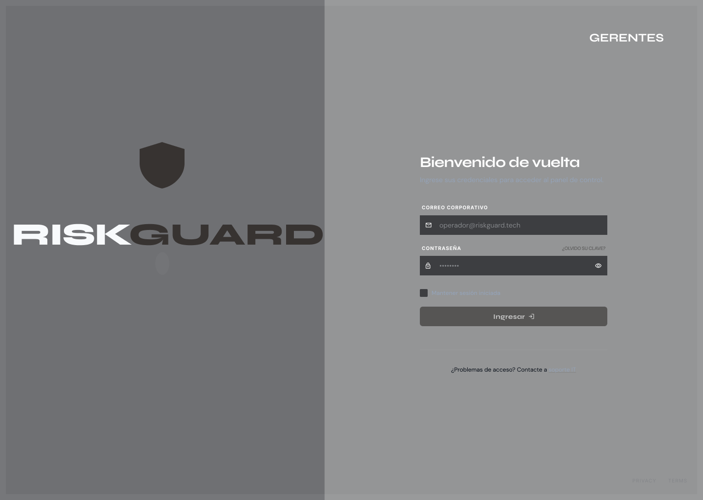

*Ilustración – Web Application Wireframe: Pantalla de Login*

La pantalla de autenticación es el punto de entrada único para todos los roles de usuario. El wireframe presenta un layout centrado de columna única con el logotipo de RiskGuard en la parte superior, seguido del formulario de credenciales compuesto por dos campos obligatorios (correo y contraseña) y el botón primario "Ingresar". Debajo del formulario se ubica el enlace de recuperación de contraseña. El wireframe especifica los estados de validación inline: borde rojo en el campo inválido y mensaje de error descriptivo debajo del campo afectado. Un indicador de intentos fallidos aparece de forma contextual tras el tercer intento consecutivo, alertando al usuario sobre el bloqueo automático a los cinco intentos.

#### Wireframes: Dashboard del Operario

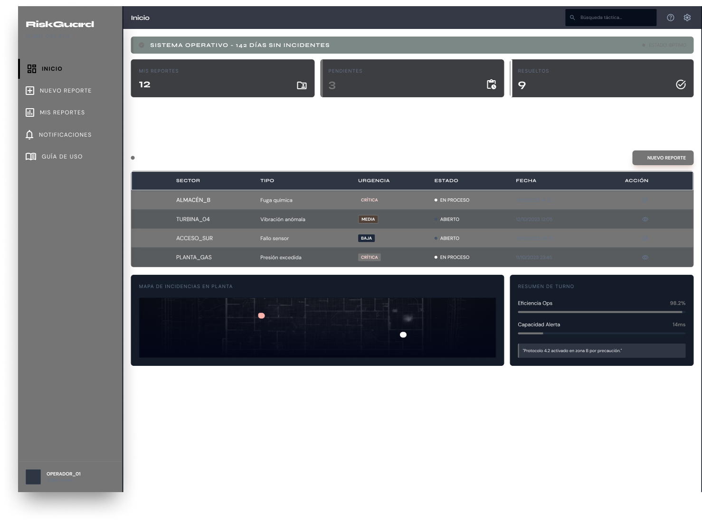

*Ilustración – Web Application Wireframe: Dashboard del Operario*

La pantalla principal del operario adopta una estructura de columna única dividida en tres bloques. El **bloque superior** presenta un resumen de alertas activas en el sector asignado, con una lista ordenada por nivel de urgencia (Alto, Medio, Bajo) diferenciadas mediante badges de color. Si no existen alertas activas, este bloque muestra el mensaje de estado seguro. El **bloque central** es el acceso directo al formulario de reporte rápido, representado como una tarjeta destacada con el botón "Nuevo Reporte" de gran tamaño para facilitar su uso desde dispositivos móviles en planta. El **bloque inferior** muestra el historial reciente de reportes enviados por el operario, con su número de ticket, estado actual y fecha.

#### Wireframes: Formulario de Reporte Rápido

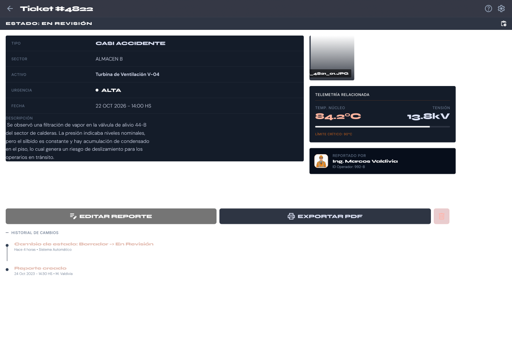

*Ilustración – Web Application Wireframe: Formulario de Reporte Rápido*

El formulario de reporte está diseñado para completarse en menos de 30 segundos. Presenta cuatro campos obligatorios en disposición vertical: selector de tipo de incidente (lista desplegable), selector de sector (lista filtrada), selector de nivel de urgencia (tres opciones visuales: Bajo, Medio, Alto) y campo de descripción en texto libre con contador de caracteres restantes. Debajo de los campos obligatorios se ubica el área opcional de adjuntar foto, representada como un botón secundario con ícono de cámara. La parte inferior del formulario muestra los botones "Cancelar" y "Enviar" con separación visual clara. El wireframe especifica el comportamiento de validación inline para cada campo y el estado de confirmación post-envío con el número de ticket asignado.

#### Wireframes: Dashboard del Supervisor

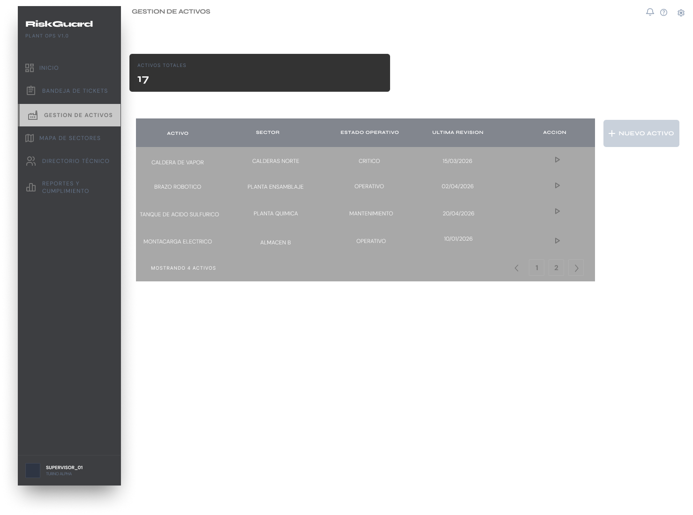

*Ilustración – Web Application Wireframe: Dashboard del Supervisor*

El dashboard del supervisor adopta la estructura de tres zonas funcionales. El área de contenido principal se organiza en dos filas. La **fila superior** presenta cuatro tarjetas KPI: tickets pendientes, tickets en progreso, alertas críticas activas y cumplimiento del plan de SST del día. La **fila inferior** se divide en dos columnas: la columna izquierda muestra el mapa de calor de la planta con los sectores representados como bloques con intensidad de color proporcional al nivel de riesgo acumulado, y la columna derecha muestra el panel de alertas activas con filtros por nivel de criticidad y sector. Cada alerta en el panel derecho incluye el tipo de riesgo, el sector, el tiempo transcurrido desde el reporte y los botones de acción disponibles.

#### Wireframes: Panel de Gestión de Tickets

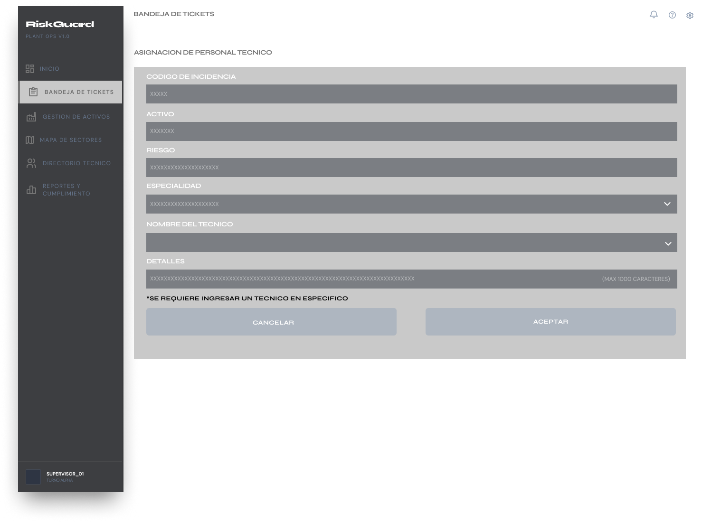

*Ilustración – Web Application Wireframe: Panel de Gestión de Tickets*

La pantalla de gestión de tickets presenta una tabla principal con las columnas: número de ticket, sector, tipo de incidente, nivel de criticidad (badge de color), técnico asignado, estado actual y tiempo transcurrido. El panel lateral izquierdo contiene los filtros: selector de sector, selector de estado (Pendiente, En Progreso, Medida Implementada, Cerrado), selector de nivel de criticidad y rango de fechas. El botón "Asignar técnico" se ubica en la columna de acciones de cada fila y despliega un drawer lateral con el selector de técnico disponible. El wireframe especifica el comportamiento del indicador de SLA: los tickets que superaron su tiempo máximo muestran una etiqueta de "SLA Incumplido" con borde de alerta visible en la fila correspondiente.

#### Wireframes: Detalle de Ticket

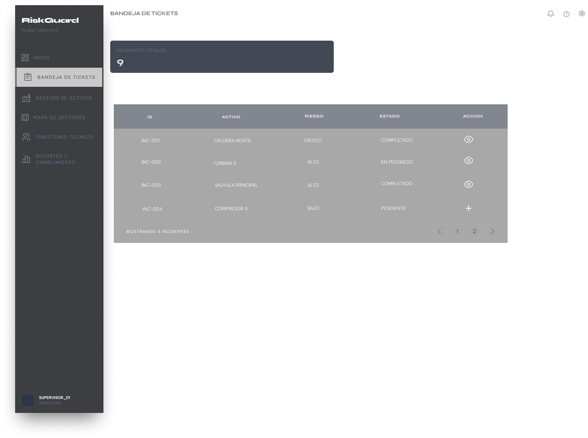

*Ilustración – Web Application Wireframe: Detalle de Ticket*

La pantalla de detalle de ticket presenta el historial completo del incidente en un layout de dos columnas. La columna izquierda (60% del ancho) muestra en orden cronológico descendente: los datos del reporte original (tipo, sector, activo vinculado, descripción y foto adjunta si existe), el historial de cambios de estado con fecha, hora y usuario responsable de cada cambio, y el campo de acción correctiva con su descripción. La columna derecha (40% del ancho) presenta el panel de estado actual con el nivel de criticidad calculado por el motor IPERC, el técnico asignado, el tiempo transcurrido y los botones de acción disponibles según el rol y el estado actual del ticket.

#### Wireframes: Dashboard Ejecutivo del Gerente

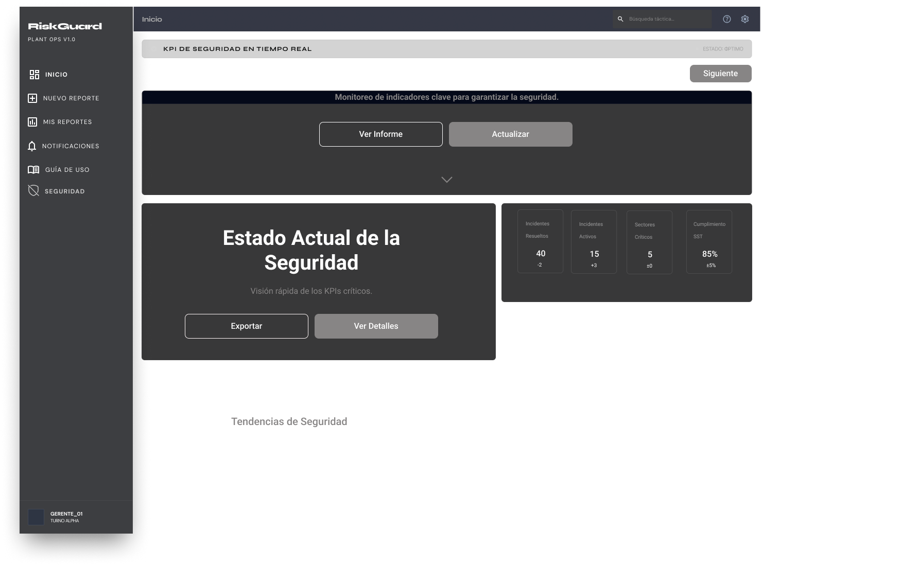

*Ilustración – Web Application Wireframe: Dashboard Ejecutivo del Gerente*

El dashboard ejecutivo adopta una grilla de cuatro columnas en la fila superior para los indicadores KPI principales: incidentes activos totales, incidentes resueltos en el mes, sectores en estado crítico y porcentaje de cumplimiento del plan anual de SST. Cada KPI presenta la cifra principal en tipografía de gran tamaño, una etiqueta descriptiva y un indicador de tendencia (flecha arriba/abajo respecto al período anterior). La fila central presenta el mapa de calor ejecutivo a pantalla completa con la distribución de riesgos por sector. La fila inferior muestra la gráfica de tendencias de accidentabilidad de los últimos 12 meses y el panel de indicadores predictivos con las zonas de atención prioritaria identificadas por el motor de reglas.

#### Wireframes: Módulo de Reportes y Auditoría

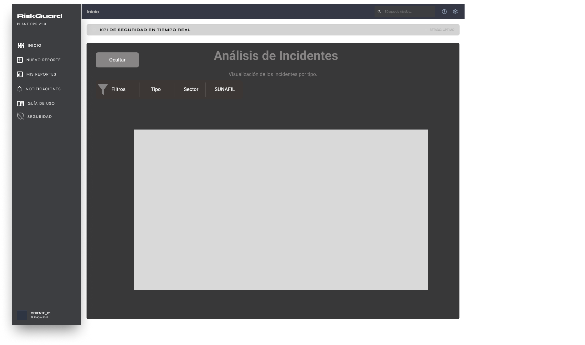

*Ilustración – Web Application Wireframe: Módulo de Reportes y Auditoría*

La pantalla de reportes presenta un panel de configuración en la parte superior con los parámetros de generación: selector de tipo de reporte (mensual, auditoría SUNAFIL, resumen ejecutivo), selector de rango de fechas, selector de sector (opcional) y selector de formato de salida (PDF o Excel). Debajo del panel de configuración se ubica el botón primario "Generar reporte". La sección inferior muestra el historial de reportes generados en formato de tabla con columnas de tipo, período, fecha de generación y botón de descarga.

#### Wireframes: Módulo de Configuración del Sistema

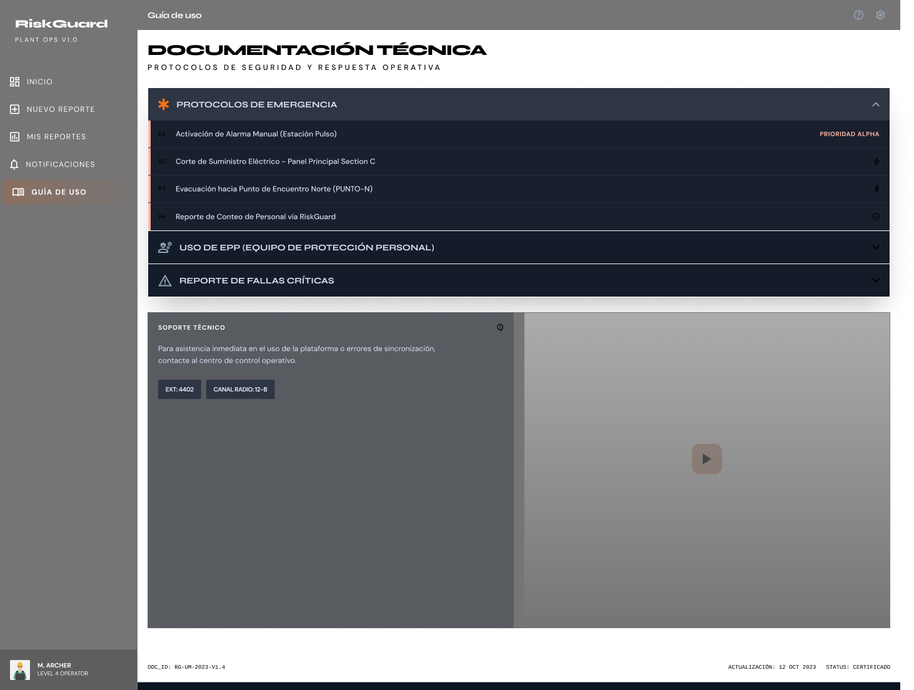

*Ilustración – Web Application Wireframe: Módulo de Configuración del Sistema*

La pantalla de configuración del sistema, accesible únicamente por el rol Administrador, presenta un layout de dos columnas. La columna izquierda muestra un menú de categorías de configuración: gestión de usuarios, sectores y áreas, activos industriales, personal técnico, niveles de riesgo, umbrales de alerta, reglas del motor predictivo y módulos del sistema. La columna derecha carga el formulario correspondiente a la categoría seleccionada. El wireframe especifica los patrones de validación, los estados de error y los modales de confirmación para operaciones destructivas como la desactivación de usuarios o la eliminación de sectores.

---

### 4.4.2. Web Applications Wireflow Diagrams

Los Wireflow Diagrams presentan de forma integrada las pantallas de la aplicación web junto con las rutas de navegación que el usuario sigue para alcanzar un objetivo específico. Cada Wireflow define un **User Goal** concreto, detalla las pantallas involucradas, las decisiones del usuario y las respuestas del sistema.

---

**Wireflow 1 – User Goal: Autenticarse e ingresar a la plataforma según rol**


*Ilustración – Web Application Wireflow Diagram: Autenticación por Rol*

**Descripción del flujo:** Cualquier usuario (operario, supervisor o gerente) accede a RiskGuard con sus credenciales preconfiguradas.

**Pantalla de Login:** El usuario ingresa correo y contraseña. Si las credenciales son válidas (US01, US31, US43, Scenario 1): el sistema valida el rol asignado y redirige a la vista principal correspondiente. Si las credenciales son incorrectas (Scenario 2): aparece el mensaje "Correo o contraseña incorrectos" y los campos quedan limpios. Si se acumulan 5 intentos fallidos consecutivos (Scenario 3): la cuenta se bloquea por 15 minutos y se muestra el mensaje de bloqueo temporal.

**Redirección por rol:** Un operario es redirigido a su dashboard con el formulario de reporte y las alertas de su sector. Un supervisor es redirigido al dashboard de monitoreo con el mapa de calor y el panel de tickets. Un gerente es redirigido al dashboard ejecutivo con los KPIs consolidados.

---

**Wireflow 2 – User Goal: Registrar un incidente y hacer seguimiento del reporte**


*Ilustración – Web Application Wireflow Diagram: Registro de Incidente*

**Descripción del flujo:** El operario detecta una condición insegura en planta y necesita registrarla en menos de 30 segundos desde su dispositivo.

**Dashboard del Operario:** El operario presiona el botón "Nuevo Reporte". El formulario de reporte rápido se despliega en la misma pantalla.

**Formulario de Reporte (US03 al US10):** El operario selecciona el tipo de incidente, el sector y el nivel de urgencia, e ingresa la descripción. Opcionalmente adjunta una foto. Si todos los campos obligatorios están completos (US10, Scenario 1): al presionar "Enviar" el sistema registra el ticket y muestra la confirmación con el número asignado. Si hay campos obligatorios vacíos (US03, Scenario 2): los campos inválidos quedan resaltados y el envío queda bloqueado. Si falla la conexión (US10, Scenario 2): el sistema conserva los datos e informa el error con opción de reintento.

**Seguimiento (US11, US12):** El operario puede consultar el estado de su reporte desde "Mis Reportes". Al cambiar el estado del ticket, el sistema envía una notificación al operario indicando el nuevo estado.

---

**Wireflow 3 – User Goal: Gestionar alertas activas y asignar acciones correctivas**


*Ilustración – Web Application Wireflow Diagram: Gestión de Alertas y Tickets*

**Descripción del flujo:** El supervisor detecta alertas activas en el dashboard y necesita asignar una acción correctiva a un técnico.

**Dashboard del Supervisor:** Al ingresar, el sistema carga el mapa de calor y el panel de alertas activas ordenadas por criticidad. El supervisor hace clic sobre una alerta crítica.

**Detalle de Ticket (US35):** El sistema carga el detalle completo del ticket. El supervisor revisa la descripción, la foto adjunta y el nivel de criticidad calculado por el motor IPERC. Presiona "Asignar técnico". Si selecciona un técnico activo y confirma (Scenario 1): el ticket pasa a estado "En Progreso" y se registra la asignación en el historial. Si intenta confirmar sin seleccionar técnico (Scenario 2): aparece el mensaje de validación y el botón permanece deshabilitado.

**Cierre del Ticket (US37):** Cuando el técnico marca la medida como implementada, el supervisor recibe una notificación y puede aprobar o rechazar. Si aprueba: el ticket pasa a "Cerrado" y el mapa de calor se actualiza. Si rechaza sin ingresar motivo (Scenario 3): el sistema bloquea la acción y solicita la justificación técnica.

---

**Wireflow 4 – User Goal: Monitorear patrones de riesgo y actuar ante escalamientos**


*Ilustración – Web Application Wireflow Diagram: Monitoreo Predictivo y Escalamiento*

**Descripción del flujo:** El supervisor utiliza el dashboard predictivo para detectar patrones recurrentes y recibe alertas de escalamiento ante SLA incumplidos.

**Panel de Patrones (US18, US21):** El supervisor accede al panel de patrones de riesgo. Aplica el filtro por tipo de peligro. Si existen patrones recurrentes (Scenario 1): el sistema muestra las alertas de patrón con el tipo de riesgo, sector, número de ocurrencias y fecha de primera ocurrencia en el período. Si no existen patrones para el tipo seleccionado (Scenario 2): el sistema muestra el mensaje informativo correspondiente.

**Alerta de SLA Incumplido (US40):** Cuando un ticket crítico supera su tiempo máximo sin cerrarse, el sistema marca el ticket con la etiqueta "SLA Incumplido" y envía una notificación de escalamiento al gerente. El supervisor puede acceder al ticket desde la notificación y ejecutar la reasignación.

---


### 4.4.3. Web Applications Mock-ups

Esta sección presenta los mock-ups de alta fidelidad de la aplicación web de RiskGuard. Los mock-ups reflejan el diseño visual final de cada pantalla, aplicando el Design System del proyecto: paleta de colores institucional (`#0A0C0F`, `#FF5B00`, `#1A1E24`, `#00C97B`, `#FF3B30`), tipografía Geist, componentes, espaciado e iconografía definidos en la sección 4.1.

#### Pantalla de Login

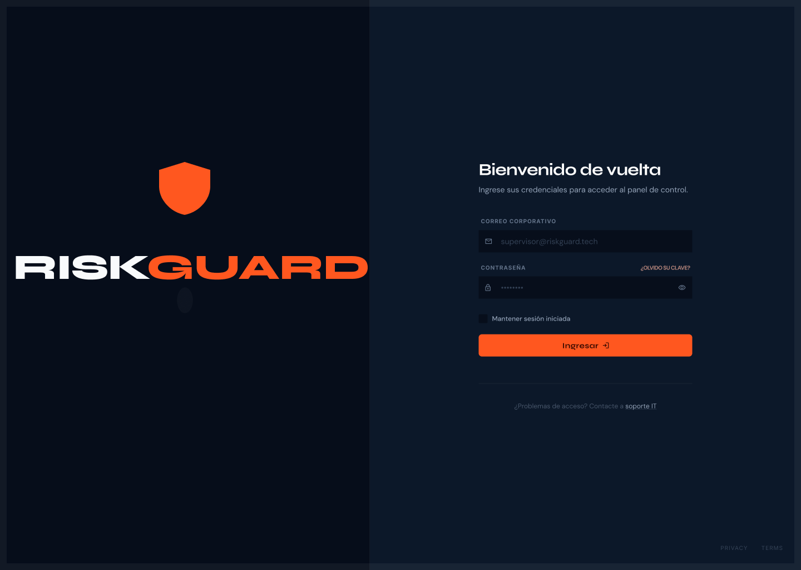

*Ilustración – Web Application Mock-up: Pantalla de Login*

La pantalla de autenticación aplica el fondo oscuro profundo `#0A0C0F` con el logotipo de RiskGuard centrado en la parte superior. El formulario de credenciales usa inputs con fondo `#1A1E24`, borde `#2A2F38` y texto blanco, con estado focus en borde naranja `#FF5B00`. El botón "Ingresar" aplica el naranja primario `#FF5B00` como fondo con texto blanco en Geist SemiBold. Los mensajes de error se presentan en rojo `#FF3B30` debajo del campo correspondiente, manteniendo consistencia con el sistema de estados definido en las style guidelines.

#### Dashboard del Operario

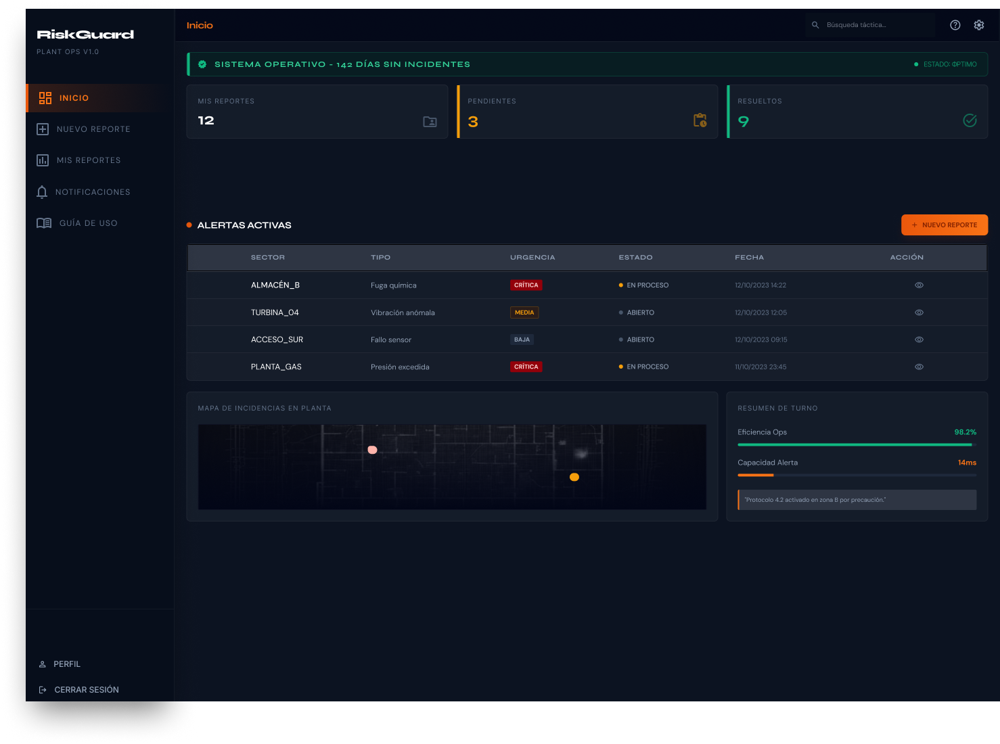

*Ilustración – Web Application Mock-up: Dashboard del Operario*

El dashboard del operario presenta el panel de alertas activas del sector con badges de color codificado: rojo `#FF3B30` para alertas críticas, naranja `#FF5B00` para nivel medio y verde `#00C97B` para bajo. El botón "Nuevo Reporte" adopta el naranja primario como color de fondo con tipografía bold de gran tamaño, maximizando su visibilidad en condiciones de uso en planta. El historial de reportes recientes usa tarjetas con fondo `#1A1E24` y borde `#2A2F38`, con el estado del ticket resaltado mediante el badge de color correspondiente.

#### Formulario de Reporte Rápido

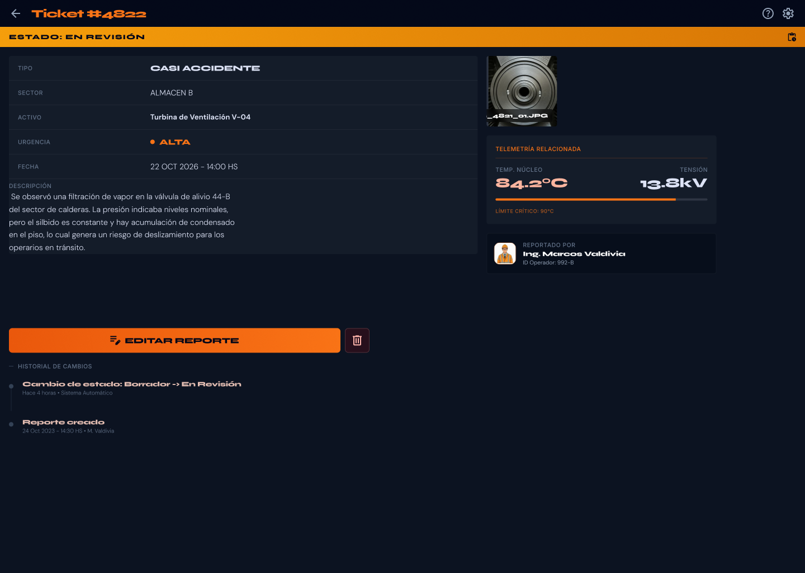

*Ilustración – Web Application Mock-up: Formulario de Reporte Rápido*

El formulario de reporte aplica el Design System completo sobre fondo `#111418`. Los selectores de tipo de incidente y sector usan el componente dropdown con fondo `#1A1E24` y borde de enfoque naranja. Los tres niveles de urgencia se presentan como botones de selección exclusiva con colores de estado diferenciados: verde `#00C97B` para Bajo, naranja `#FF5B00` para Medio y rojo `#FF3B30` para Alto. El área de adjuntar foto es un botón secundario con borde naranja tenue y texto naranja. El contador de caracteres del campo de descripción usa el color gris secundario `#8A8F9A` y cambia a naranja al aproximarse al límite.

#### Dashboard del Supervisor

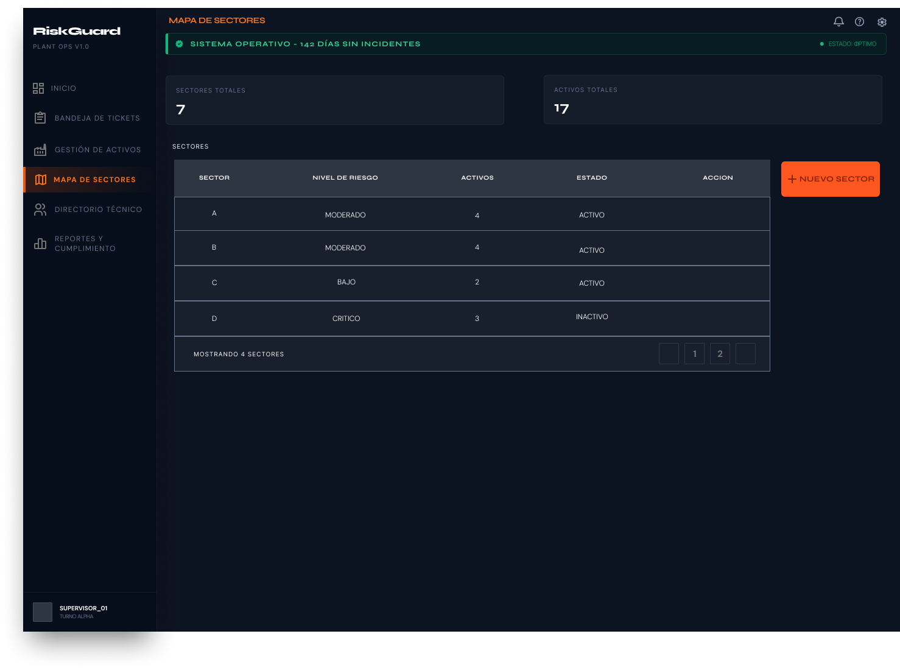

*Ilustración – Web Application Mock-up: Dashboard del Supervisor*

El dashboard del supervisor aplica la paleta oscura del sistema con el mapa de calor como elemento visual central. Los sectores de la planta se representan como bloques rectangulares con intensidad de color proporcional al nivel de riesgo acumulado: desde el gris oscuro `#1A1E24` para sectores sin riesgo hasta el rojo intenso `#FF3B30` para sectores en estado crítico, pasando por naranja `#FF5B00` para nivel alto y amarillo para nivel medio. Las cuatro tarjetas KPI en la fila superior usan el borde izquierdo de color como indicador de estado: verde para valores dentro de parámetros normales y rojo para indicadores críticos.

#### Panel de Gestión de Tickets

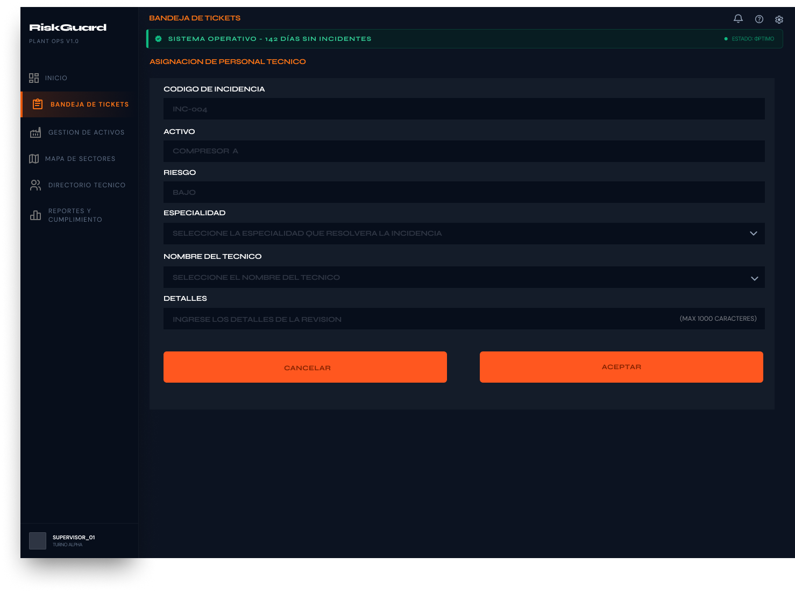

*Ilustración – Web Application Mock-up: Panel de Gestión de Tickets*

La tabla de tickets aplica filas con fondo `#111418` y fondo alterno `#1A1E24` para facilitar la lectura horizontal. Los badges de criticidad usan el color de estado del sistema: Crítico en rojo, Alto en naranja, Medio en amarillo y Bajo en verde. Los tickets con SLA incumplido muestran una etiqueta de alerta en rojo `#FF3B30` en la columna de estado, diferenciándose visualmente de manera inmediata del resto de los tickets. El panel lateral de filtros usa el mismo fondo `#111418` con selectores del Design System.

#### Detalle de Ticket

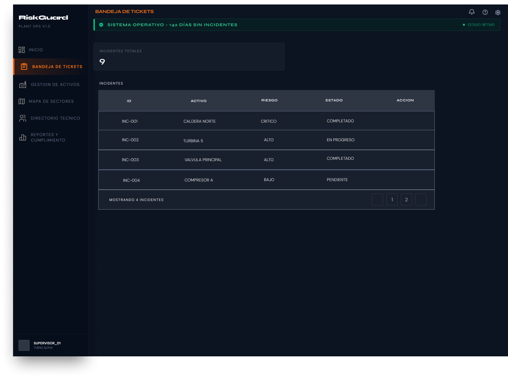

*Ilustración – Web Application Mock-up: Detalle de Ticket*

La pantalla de detalle de ticket aplica el layout de dos columnas sobre fondo `#0A0C0F`. La columna izquierda presenta la foto adjunta (si existe) en un contenedor con border-radius de 12 px y borde `#2A2F38`, seguida de la descripción del incidente en texto gris `#8A8F9A` y el historial de cambios de estado en una línea de tiempo vertical con puntos de color según el estado correspondiente. La columna derecha muestra el nivel de criticidad IPERC en una tarjeta con fondo `#1A1E24` y el indicador de color del nivel en el borde superior. El botón "Asignar técnico" aplica el naranja primario y ocupa el ancho completo de la columna para garantizar visibilidad.

#### Dashboard Ejecutivo del Gerente

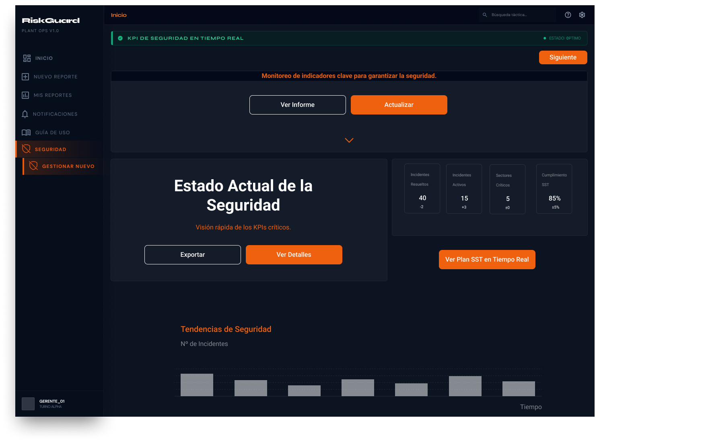

*Ilustración – Web Application Mock-up: Dashboard Ejecutivo del Gerente*

El dashboard ejecutivo aplica la misma paleta oscura con énfasis en los indicadores predictivos. Las cuatro tarjetas KPI de la fila superior usan cifras en tipografía Geist Bold de 48 px en blanco sobre fondo `#1A1E24`, con el indicador de tendencia en verde `#00C97B` para mejora y rojo `#FF3B30` para deterioro. La gráfica de tendencias de accidentabilidad usa líneas de color diferenciadas por tipo de incidente sobre un fondo de grilla sutil en `#2A2F38`. El panel de indicadores predictivos destaca las zonas de atención prioritaria con un badge naranja "ATENCIÓN PRIORITARIA" en tipografía uppercase de 10 px.

#### Módulo de Reportes y Auditoría

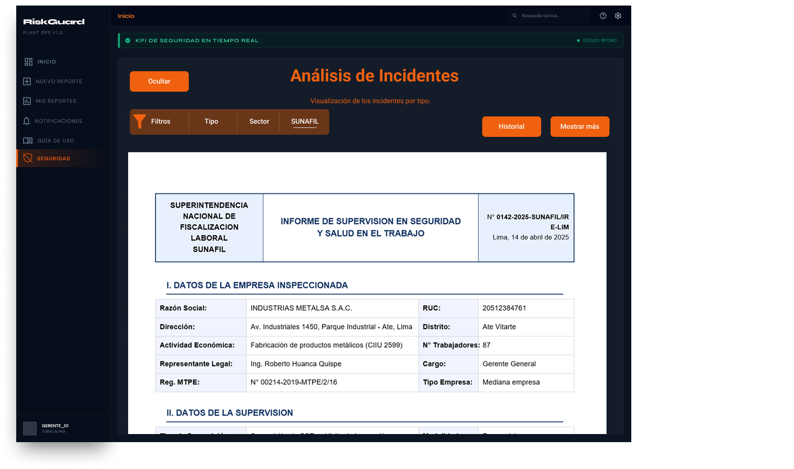

*Ilustración – Web Application Mock-up: Módulo de Reportes y Auditoría*

El módulo de reportes aplica el Design System en el panel de configuración con selectores, inputs de fecha y radio buttons de formato de salida estilizados con el naranja primario como color de selección activa. El historial de reportes generados usa una tabla con filas alternas y badges de tipo de reporte diferenciados por color. El botón "Generar reporte" ocupa el ancho completo del panel de configuración con el naranja primario como fondo, garantizando su visibilidad como la acción principal de la pantalla.

---

### 4.4.4. Web Applications User Flow Diagrams

Esta sección presenta los User Flow Diagrams de la aplicación web de RiskGuard. A diferencia de los Wireflows, los User Flows incluyen los mock-ups de las pantallas junto con los nodos de decisión, condiciones y rutas alternativas que conforman el flujo completo de cada objetivo de usuario.

---

**User Flow 1 – Registro y seguimiento de incidente por el Operario**

*User Goal: El operario desea registrar una condición insegura y confirmar que fue atendida.*


*Ilustración – Web Application User Flow Diagram: Registro y Seguimiento de Incidente*

**Happy Path:**
Dashboard Operario → Clic "Nuevo Reporte" → Formulario desplegado → Completa tipo, sector, urgencia y descripción → Clic "Enviar" → Confirmación con número de ticket → Regresa al dashboard → Recibe notificación cuando el supervisor cambia el estado → Consulta detalle desde "Mis Reportes".

**Unhappy Paths:**
- Campos obligatorios vacíos (US03, Scenario 2): campos resaltados en rojo → botón "Enviar" bloqueado.
- Error de conexión al enviar (US10, Scenario 2): mensaje de error con opción "Reintentar" → datos conservados.
- Foto supera 5 MB (US04, Scenario 2): sistema rechaza el archivo y muestra el límite de tamaño → operario puede seleccionar otra imagen o enviar sin foto.

---

**User Flow 2 – Gestión de tickets y cierre de acciones correctivas por el Supervisor**

*User Goal: El supervisor desea asignar una acción correctiva y verificar su implementación hasta el cierre del ticket.*


*Ilustración – Web Application User Flow Diagram: Gestión de Tickets y Cierre*

**Happy Path:**
Dashboard Supervisor → Panel de alertas activas → Clic sobre alerta crítica → Detalle del ticket → Clic "Asignar técnico" → Selector de técnico activo → Confirmar → Ticket pasa a "En Progreso" → Técnico implementa la medida → Supervisor recibe notificación → Accede al detalle → Aprueba la medida → Ticket pasa a "Cerrado" → Mapa de calor se actualiza → Operario recibe notificación de resolución.

**Unhappy Paths:**
- Intento de asignar sin seleccionar técnico (US35, Scenario 2): mensaje de validación → botón deshabilitado.
- Rechazo de medida sin justificación (US37, Scenario 3): sistema bloquea el rechazo → campo de motivo resaltado en rojo.
- Ticket supera SLA sin cerrarse (US40, Scenario 1): etiqueta "SLA Incumplido" aparece en la fila → notificación enviada al gerente.

---

**User Flow 3 – Visualización del dashboard ejecutivo y exportación de reporte**

*User Goal: El gerente desea revisar los indicadores predictivos de la planta y exportar el reporte mensual para el directorio.*


*Ilustración – Web Application User Flow Diagram: Dashboard Ejecutivo y Exportación*

**Happy Path:**
Login Gerente → Dashboard Ejecutivo → Revisión de KPIs → Clic en indicador de "Sectores en estado crítico" → Detalle de sectores con alertas → Regresa al dashboard → Accede a sección de tendencias → Filtra por sector → Exporta gráfica en PNG → Navega a Módulo de Reportes → Selecciona tipo "Reporte mensual" → Elige período → Clic "Generar reporte" → PDF descargado automáticamente.

**Unhappy Paths:**
- Período sin datos suficientes (US52, Scenario 2): mensaje "No hay datos registrados para el período seleccionado" → no se genera archivo.
- Fecha de inicio posterior a fecha de fin (TS55, Scenario 3): error de validación de rango → generación bloqueada.
- Indicadores predictivos sin tendencias crecientes (US48, Scenario 2): mensaje informativo "No se detectaron tendencias de riesgo creciente en el período consultado".

---

**User Flow 4 – Gestión de sectores, activos y personal técnico predictivo**

*User Goal: El supervisor desea configurar la estructura de la planta para que los operarios puedan georreferenciar correctamente sus reportes.*


*Ilustración – Web Application User Flow Diagram: Configuración de Sectores y Activos*

**Happy Path:**
Login Supervisor → Módulo de Configuración → Categoría "Sectores" → Clic "Nuevo Sector" → Completa nombre y descripción → Guardar → Sector aparece en la lista como "Activo" → Navega a categoría "Activos" → Clic "Nuevo Activo" → Selecciona sector creado → Completa datos del activo → Guardar → Activo aparece vinculado al sector.

**Unhappy Paths:**
- Nombre de sector duplicado (US32, Scenario 2): sistema bloquea la creación → mensaje "El nombre del área ya existe".
- Intento de registrar activo en sector inactivo (US33, Scenario 2): sistema rechaza la operación → mensaje de error de validación.
- Desactivación de sector con historial (US32, Scenario 3): sistema cambia estado a "Inactivo" preservando los datos históricos → sector desaparece de los formularios de los operarios.

---

## 4.5. Web Applications Prototyping

### Introducción y criterios de diseño

El prototipo interactivo de RiskGuard simula la navegación y los principales flujos de interacción de la aplicación web, permitiendo evaluar la coherencia de la experiencia de usuario antes del desarrollo, identificar puntos de fricción y validar las decisiones de arquitectura de información tomadas a lo largo del capítulo 4. El prototipo fue construido en Figma utilizando conexiones de prototipado entre frames, transiciones y overlays para representar de forma fiel los comportamientos especificados en los User Flow Diagrams.

Los criterios de diseño que guiaron las decisiones de interacción y navegación del prototipo son los siguientes:

**Orientación al rol y al flujo operativo de urgencia:** La arquitectura de navegación prioriza el acceso inmediato a las tareas de mayor frecuencia e importancia definidas en el User Task Matrix del capítulo 2. Para el operario, el botón "Nuevo Reporte" es el elemento más prominente de su pantalla principal. Para el supervisor, el mapa de calor y el panel de alertas activas son los primeros elementos visibles al iniciar sesión. Para el gerente, el dashboard ejecutivo con los KPIs consolidados carga como vista inicial sin necesidad de pasos adicionales.

**Consistencia en los patrones de interacción:** Se emplearon cuatro patrones de navegación a lo largo de toda la aplicación: (1) **Navegación por Sidebar** para el cambio entre módulos principales según el rol activo; (2) **Drawer lateral deslizante** para formularios de creación y edición que no requieren cambio de contexto (asignación de técnico, creación de sectores, registro de activos); (3) **Modal central** para acciones críticas que requieren confirmación del usuario (cierre de ticket, desactivación de usuario, restauración de configuración); y (4) **Toast / Snackbar** para retroalimentación inmediata de resultado sin interrumpir el flujo operativo. Esta consistencia reduce la carga cognitiva del usuario, ya que los patrones aprendidos en un módulo son directamente aplicables a los demás.

**Prevención de errores en acciones de alto impacto:** En operaciones con consecuencias irreversibles o de alto impacto operativo como cerrar un ticket, escalar una alerta, desactivar un usuario o restaurar la configuración por defecto, el prototipo incluye una capa adicional de confirmación mediante modal que describe el impacto de la acción antes de ejecutarla. Esto es especialmente crítico en el contexto de RiskGuard, donde una acción incorrecta puede afectar la trazabilidad de un incidente real.

**Retroalimentación inmediata en tiempo real:** Todos los cambios en el estado del sistema que afectan al usuario se comunican de forma inmediata: el mapa de calor se actualiza al registrarse o resolverse un incidente, el contador de notificaciones no leídas se actualiza al recibir una nueva alerta, y los campos de formulario muestran validación inline sin necesidad de enviar el formulario completo.

**Accesibilidad y objetivos táctiles:** Todos los elementos interactivos del prototipo tienen dimensiones mínimas de 48 × 48 px para cumplir los requisitos de objetivo táctil, especialmente relevantes para operarios que interactúan con la aplicación desde dispositivos móviles en entornos industriales con guantes de trabajo. Los contrastes de color en todos los estados cumplen el mínimo WCAG 2.1 AA.

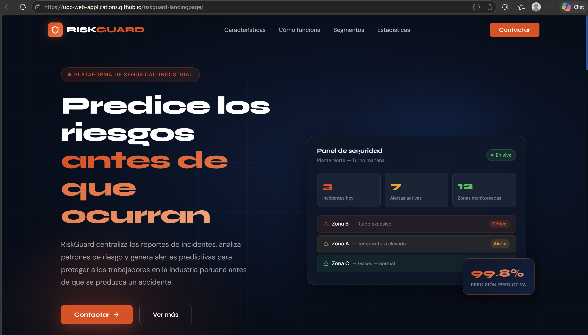

*Ilustración – Web Application Prototyping: Vista general del flujo de navegación*

### Flujos de interacción cubiertos por el prototipo

El prototipo cubre los siguientes flujos principales de interacción, representando tanto las rutas exitosas como las principales rutas alternativas ante errores o condiciones de excepción:

**Flujo 1 – Registro de incidente por operario:** Comprende la pantalla principal del operario, el formulario de reporte rápido con validación inline de campos, la selección de nivel de urgencia con indicadores de color, la adjunción de foto con previsualización, la confirmación post-envío con número de ticket y la pantalla de historial de reportes con filtros por estado.

**Flujo 2 – Gestión de alertas y tickets por supervisor:** Comprende el dashboard del supervisor con el mapa de calor interactivo, el panel de alertas activas con filtros aplicables, el detalle de ticket con el historial completo, el drawer de asignación de técnico, el flujo de aprobación y rechazo de medidas correctivas y la actualización del mapa de calor post-cierre.

**Flujo 3 – Monitoreo predictivo y escalamiento:** Comprende el panel de patrones de riesgo recurrentes con filtros por tipo de peligro, la visualización del mapa de calor con selector de detalle por sector, las notificaciones de SLA incumplido y el flujo de escalamiento hacia gerencia.

**Flujo 4 – Dashboard ejecutivo y reportes:** Comprende el dashboard ejecutivo del gerente con los KPIs interactivos, la gráfica de tendencias filtrable por sector, el panel de indicadores predictivos, el módulo de exportación de reportes de auditoría compatible con la Ley N° 29783 y la generación del reporte mensual de gestión de SST.

**Flujo 5 – Configuración del sistema:** Comprende el módulo de gestión de usuarios con los flujos de creación y desactivación de cuentas, la configuración de sectores y activos industriales, la gestión del personal técnico y la configuración de parámetros del motor predictivo.

---

## 4.6. Domain-Driven Software Architecture

En esta sección se elaboró el diseño de los Bounded Contexts (BC) y sus conexiones dentro del sistema RiskGuard, basado en el proceso de Event Storming documentado en el capítulo 2.


### 4.6.1. Design-Level Event Storming

A continuación, se presentan los distintos Bounded Contexts identificados a partir del Event Storming de RiskGuard, junto con sus respectivos diagramas y BC Canvas.

#### Generación y Autenticación de Cuenta BC
<p align="center">
  
</p>

<p align="center">
  
</p>

Este Bounded Context gestiona la creación de cuentas de usuario y el control de acceso a la plataforma. El flujo contempla el registro de nuevos usuarios mediante correo electrónico vinculado a través del servicio de email, así como métodos de autenticación alternativos vía GoogleOAuth. Las reglas de negocio establecen que se permite autenticación con proveedores externos, que el sistema debe ofrecer recuperación de contraseña y que las sesiones deben gestionarse de forma segura mediante tokens temporales. Como salida, se actualizan los datos de usuario en MySQL, se notifica al BC de Perfil y Configuración, y se muestra el panel principal al usuario autenticado en el frontend.

---

#### Sede / Área y Activo Industrial BC

<p align="center">
  
</p>

<p align="center">
  
</p>

Este Bounded Context gestiona la configuración de las sedes, sectores físicos y activos industriales (máquinas y equipos) registrados en la plataforma. El flujo incluye la activación e inactivación de sectores, el traslado de activos entre zonas y la preservación del historial mediante baja lógica. Es un contexto de soporte esencial para los módulos de inspección y mitigación, ya que provee la lista de sectores activos y los activos disponibles por sector.

---

#### Inspección / Condición Insegura BC
<p align="center">
  
</p>

<p align="center">
  
</p>

Este Bounded Context gestiona el registro de incidentes, casi-accidentes y condiciones inseguras reportados principalmente por operarios desde dispositivos móviles. El flujo comienza con el envío de un nuevo reporte (con foto adjunta como evidencia), que genera automáticamente un ticket con número único. Se aplican reglas de negocio orientadas a la agilidad: máximo 4 campos obligatorios, registro automático de fecha, hora y usuario, y almacenamiento local si falla la conexión. Al concluir, se notifica al operario y se envía el ticket al BC de Evaluación de Riesgo.

---

#### Evaluación de Riesgo (IPERC) BC
<p align="center">
  
</p>

<p align="center">
  
</p>

Este Bounded Context aplica la metodología IPERC (Identificación de Peligros y Evaluación de Riesgos y Controles) sobre cada ticket recibido desde el BC de Inspección. El motor predictivo calcula automáticamente el nivel de criticidad (Bajo, Medio, Alto o Crítico) a partir de índices de probabilidad y severidad. Cuando el mismo tipo de riesgo se detecta más de 3 veces en 30 días, se identifica un patrón recurrente y se genera una alerta de patrón. Un nivel crítico activa una notificación inmediata. Como salida, se actualizan el mapa de calor y se notifica al BC de Mitigación y al BC Dashboard.

---

#### Mitigación BC
<p align="center">
  
</p>

<p align="center">
  
</p>

Este Bounded Context gestiona la asignación y seguimiento de acciones correctivas sobre los tickets clasificados por el motor de riesgo. El supervisor asigna un técnico de mantenimiento y define una medida de control; el SLA se determina automáticamente según el nivel de criticidad del ticket. Si el ticket supera su tiempo máximo sin cerrarse, se genera un escalamiento automático hacia roles gerenciales. El sistema puede apoyarse en un sistema de IA externo para generar instrucciones de mitigación complejas. Como salida, se producen el ticket cerrado, la alerta escalada y la actualización del área segura hacia el BC Dashboard y el BC Reportes.

---

#### Monitoreo / Dashboard BC

<p align="center">
  
</p>

<p align="center">
  
</p>

Este Bounded Context centraliza la visualización en tiempo real del estado de seguridad de la planta. Recibe alertas de patrón desde el BC de Evaluación de Riesgo y tickets cerrados desde el BC de Mitigación, y los consolida en un dashboard con mapa de calor por zona, alertas activas ordenadas por urgencia y resumen diario de KPIs. Un activo en mantenimiento preventivo activo no genera alertas en este contexto. Como salida, el dashboard renderizado se envía al frontend, y puede generar tickets preventivos hacia el BC de Mitigación.

---

#### Reportes / Cumplimiento BC

<p align="center">
  
</p>

<p align="center">
  
</p>

Este Bounded Context genera los reportes gerenciales, indicadores de cumplimiento del plan anual de SST y documentos de auditoría compatibles con los formatos referenciales de la Ley N° 29783 para inspecciones de SUNAFIL. Recibe alertas escaladas del BC de Mitigación, historial de incidentes de MySQL y gráficas de tendencia generadas con Google Charts. Un sistema de IA externo apoya el cálculo de KPIs predictivos. Como salida produce el reporte gerencial, el KPI calculado y el reporte archivado, accesibles desde el frontend y el BC Reportes.

---

#### Unión de Bounded Contexts

<p align="center">
  
</p>

Este diagrama muestra la integración y comunicación entre todos los Bounded Contexts de RiskGuard, evidenciando el flujo completo desde el registro de un incidente por parte de un operario hasta la generación de reportes ejecutivos para gerencia, pasando por la evaluación de riesgo automática, la mitigación supervisada y el monitoreo en tiempo real.

---

### 4.6.2. Software Architecture Context Diagram
A continuación, se presenta el System Context Diagram del sistema RiskGuard. En este diagrama se identifican los actores principales: Administrador/Gerente, Operario y Supervisor, quienes interactúan con la plataforma para administrar, reportar incidentes y supervisar riesgos. Asimismo, se muestran los sistemas externos que se integran con la solución, tales como Gmail (servicio de correo electrónico), Almacenamiento S3 (para guardar evidencias y reportes), Sistema de Notificaciones (para notificaciones internas y alertas) y WebSocket Server (para comunicación en tiempo real).

<p align="center">
  
</p>

### 4.6.3. Software Architecture Container Diagrams
A continuación, se presenta el Container Diagram del sistema RiskGuard. Este diagrama describe la arquitectura interna a nivel de contenedores, mostrando los principales componentes desplegables: el API Gateway (Node.js) como punto de entrada único, siete Bounded Contexts implementados como servicios independientes , sus respectivas bases de datos PostgreSQL (y TimescaleDB para métricas), y los sistemas externos con los que se integra (Gmail, Almacenamiento S3, Sistema de Notificaciones y WebSocket Server). Las flechas indican el flujo de comunicación entre usuarios, API Gateway, BCs, bases de datos y sistemas externos, permitiendo visualizar la distribución de responsabilidades y la estructura general del sistema.

.png?raw=true)

### 4.6.4. Software Architecture Components Diagrams

A continuación, se presenta el Diagrama de Componentes para cada uno de los siete Bounded Contexts del sistema RiskGuard. Cada diagrama muestra la estructura interna del contenedor, incluyendo el Controller, el Command Side (Command Facade y comandos concretos), el Query Side (Query Service y queries concretas), los Repositories, las Databases y los External Services con los que se integra.

<p align="center">Usuario y Autenticación de Cuenta BC</p>
<p align="center">
  
</p>

.png?raw=true)

Este Bounded Context es responsable de la gestión de identidad del usuario dentro del sistema, abarcando tanto el registro como la autenticación. Para ello, integra un servicio externo de correo (Gmail) para el envío de notificaciones de bienvenida, recuperación de contraseña y alertas de bloqueo. A nivel funcional, incluye queries orientados a la validación de token JWT, verificación de roles, consulta de estado de cuenta y conteo de intentos fallidos; y commands destinados a la creación de cuentas, actualización de perfil, cambio de contraseña, bloqueo, desbloqueo y desactivación de cuentas. Finalmente, la información es persistida en bases de datos PostgreSQL de usuarios, sesiones y auditoría, garantizando la consistencia y seguridad de los datos.

<p align="center">Sede / Área y Activo industrial BC</p>
<p align="center">
  
</p>

.png?raw=true)

Este Bounded Context es responsable de la gestión de la estructura organizacional y los activos industriales dentro del sistema. Para ello, integra un servicio externo de notificaciones para alertar sobre cambios de estado y traslados de activos. A nivel funcional, incluye queries orientados a listar sectores activos, validar nombres duplicados, obtener activos por sector y verificar historial de riesgos; y commands destinados a la creación, edición, activación y desactivación de sectores, así como el registro, actualización, traslado, baja, mantenimiento y reactivación de activos industriales. Finalmente, la información es persistida en bases de datos PostgreSQL de sectores, activos e historial de ubicaciones.

<p align="center">Inspección / Condición Insegura BC</p>
<p align="center">
  
</p>

.png?raw=true)

Este Bounded Context es responsable de la gestión de incidentes y condiciones inseguras reportadas en el entorno laboral. Para ello, integra un servicio externo de almacenamiento S3 para guardar evidencias fotográficas y el sistema de notificaciones para alertar sobre nuevos reportes. A nivel funcional, incluye queries orientados a obtener reportes por ID, sector, estado y nivel de urgencia, así como consultar notificaciones por usuario y evidencias por reporte; y commands destinados a la creación, actualización de estado y cancelación de reportes, gestión de formularios de inspección, evaluación de condiciones inseguras, envío de notificaciones y subida de evidencias. Finalmente, la información es persistida en bases de datos PostgreSQL de incidentes, formularios, notificaciones y evidencias.

<p align="center">Evaluación de Riesgo BC</p>

<p align="center">
  
</p>

.png?raw=true)

Este Bounded Context es responsable del cálculo y análisis de riesgos mediante la metodología IPERC. Para ello, integra el sistema de notificaciones para alertar sobre patrones de riesgo recurrentes detectados. A nivel funcional, incluye queries orientados a obtener matrices IPERC por ID y sector, consultar patrones de riesgo por sector, obtener niveles de criticidad por área y listar alertas pendientes; y commands destinados al cálculo y validación de matrices IPERC, detección de patrones de recurrencia, actualización de niveles de criticidad por área, generación de resúmenes diarios y creación de alertas de patrones. Finalmente, la información es persistida en bases de datos PostgreSQL de matrices, patrones, niveles por área, resúmenes y alertas de riesgo.

<p align="center">Mitigación BC</p>
<p align="center">
  
</p>

.png?raw=true)

Este Bounded Context es responsable de la gestión de acciones correctivas y tickets de mitigación. Para ello, integra Gmail para el envío de notificaciones de tickets asignados y el sistema de notificaciones para alertas internas de escalamiento. A nivel funcional, incluye queries orientados a obtener tickets por ID, estado y sector, listar acciones pendientes y verificaciones por acción, así como consultar acciones asignadas por usuario; y commands destinados a la creación, asignación, actualización de estado, escalamiento y cierre de tickets, gestión de acciones correctivas, creación y aprobación de verificaciones, y asignación de acciones a usuarios. Finalmente, la información es persistida en bases de datos PostgreSQL de tickets, verificaciones, acciones asignadas y acciones correctivas.

<p align="center">Monitoreo y Dashboard BC</p>
<p align="center">
  <a href="https://postimg.cc/bDJyz295">
    
  </a>
</p>

.png?raw=true)

Este Bounded Context es responsable de la visualización en tiempo real de métricas y alertas del sistema. Para ello, integra un servidor WebSocket para comunicación en tiempo real y Gmail para el envío de alertas críticas por correo. A nivel funcional, incluye queries orientados a obtener alertas por nivel de urgencia, heatmaps por sector, dashboards por usuario, métricas globales y por sector, widgets por dashboard y notificaciones pendientes; y commands destinados a la creación, actualización y resolución de alertas, generación y actualización de mapas de calor, gestión de dashboards y widgets, cálculo de métricas de riesgo y envío de notificaciones. Finalmente, la información es persistida en bases de datos de alertas, heatmaps, dashboards, widgets, notificaciones y métricas (TimescaleDB).

<p align="center">Reportes y Cumplimiento BC</p>
<p align="center">
  
</p>

.png?raw=true)
Este Bounded Context es responsable de la generación de reportes ejecutivos e indicadores de cumplimiento. Para ello, integra Gmail para el envío de reportes programados y Almacenamiento S3 para la exportación y guardado de reportes generados. A nivel funcional, incluye queries orientados a obtener reportes por rango de fechas, cumplimiento por sector y global, tendencias de cumplimiento, datos históricos y comparación de períodos; y commands destinados a la generación, programación y exportación de reportes ejecutivos, cálculo de indicadores de cumplimiento, análisis histórico, comparación de períodos, registro de auditoría de accesos, verificación de integridad y envío de alertas de cumplimiento. Finalmente, la información es persistida en bases de datos PostgreSQL de reportes, cumplimiento, auditoría, históricos y alertas.

## 4.7. Software Object-Oriented Design

### 4.7.1. Class Diagrams

<p align="center">Usuario y Autenticación de Cuenta BC</p>
<p align="center"></p>

<p align="center">Sede / Área y Activo industrial BC</p>
<p align="center"></p>

<p align="center">Inspección / Condición Insegura BC</p>
<p align="center"></p>

<p align="center">Evaluación de Riesgo BC</p>
<p align="center"></p>

<p align="center">Mitigación BC</p>
<p align="center"></p>

<p align="center">Monitoreo y Dashboard BC</p>
<p align="center"></p>

<p align="center">Reportes y Cumplimiento BC</p>
<p align="center"></p>


## 4.8. Database Design

### 4.8.1. Database Diagrams
En esta seccion se muestran los diagramas de de base de datos por cada Bounded Context. En estos diagramas se pueden evidenciar tanto las tablas, columnas, constraints y relaciones entre si por cada bounded context
<div align="center">
    
  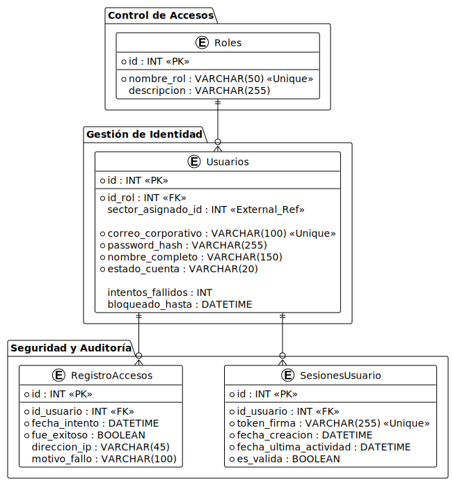
  <p>Diagrama de base de datos BC 1</p>
</div>


<div align="center">
    
  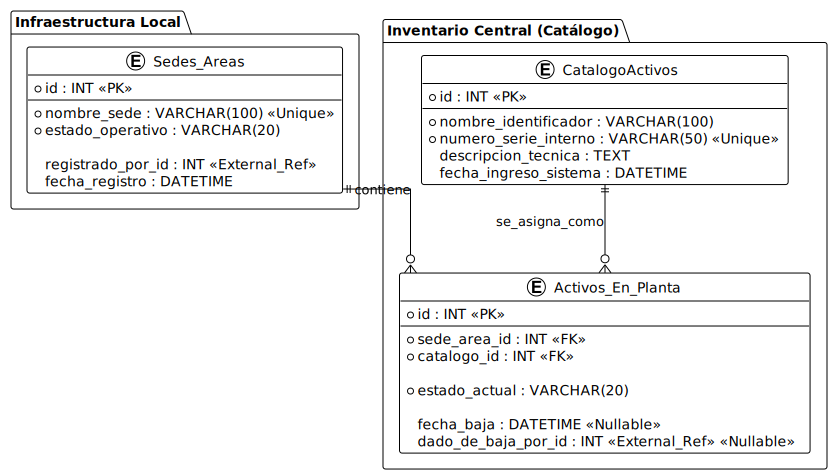
  <p>Diagrama de base de datos BC 2</p>

</div>

<div align="center">
    
  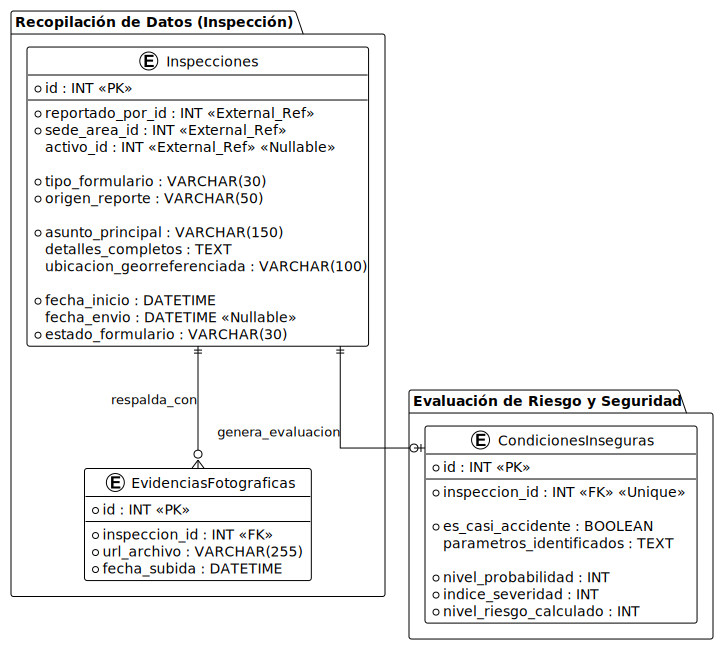
  <p>Diagrama de base de datos BC 3</p>

</div>
<div align="center">
    
  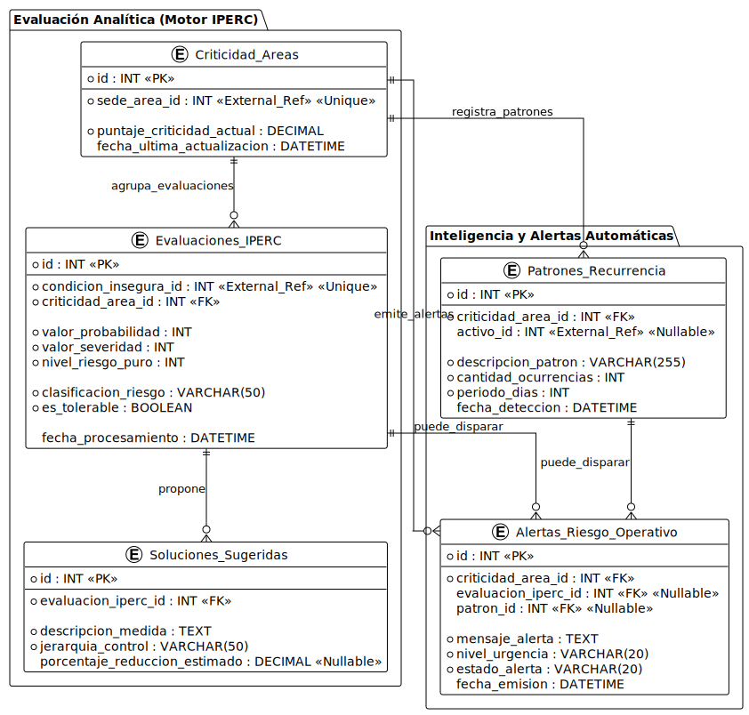
  <p>Diagrama de base de datos BC 4</p>

</div>

<div align="center">
    
  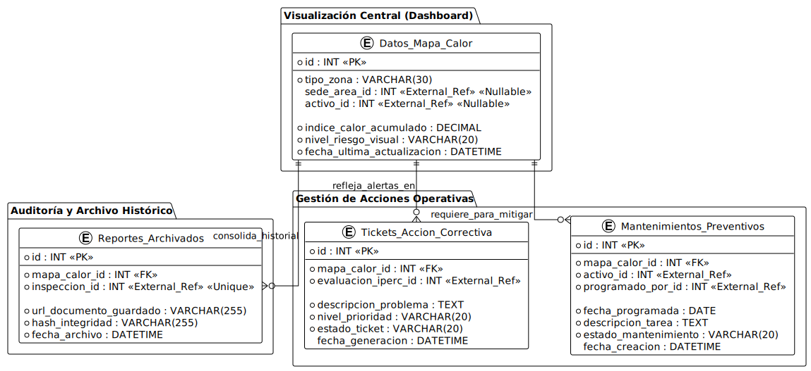
  <p>Diagrama de base de datos BC 5</p>

</div>

<div align="center">
    
  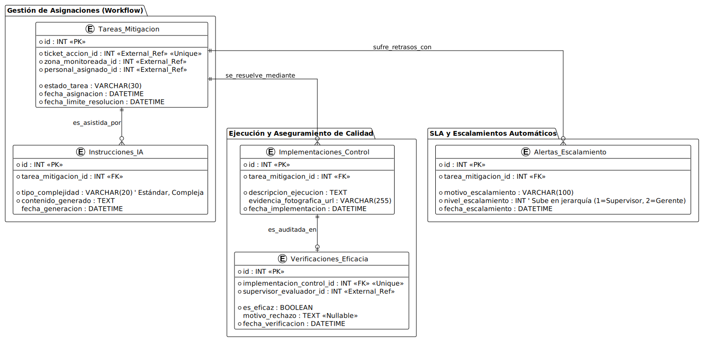
  <p>Diagrama de base de datos BC 6</p>

</div>

<div align="center">
    
  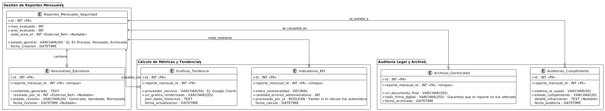
  <p>Diagrama de base de datos BC 7</p>

</div>
