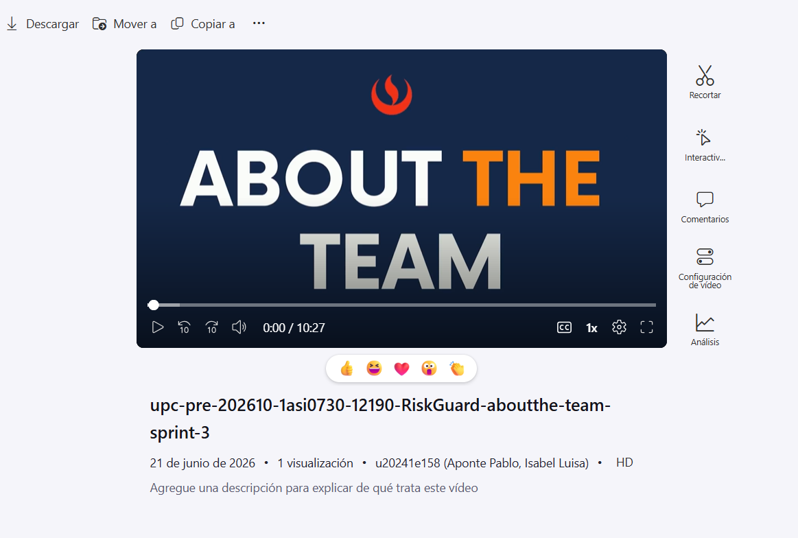

## Video About The Team

El video About-the-Team resume el proceso de trabajo realizado por el equipo RiskGuard Solutions durante el ciclo de desarrollo del proyecto. El contenido incluye escenas de sesiones de trabajo real del equipo, complementadas con narración en voz en off que describe el proceso de ingeniería aplicado a lo largo de los sprints. Además, incluye el testimonio ante cámara de cada integrante del equipo describiendo las actividades realizadas, el logro de outcomes y el desarrollo de competencias alcanzados.

**Pauta de secuencias de contenido:**

| Sección | Inicio | Descripción |
|---|---|---|
| Introducción | 00:00:00 | Presentación del equipo RiskGuard Solutions y objetivo del proyecto |
| Contexto del problema | 00:00:35 | Problemática de seguridad industrial en el Perú y propuesta de solución |
| Avance 1 - Sprint 1 | 00:01:26 | Documentación, Event Storming, diseño en Figma y despliegue de Landing Page |
| Sprint 2 | 00:02:07 | Desarrollo del frontend, flujos por rol de usuario |
| Sprint 3 | 00:03:21 | Desarrollo del backend |
| Reflexión del equipo | 00:04:09 | Retos enfrentados, aprendizajes y dinámica de trabajo |
| Testimonio - Isabel Aponte | 00:04:49 | Actividades, outcomes y competencias desarrolladas |
| Testimonio - Angel Flores | 00:06:02 | Actividades, outcomes y competencias desarrolladas |
| Testimonio - Carlos Blancas | 00:06:02 | Actividades, outcomes y competencias desarrolladas |
| Testimonio - Angel Flores | 00:07:49 | Actividades, outcomes y competencias desarrolladas |
| Testimonio - Victor Laura | 00:10:27 | Actividades, outcomes y competencias desarrolladas |

**Duración:** 10:27

**Publicación en Microsoft Stream:** [Ver video](https://upcedupe-my.sharepoint.com/:v:/g/personal/u20241e158_upc_edu_pe/IQC3wSJAyfZPSoIjcF7HrYDZARNfn-lARO52DjjiJ9z--dY?nav=eyJyZWZlcnJhbEluZm8iOnsicmVmZXJyYWxBcHAiOiJTdHJlYW1XZWJBcHAiLCJyZWZlcnJhbFZpZXciOiJTaGFyZURpYWxvZy1MaW5rIiwicmVmZXJyYWxBcHBQbGF0Zm9ybSI6IldlYiIsInJlZmVycmFsTW9kZSI6InZpZXcifX0%3D&e=2ELTmg)

**Publicación en YouTube:** [Ver video](https://youtu.be/ZGSDDErFNhs?si=kmiXPAML09szMIQL)
